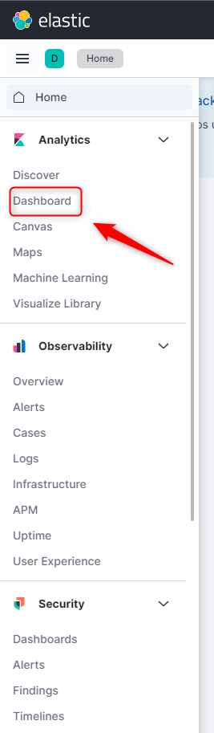

USAGE
-----

> **NOTE:** Tools **Java**, **Maven** and **Docker** have to be installed. Tool **Docker** has to be up and running. Please open Command Line tool on **main folder of project**.

Usage steps:
1. Build packages with `mvn clean package -D maven.test.skip`
1. Start custom services with `docker-compose up -d --scale service-helloworld-be=2 --build`
     * (Optional) Check if containers are running (expected result "HEALTHY") with `docker ps -a`
1. Visit many times system via service Gateway (value "uuid of service BE" should be changed) with `http://localhost:8762`
     * (Optional) Visit service HelloWorld Fe directly with `http://localhost:8080`
     * (Optional) Visit service HelloWorld Be directly with `http://localhost:9090`
     * (Optional) Visit service Discovery with `http://localhost:8761`
1. Check tracking in Zipkin with `http://localhost:9411/`
1. Check logs in Kibana 
     * Configure Kibana. Please check section **KIBANA CONFIGURATION**
     * Visit Kibana with `http://localhost:5601/`
1. Clear local environment
     * Remove services with `docker-compose down --rmi local`

DESCRIPTION
-----------

##### Goal
The goal of this project is to present how to implement example **full microservices system** in **Java** programming language with usage **Spring Boot Cloud** framework.

Project will be configured and run by orchestration tool called **Docker Compose**.

##### Services
This project consists of following services:
* **Service Discovery**: port **8761**. This service contains information about all services registered in the system. Main tasks:
     * **Checking status**: this service can be used to check status of services in the system 
     * **Load balancing**: this service can be used by load balancers to identify services and their instances in the system
* **Service Gateway**: port **8762**. This service redirects traffic from outside system to inside system. Main tasks:
     * **Redirecting**: this service can redirect requests from outside system to some services inside system
     * **Load balancing**: this service can take care of load balancing requests from outside system to services inside system basing on information from service Discovery
* **Service HelloWorld BE**: port **9090**. This service provides message, port and uuid
* **Service HelloWorld FE**: port **8080**. This service provides message, port of BE, uuid of BE, port of FE and uuid of FE. It contacts with Hello World BE service
* **Service Config**: port **8888**. This service provides configuration properties stored in Github
* **Zipkin**: port **9411**. This tool enables tracking request through microservices
* **Elasticsearch**: port **9200**. This is noSql database for logs
* **Kibana**: port **5601**. This is GUI for logs

##### Flow
The following flow takes place in this project:
1. User via Browser sends request to Service Gateway for content
1. Service Gateway sends request to Service HelloWorld FE for content
1. Service HelloWorld FE sends request to service HelloWorld BE for content. Communication is handled by load balancer which redirects traffic to different instances of HelloWorld BE
1. Service HelloWorld BE sends back response to service HelloWorld FE with message, port and uuid
1. Service HelloWorld FE sends back response to Service Gateway with message, port of BE, uuid of BE, port of FE and uuid of FE
1. Service Gateway sends back response to User via Browser with message, port of BE, uuid of BE, port of FE and uuid of FE

##### Launch
To launch this application please make sure that the **Preconditions** are met and then follow instructions from **Usage** section.

##### Technologies
This project uses following technologies:
* **Java**: `https://docs.google.com/document/d/119VYxF8JIZIUSk7JjwEPNX1RVjHBGbXHBKuK_1ytJg4/edit?usp=sharing`
* **Maven**: `https://docs.google.com/document/d/1cfIMcqkWlobUfVfTLQp7ixqEcOtoTR8X6OGo3cU4maw/edit?usp=sharing`
* **Git**: `https://docs.google.com/document/d/1Iyxy5DYfsrEZK5fxZJnYy5a1saARxd5LyMEscJKSHn0/edit?usp=sharing`
* **Spring Boot**: `https://docs.google.com/document/d/1mvrJT5clbkr9yTj-AQ7YOXcqr2eHSEw2J8n9BMZIZKY/edit?usp=sharing`
* **Microservices**: `https://docs.google.com/document/d/1j_lwf5L0-yTPew75RIWcA6AGeAnJjx0M4Bk4DrUcLXc/edit?usp=sharing`
* **Docker**: `https://docs.google.com/document/d/1tKdfZIrNhTNWjlWcqUkg4lteI91EhBvaj6VDrhpnCnk/edit?usp=sharing`
* **Docker Compose**: `https://docs.google.com/document/d/1SPrCS5OS_G0je_wmcLGrX8cFv7ZkQbb5uztNc9kElS4/edit?usp=sharing`

PRECONDITIONS
-------------

##### Preconditions - Tools
* Installed **Operating System** (tested on Windows 10)
* Installed **Java** (tested on version 17.0.5)
* Installed **Maven** (tested on version 3.8.5)
* Installed **Git** (tested on version 2.33.0.windows.2)
* Installed **Docker** (tested on version 20.10.21)
* Installed **Docker Compose** (tested on version v2.12.2)

##### Preconditions - Actions
* **Launched** Docker on your local machine
* **Download** source code using Git command `git clone https://github.com/wisniewskikr/chrisblog-it-cloud.git`
* Open any **Command Line** tool (for instance "Windonw PowerShell" on Windows OS) on **project's main folder**

KIBANA CONFIGURATION
--------------------S

Link:
* http://localhost:5601/

