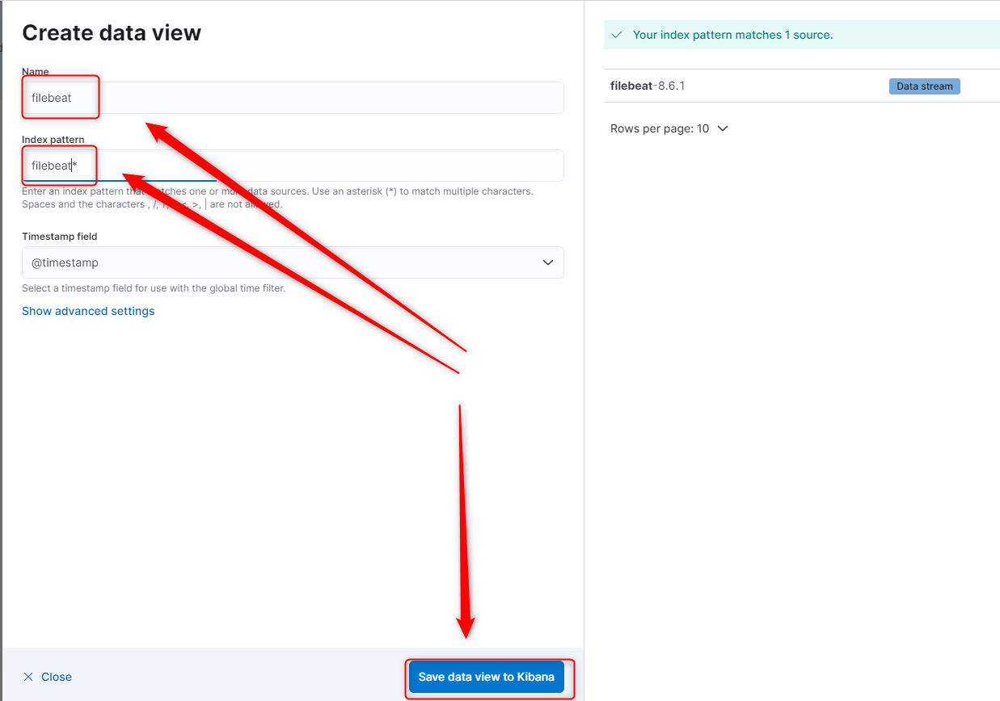
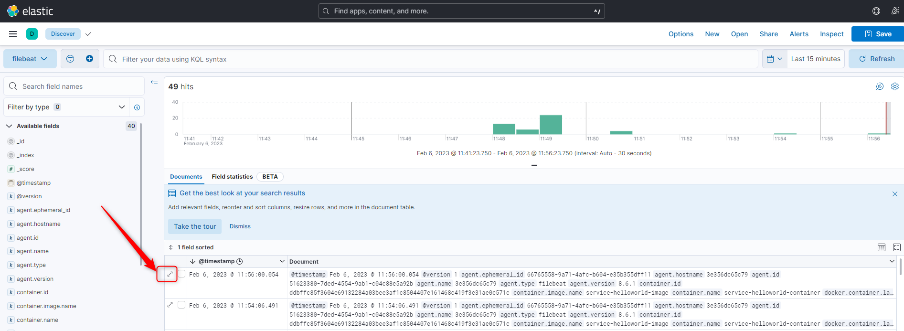

DESCRIPTION
-----------

##### Goal
The goal of this project is to present how to implement **microservices** in **Java** programming language with usage **Spring Boot Cloud** framework. Logs from specific microservices should be stored in one place. It should be handled by **elastic stack** - tool **elasticsearch** (database) + tool **kibana** (dashboard) + tool **filebeat** (pipelines). 

##### Service
This project consists of following services:
* **Service Discovery**: port **8761**. This service displays list of all active services in system
* **Service Config**: port **8888**. This service provides flexible configuration variables. These variables can be taken for instance from Github
* **Service HelloWorld**: port **8080**. Two instances of Service HelloWorld which provide JSON with message and application id
* **Service Gateway**: port **8762**. This service redirects request from outside system to service inside system. It also takes care of load balancing
* **Elasticsearch**: port **9200**. Database for logs
* **Kibana**: port **5601**. Dashboard for logs
* **Filebeat**: pipelines for logs 

##### Flow
The following flow takes place in this project:
1. User via browser sends request to Service HellWorld for content. This request is not sent directly but through Service Gateway. 
1. Service Gateway takes location of all services in system from Service Discovery.
1. This example system consists of two instances of Service HelloWorld. In such situation Service Gateway also performs load balancing - first request is sent to Service HelloWorld 1,
second to Service HelloWorld 2, third again to Service HelloWorld 1 etc. 
1. Service HelloWorld which receives request connects with Service Config for text of message. This text is taken from Github project
1. Service HelloWorld sends response to User via browser. This response contains message and application id of this exact instance of Servie HelloWorld. 
After every request this application id is changed because of Service Gateway and load balancing

##### Launch
To launch this application please make sure that the **Preconditions** are met and then follow instructions from **Usage** section.

##### Technologies
This project uses following technologies:
* **Java**: `https://docs.google.com/document/d/119VYxF8JIZIUSk7JjwEPNX1RVjHBGbXHBKuK_1ytJg4/edit?usp=sharing`
* **Maven**: `https://docs.google.com/document/d/1cfIMcqkWlobUfVfTLQp7ixqEcOtoTR8X6OGo3cU4maw/edit?usp=sharing`
* **Git**: `https://docs.google.com/document/d/1Iyxy5DYfsrEZK5fxZJnYy5a1saARxd5LyMEscJKSHn0/edit?usp=sharing`
* **Spring Boot** framework: `https://docs.google.com/document/d/1mvrJT5clbkr9yTj-AQ7YOXcqr2eHSEw2J8n9BMZIZKY/edit?usp=sharing`
* **Microservices**: `https://docs.google.com/document/d/1j_lwf5L0-yTPew75RIWcA6AGeAnJjx0M4Bk4DrUcLXc/edit?usp=sharing`
* **Docker**: `https://docs.google.com/document/d/1tKdfZIrNhTNWjlWcqUkg4lteI91EhBvaj6VDrhpnCnk/edit?usp=sharing`
* **Docker Compose**: `https://docs.google.com/document/d/1SPrCS5OS_G0je_wmcLGrX8cFv7ZkQbb5uztNc9kElS4/edit?usp=sharing`

PRECONDITIONS
-------------

##### Preconditions - Tools
* Installed **Operating System** (tested on Windows 10)
* Installed **Java** (tested on version 11.0.16.1)
* Installed **Maven** (tested on version 3.8.5)
* Installed **Git** (tested on version 2.33.0.windows.2)
* Installed **Docker** (tested on version 20.10.21)
* Installed **Docker Compose** (tested on version v2.12.2)

##### Preconditions - Actions
* **Launched** Docker on your local machine
* **Download** source code using Git command `git clone https://github.com/wisniewskikr/chrisblog-it-cloud.git`
* Open any **Command Line** (for instance "Windonw PowerShell" on Windows OS) tool on **project's folder**

USAGE
-----

Usage steps:
1. Build packages with `mvn clean package -D maven.test.skip`
1. Start services with `docker-compose up -d --build`
1. Visit Gateway `http://localhost:8762`
1. Check logs in Kibana - follow instructions from section **Usage Kibana**
1. Clean local environment:
     * Remove containers with `docker-compose down -rmi`
   
     
USAGE KIBANA
------------

Visit Kibana `http://localhost:5601`

