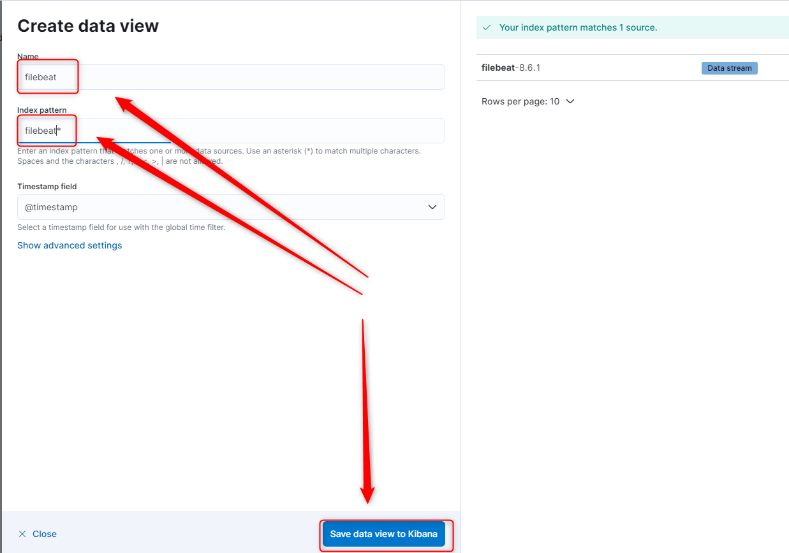
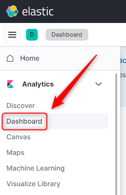

USAGE
-----

> **NOTE:** Tools **Java**, **Maven**, **Docker** and **Minikube** have to be installed. Tools **Docker** and **Minikube** have to be up and running. Please open Command Line tool as **administrator** on **main folder of project**.

Usage steps:
1. Start Minikube with increased resources `minikube start --cpus 4 --memory 7000`
1. Connect Minikube and Docker with (Windows) `minikube docker-env | Invoke-Expression`
1. Pull Elasticsearch image with `docker pull docker.elastic.co/elasticsearch/elasticsearch:7.12.1`
1. Pull Kibana image with `docker pull docker.elastic.co/kibana/kibana:7.12.1`
1. Pull Filebeat image with `docker pull docker.elastic.co/beats/filebeat:7.12.0`
1. Build package with `mvn clean package -D maven.test.skip`
1. Build Service Discovery image with `docker build -f service-discovery/Dockerfile-Fast -t discovery-image ./service-discovery`
1. Build Service HelloWorld image with `docker build -f service-helloworld/Dockerfile-Fast -t helloworld-image ./service-helloworld`
1. Build Service Gateway image with `docker build -f service-gateway/Dockerfile-Fast -t gateway-image ./service-gateway`
1. (Optional) Check images in Minikube:

     * Run Minikube SSH with `minikube ssh`
     * Display Minikube images (expected new images from this project) with `docker images`
     * Close Minikube SSH with `exit`

1. Start Elasticsearch service with `kubectl apply -f k8s-scripts/1-elasticsearch.yaml`
1. Start Kibana service with `kubectl apply -f k8s-scripts/2-kibana.yaml`
1. Start Filebeat service with `kubectl apply -f k8s-scripts/3-filebeat.yaml`
1. Start Discovery service with `kubectl apply -f k8s-scripts/4-discovery.yaml`
1. Start HelloWorld service with `kubectl apply -f k8s-scripts/5-helloworld.yaml`
1. Start Gateway service with `kubectl apply -f k8s-scripts/6-gateway.yaml`
1. (Optional) Check status of services with `kubectl get pods`
1. Visit in browser Gateway Service with `minikube service service-gateway-show`
1. Visit in browser Kibana Service with `minikube service kibana-show`
1. Configure Kibana dashboard to see logs (check section "Usage Kibana")
1. (Optional) Visit in browser Discovery Service with `minikube service service-discovery-show`
1. (Optional) Visit in browser HelloWorld Service directly with `minikube service service-helloworld-show`
1. Clean up environment:
    
    * Remove Gateway service with `kubectl delete -f k8s-scripts/6-gateway.yaml`
    * Remove HelloWorld service with `kubectl delete -f k8s-scripts/5-helloworld.yaml`
    * Remove Discovery service with `kubectl delete -f k8s-scripts/4-discovery.yaml`
    * Remove Filebeat service with `kubectl delete -f k8s-scripts/3-filebeat.yaml`
    * Remove Kibana service with `kubectl delete -f k8s-scripts/2-kibana.yaml`
    * Remove Elasticsearch service with `kubectl delete -f k8s-scripts/1-elasticsearch.yaml`
    * Remove Service Gateway image with `docker rmi gateway-image`
    * Remove Service HelloWorld image with `docker rmi helloworld-image`
    * Remove Service Discovery image with `docker rmi discovery-image`   
    * Remove Service Filebeat image with `docker rmi docker.elastic.co/beats/filebeat:7.12.0`
    * Remove Service Kibana image with `docker rmi docker.elastic.co/kibana/kibana:7.12.1`
    * Remove Service Elasticsearch image with `docker rmi docker.elastic.co/elasticsearch/elasticsearch:7.12.1` 

DESCRIPTION
-----------

##### Goal
The goal of this project is to present how to implement **microservices** in **Java** programming language with usage **Spring Boot Cloud** framework which will provide logs to **distributed logging** services called **elastic stack**. This solution will enable user to have access to all logs from services in the system from one place.

Project will be configured and run by orchestration tool called **Kubernetes**.

##### Services
This project consists of following services:
* **Service Discovery**: port **8761**. This service contains information about all services registered in the system. Main tasks:
     * **Checking status**: this service can be used to check status of services in the system 
     * **Load balancing**: this service can be used by load balancers to identify services and their instances in the system
* **Service Gateway**: port **8762**. This service redirects traffic from outside system to inside system. Main tasks:
     * **Redirecting**: this service can redirect requests from outside system to some services inside system
     * **Load balancing**: this service can take care of load balancing requests from outside system to services inside system basing on information from service Discovery
* **Service HelloWorld**: port **8080**. This service provides message, port and uuid
* **Service Elasticsearch**: port **9200**. This service stores logs from the system
* **Service Kibana**: port **9200**. This service provides dashboard to work with logs
* **Service Filebeat**: no port: This service listening for logs in services and moves them to database

##### Flow
The following flow takes place in this project:
1. User via Browser sends request to Service Gateway for content
1. Service Gateway sends request to Service HelloWorld for content
1. Service HelloWorld sends back response to Service Gateway with message, port and uuid. In the meantime logs are sent to elastic stack
1. Service Gateway sends back response to User via Browser with message, port and uuid

##### Launch
To launch this application please make sure that the **Preconditions** are met and then follow instructions from **Usage** section.

##### Technologies
This project uses following technologies:
* **Java**: `https://docs.google.com/document/d/119VYxF8JIZIUSk7JjwEPNX1RVjHBGbXHBKuK_1ytJg4/edit?usp=sharing`
* **Maven**: `https://docs.google.com/document/d/1cfIMcqkWlobUfVfTLQp7ixqEcOtoTR8X6OGo3cU4maw/edit?usp=sharing`
* **Git**: `https://docs.google.com/document/d/1Iyxy5DYfsrEZK5fxZJnYy5a1saARxd5LyMEscJKSHn0/edit?usp=sharing`
* **Spring Boot**: `https://docs.google.com/document/d/1mvrJT5clbkr9yTj-AQ7YOXcqr2eHSEw2J8n9BMZIZKY/edit?usp=sharing`
* **Microservices**: `https://docs.google.com/document/d/1j_lwf5L0-yTPew75RIWcA6AGeAnJjx0M4Bk4DrUcLXc/edit?usp=sharing`
* **Docker**: `https://docs.google.com/document/d/1tKdfZIrNhTNWjlWcqUkg4lteI91EhBvaj6VDrhpnCnk/edit?usp=sharing`
* **Kubernetes**: `https://docs.google.com/document/d/1jOsK3Lkbkoq-Xx7Ln9o_ozCt6XpcSElOwu1o2AfQnNc/edit?usp=sharing`
* **Minikube**: `https://docs.google.com/document/d/1GfgN7tJNTIJCaSzexJdR_Lm_S9pF2YykcpgSQzAZWZo/edit?usp=sharing`

PRECONDITIONS
-------------

##### Preconditions - Tools
* Installed **Operating System** (tested on Windows 10)
* Installed **Java** (tested on version 17.0.5)
* Installed **Maven** (tested on version 3.8.5)
* Installed **Git** (tested on version 2.33.0.windows.2)
* Installed **Docker** (tested on version 20.10.21)
* Installed **Minikube** (tested on version v1.28.0)
* Installed **kubectl** (tested on version v4.5.4)

##### Preconditions - Actions
* **Launched** Docker on your local machine
* **Launched** Minikube on your local machine with (as administrator) with `minikube start`
* **Connected** Minikube with Docker with (Windows - as administrator): `minikube docker-env` and `minikube docker-env | Invoke-Expression` or with (Linux) `eval $(minikube docker-env)` 
* **Download** source code using Git command `git clone https://github.com/wisniewskikr/chrisblog-it-cloud.git`
* Open any **Command Line** tool (for instance "Windonw PowerShell" on Windows OS) on **project's main folder**

USAGE KIBANA
------------

Visit Kibana `http://localhost:5601`

