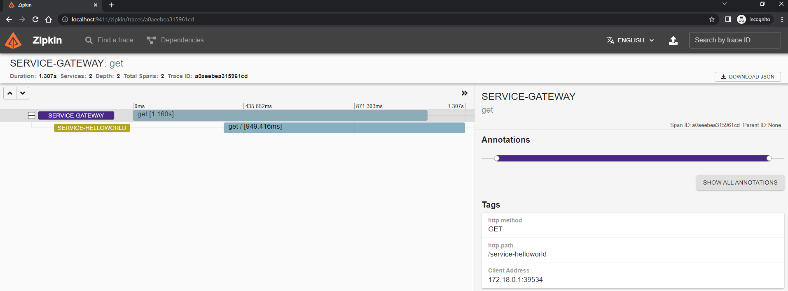
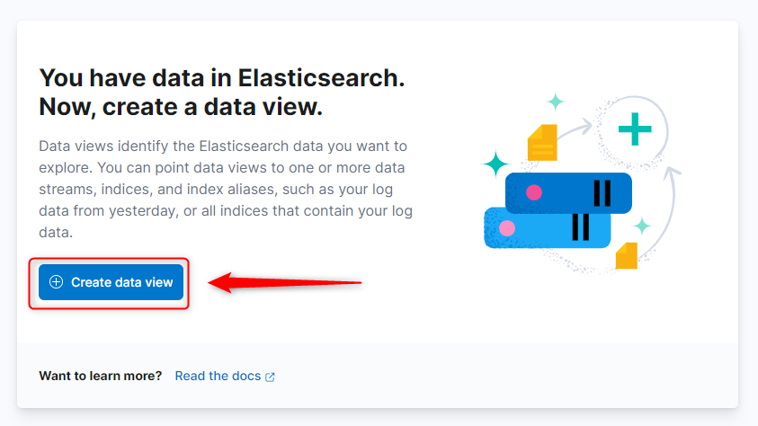

DESCRIPTION
-----------

##### Goal
The goal of this project is to present how to implement **microservices** using **Java** programming language and **Spring Boot Cloud** framework. This project consists of few microservices implemented as independent **Maven modules**. In the system there is only one custom service - Service HelloWorld. This service is run as two instances to present load balancing usage. The rest of services in the system are provided by Spring Boot Cloud and they are used for system management.

All services are dockerized and manged by docker orchestration tool **docker compose**. It means that user does not have to start up manually all services one by one. It's done automatically by orchestration tool. 

This project also presents how to configure and use **Zipkin** - tool for distributed tracking. It enables to track every request/response sent in system - which services were involved in this communication and how long takes every service to handle request/response.

This project also presents how to configure and use **EKL** (Elasticsearch, Kibana, Logstash) - tool for centralized logging. It enables to display in one place logs from all services in system.

##### Service
This project consists of following services:
* **Service Discovery**: port **8761**. This service displays list of all active services in system
* **Service Config**: port **8888**. This service provides flexible configuration variables. These variables can be taken for instance from Github
* **Service HelloWorld**: port **random**. Two instances of Service HelloWorld which provide JSON with message and application id
* **Service Gateway**: port **8762**. This service redirects request from outside system to service inside system. It also takes care of load balancing
* **Elasticsearch**: port **9200**. This service stores logs provided by applications and used by Kibana
* **Kibana**: port **5601**. This service displays logs.
* **Logstash**: port **5000**. This service takes logs from applications and provides them to Kibana
* **Zipkin**: port **9411**. This service provides information about distributed tracking.

##### Flow
The following flow takes place in this project:
1. User via any REST Client (for instance Postman) sends request to Service HellWorld for content. This request is not sent directly but through Service Gateway. 
1. Service Gateway takes location of all services in system from Service Discovery.
1. This example system consists of two instances of Service HelloWorld. In such situation Service Gateway also performs load balancing - first request is sent to Service HelloWorld 1,
second to Service HelloWorld 2, third again to Service HelloWorld 1 etc. 
1. Service HelloWorld which receives request connects with Service Config for text of message. This text is taken from Github project
1. Service HelloWorld sends response to User via REST Client. This response contains message and application id of this exact instance of Servie HelloWorld. 
After every request this application id is changed because of Service Gateway and load balancing

##### Launch
To launch this application please make sure that the **Preconditions** are met and then follow instructions from **Usage** section.

##### Technologies
This project uses following technologies:
* **Spring Boot** framework: `https://docs.google.com/document/d/1mvrJT5clbkr9yTj-AQ7YOXcqr2eHSEw2J8n9BMZIZKY/edit?usp=sharing`
* **Microservices**: `https://docs.google.com/document/d/1j_lwf5L0-yTPew75RIWcA6AGeAnJjx0M4Bk4DrUcLXc/edit?usp=sharing`
* **Docker**: `https://docs.google.com/document/d/1tKdfZIrNhTNWjlWcqUkg4lteI91EhBvaj6VDrhpnCnk/edit?usp=sharing`
* **Docker Compose**: `https://docs.google.com/document/d/1SPrCS5OS_G0je_wmcLGrX8cFv7ZkQbb5uztNc9kElS4/edit?usp=sharing`

PRECONDITIONS
-------------

##### Preconditions - Tools
* Installed **Operating System** (tested on Windows 10)
* Installed **Java** (tested on version 11.0.16.1). Tool details: `https://docs.google.com/document/d/119VYxF8JIZIUSk7JjwEPNX1RVjHBGbXHBKuK_1ytJg4/edit?usp=sharing`
* Installed **Maven** (tested on version 3.8.5). Tool details: `https://docs.google.com/document/d/1cfIMcqkWlobUfVfTLQp7ixqEcOtoTR8X6OGo3cU4maw/edit?usp=sharing`
* Installed **Git** (tested on version 2.33.0.windows.2). Tool details: `https://docs.google.com/document/d/1Iyxy5DYfsrEZK5fxZJnYy5a1saARxd5LyMEscJKSHn0/edit?usp=sharing`
* Installed **Docker** (tested on version 20.10.21). Tool details: `https://docs.google.com/document/d/1tKdfZIrNhTNWjlWcqUkg4lteI91EhBvaj6VDrhpnCnk/edit?usp=sharing`
* Installed **Docker Compose** (tested on version v2.12.2). Tool details: `https://docs.google.com/document/d/1SPrCS5OS_G0je_wmcLGrX8cFv7ZkQbb5uztNc9kElS4/edit?usp=sharing`

##### Preconditions - Actions
* **Launched** Docker and Docker Compose tools on your local machine
* **Download** source code using Git 
* Open any **Command Line** (for instance "Windonw PowerShell" on Windows OS) tool on **project's folder** (exact localization of project you can check in GIT repositories on page `https://github.com/wisniewskikr/chrisblog-it-cloud`)

USAGE FAST (REQUIRES LOCALLY INSTALLED JAVA AND MAVEN)
------------------------------------------------------

Usage steps:
1. In Command Line tool build packages with `mvn clean package -Dmaven.test.skip`
1. In Command Line tool start services with `docker-compose -f docker-compose-fast.yml up --scale service-helloworld=2 --build`
1. In any REST Client (for instance Postman) connect with Service HelloWorld via Service Gateway with (method GET): `http://localhost:8762/service-helloworld`
1. Check distributed tracking in Zipkin with `http://localhost:9411`
1. Check centralized logs in Kibana with `http://localhost:5601` 
1. (Optional) In any browser check services list with `http://localhost:8761`
1. (Optional) In any Rest Client run following request many times to check load balancing (application id should be changed every request) (method GET): `http://localhost:8762/service-helloworld`
1. In Command Line stop services with `ctrl + C`
1. In Command Line remove containers with `docker-compose down`

USAGE SLOW (DOES NOT REQUIRE LOCALLY INSTALLED JAVA AND MAVEN)
--------------------------------------------------------------

Usage steps:
1. In Command Line tool start services with `docker-compose up --scale service-helloworld=2 --build`
1. In any REST Client (for instance Postman) connect with Service HelloWorld via Service Gateway with (method GET): `http://localhost:8762/service-helloworld`
1. Check distributed tracking in Zipkin with `http://localhost:9411`
1. Check centralized logs in Kibana with `http://localhost:5601` 
1. (Optional) In any browser check services list with `http://localhost:8761`
1. (Optional) In any Rest Client run following request many times to check load balancing (application id should be changed every request) (method GET): `http://localhost:8762/service-helloworld`
1. In Command Line stop services with `ctrl + C`
1. In Command Line remove containers with `docker-compose down`

USAGE ZIPKIN
------------

USAGE ELK
------------

