DESCRIPTION
-----------

##### Goal
The goal of this project is to present how to implement **microservices** using **Java** programming language and **Spring Boot Cloud** framework. This project consists of few microservices implemented as independent **Maven modules**. In the system there are two Hello World modules - Display and Storage - which are connected in the **network**. Network means that Service HelloWorld Display displays message received from Service HelloWorld Storage. Additionally service Storage is run as two instances to present load balancing usage. The rest of services in the system are provided by Spring Boot Cloud and they are used for system management. 

This project also presents how to configure and use **Zipkin** - tool for distributed tracking. It enables to track every request/response sent in system - which services were involved in this communication and how long takes every service to handle request/response.

This project also presents how to configure and use **EKL** (Elasticsearch, Kibana, Logstash) - tool for centralized logging. It enables to display in one place logs from all services in system.

##### Service
This project consists of following services:
* **Service Discovery**: port **8761**. This service displays list of all active services in system
* **Service Config**: port **8888**. This service provides flexible configuration variables. These variables can be taken for instance from Github
* **Service HelloWorld Storage 1**: port **8081**. First instance of Service HelloWorld Storage which provides JSON with message and port
* **Service HelloWorld Storage 2**: port **8082**. Second instance of Service HelloWorld Storage which provides JSON with message and port
* **Service HelloWorld Display**: port **8080**. This service displays to the user three information: message from Storage, port from Storage and port from Display
* **Service Gateway**: port **8762**. This service redirects request from outside system to service inside system. It also takes care of load balancing

##### Flow
The following flow takes place in this project:
1. User via any REST Client (for instance Postman) sends request to Service HellWorld Display for content. This request is not sent directly but through Service Gateway. 
1. Service Gateway takes location of all services in system from Service Discovery.
1. Service HelloWorld Display sends request for content to Service HelloWorld Storage. In this example system there are two instances of Storage. In such situation Service Gateway performs load balancing - first request is sent to Service HelloWorld Storage 1, second to Service HelloWorld Storage 2, third again to Service HelloWorld Storage 1 etc. 
1. Service HelloWorld Storage connects with Service Config for text of message. This text is taken from Github project
1. Service HelloWorld Storage sends response to Service HelloWorld Display
1. Service HelloWorld Display sends response to User via REST Client. This response contains message, port of Display and port of instance of Storage. 
After every request this port is changed because of Service Gateway and load balancing

##### Launch
To launch this application please make sure that the **Preconditions** are met and then follow instructions from **Usage** section.

##### Technologies
This project uses following technologies:
* **Spring Boot** framework: `https://docs.google.com/document/d/1mvrJT5clbkr9yTj-AQ7YOXcqr2eHSEw2J8n9BMZIZKY/edit?usp=sharing`
* **Microservices**: `https://docs.google.com/document/d/1j_lwf5L0-yTPew75RIWcA6AGeAnJjx0M4Bk4DrUcLXc/edit?usp=sharing`


PRECONDITIONS
-------------

##### Preconditions - Tools
* Installed **Operating System** (tested on Windows 10)
* Installed **Java** (tested on version 11.0.16.1). Tool details: `https://docs.google.com/document/d/119VYxF8JIZIUSk7JjwEPNX1RVjHBGbXHBKuK_1ytJg4/edit?usp=sharing`
* Installed **Maven** (tested on version 3.8.5). Tool details: `https://docs.google.com/document/d/1cfIMcqkWlobUfVfTLQp7ixqEcOtoTR8X6OGo3cU4maw/edit?usp=sharing`
* Installed **Git** (tested on version 2.33.0.windows.2). Tool details: `https://docs.google.com/document/d/1Iyxy5DYfsrEZK5fxZJnYy5a1saARxd5LyMEscJKSHn0/edit?usp=sharing`

##### Preconditions - Actions
* **Download** and **install** tool **Otp** (required on Windows by Zipkin):
    * Download installation file from: `https://www.erlang.org/downloads`
    * Run downloaded file
* **Download**, **install** and **run** tool **RabbitMQ** (required by Zipkin):
     * Download installation file from: `https://www.rabbitmq.com/download.html`
     * Run downloaded file as administrator
     * Run service with (bu Command Line tool in location: "{tool_home}/bin"): `rabbitmq-service.bat start`
     * Check service with `http://localhost:15672`
* **Download**, **extract** and **run** tool **Zipkin**:
     * Download package with tool from `https://zipkin.io/pages/quickstart.html`
     * Extract package
     * Start service with (by GIT bash tool in location: "{tool_home}/bin"): `RABBIT_URI=amqp://localhost java -jar zipkin.jar`
     * Check service with `http://localhost:9411`
* **Download**, **extract** and **run** tool **Elasticsearch** (required by ELK in version 7.6.2):
     * Download package with tool from `https://www.elastic.co/downloads/elasticsearch`
     * Extract package
     * Start service with (by Command Line tool in location: "{tool_home}/bin"): `elasticsearch.bat`
     * Check service with `http://localhost:9200`
* **Download**, **extract** and **run** tool **Kibana** (required by ELK in version 7.6.2):
     * Download package with tool from `https://www.elastic.co/downloads/kibana`
     * Extract package
     * Start service with (by Command Line tool in location: "{tool_home}/bin"): `kibana.bat`
     * Open tool console with `http://localhost:5601`
     * In tool console create index in section "Kibana -> Dev Tools" (check code snippets below)     
     * In tool console create index pattern in section "Kibana -> Management - Index Pattern -> Create Index Pattern -> Pattern 'helloworld*' -> 'I don't want to use the Time Filter'"
     * In tool console check logs in section "Kibana -> Discover"
               
```
PUT /helloworld	
{
  "settings": {
  "index": {
    "number_of_shards" : 3,
    "number_of_replicas" : 2
  }
  }
}
```

```
POST /helloworld/default
{
  "name": "event_processing",
  "instructor": {
    "firstName": "Hello",
    "lastName": "World"
  }
}
```
     
* **Download**, **extract** and **run** tool **Logstash** (required by ELK in version 7.6.2):
     * Download package with tool from `https://www.elastic.co/downloads/logstash`
     * Extract package
     * Create following file: "{tool_home}/bin/logstash.conf"
     * Fill created file with data from code snippet below
     * Start service with (by Command Line tool in location: "{tool_home}/bin"): `logstash.bat -f logstash.conf`
     
```
input {
	file {
		path => "C:\logs\springcloud-network-modules-elk-zipkin.log"
		start_position => "beginning"
	}
}

output {
	
	stdout {
		codec => rubydebug
	}
	
	elasticsearch {
		hosts => ["localhost:9200"]
		index => "helloworld-%{+yyyy.MM.dd}"
	}
	
}
```

* **Download** source code using Git 
* Open any **Command Line** (for instance "Windonw PowerShell" on Windows OS) tool on **project's folder** (exact localization of project you can check in GIT repositories on page `https://github.com/wisniewskikr/chrisblog-it-cloud`)


USAGE
-----

Usage steps:
1. First Command Line: Start Service Discovery with `mvn -f ./service-discovery spring-boot:run`
1. Second Command Line: Start Service Config with `mvn -f ./service-config spring-boot:run`
1. Third Command Line: Start Service HelloWorld Storage 1 with `mvn -f ./service-helloworld-storage-1 spring-boot:run`
1. Fourth Command Line: Start Service HelloWorld Storage 2 with `mvn -f ./service-helloworld-storage-2 spring-boot:run`
1. Fifth Command Line: Start Service HelloWorld Display with `mvn -f ./service-helloworld-display spring-boot:run`
1. Sixth Command Line: Start Service Gateway with `mvn -f ./service-gateway spring-boot:run`
1. (Optional) In any browser check services list with `http://localhost:8761`
1. In any REST Client (for instance Postman) connect with Service HelloWorld via Service Gateway with (method GET): `http://localhost:8762/service-helloworld-display`
1. (Optional) In any Rest Client run following request many times to check load balancing (port of Storage should be changed every request) (method GET): `http://localhost:8762/service-helloworld-display`
1. Check distributed tracking (Zipkin) with `http:\\localhost:9411`
1. Check centralized logging (ELK) with `http:\\localhost:5601`
1. Sixth Command Line: Clean up environment with `ctrl + C`
1. Fifth Command Line: Clean up environment with `ctrl + C`
1. Fourth Command Line: Clean up environment with `ctrl + C`
1. Third Command Line: Clean up environment with `ctrl + C`
1. Second Command Line: Clean up environment with `ctrl + C`
1. First Command Line: Clean up environment with `ctrl + C`


ZIPKIN CONFIGURATION - PRINTSCREENS
-----------------------------------

##### Otp

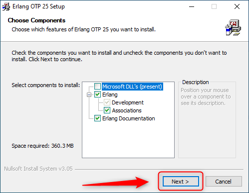


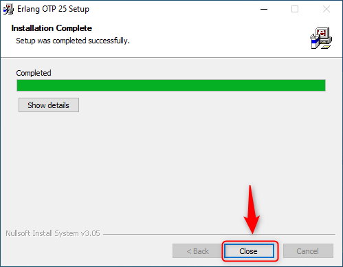

#### RabbitMQ


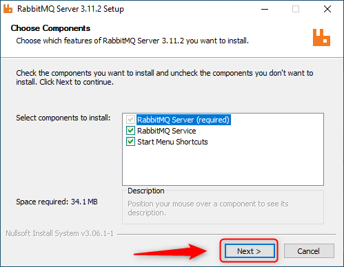

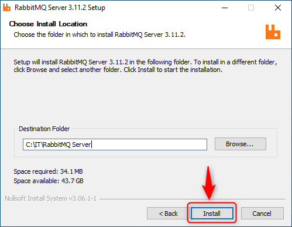

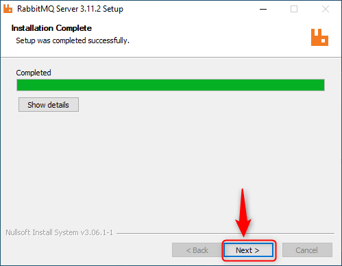

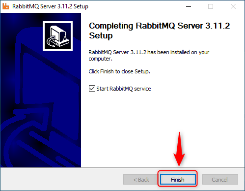


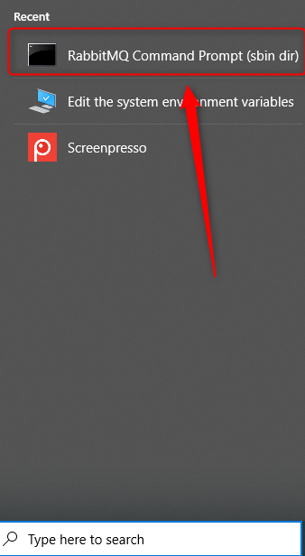


#### Zipkin

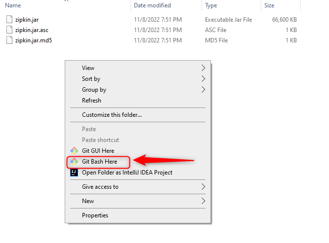

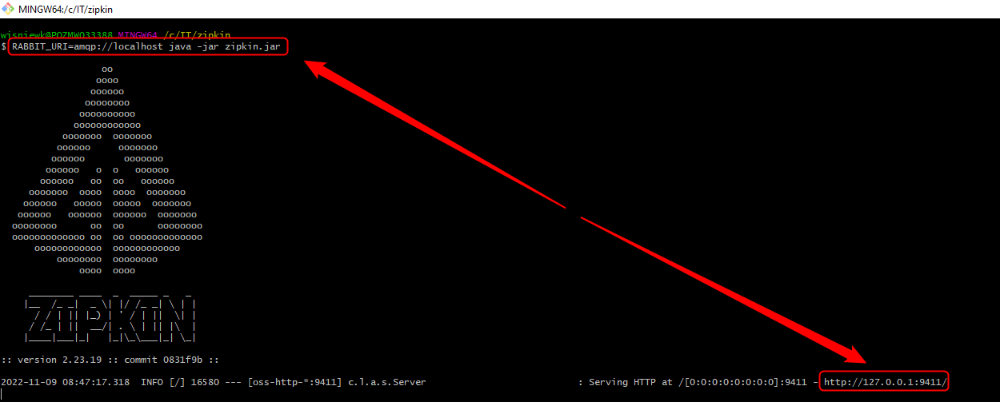


ELK CONFIGURATION - PRINTSCREENS
--------------------------------

#### Elasticsearch


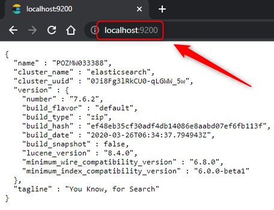

#### Kibana


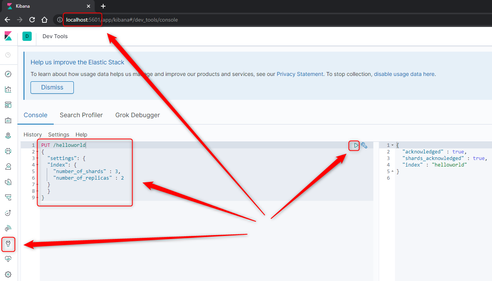


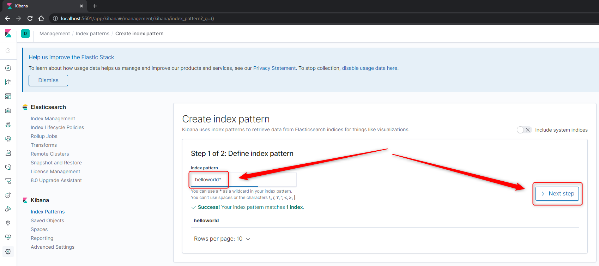

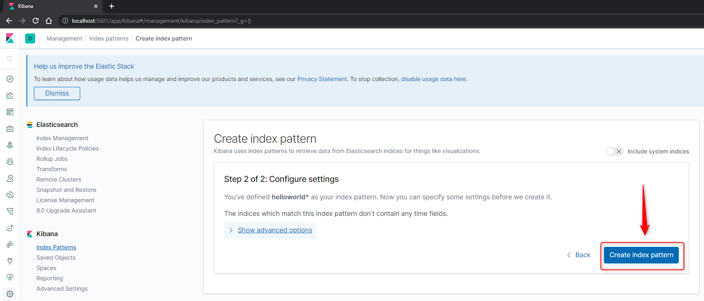

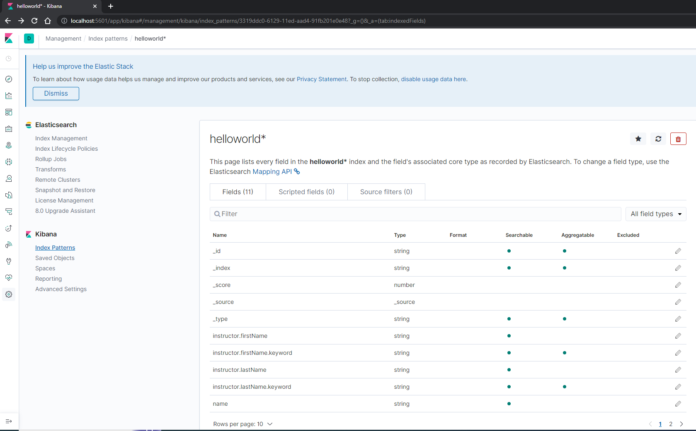


#### Logstash

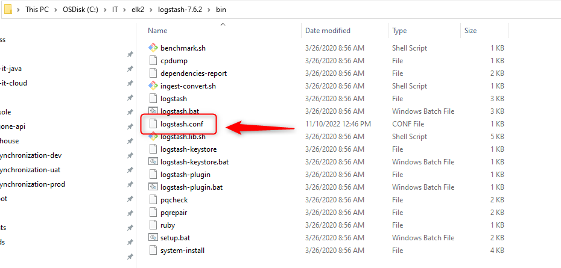

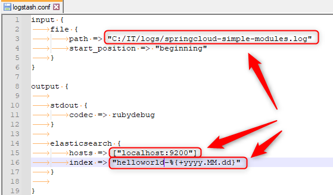

