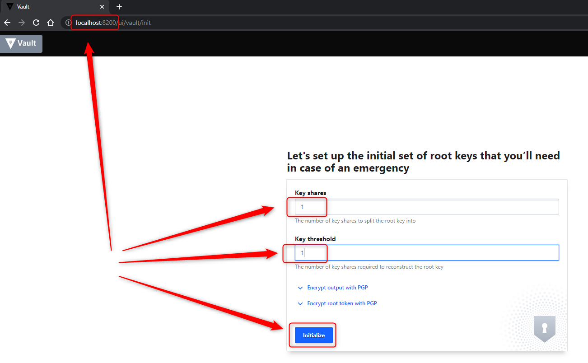
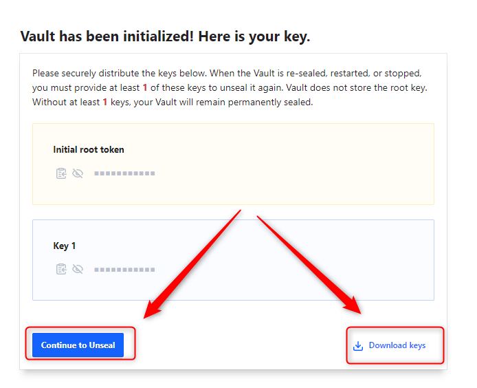
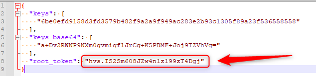
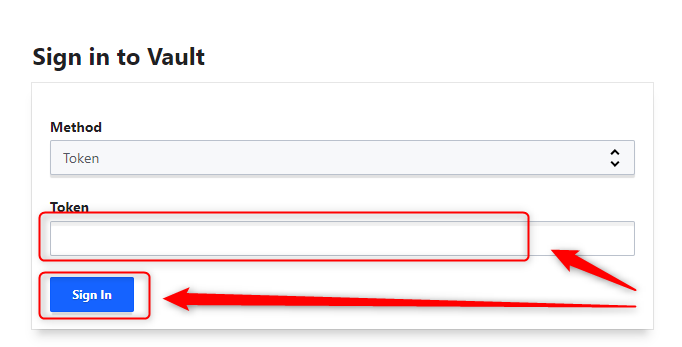
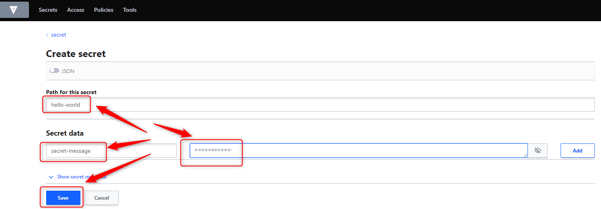
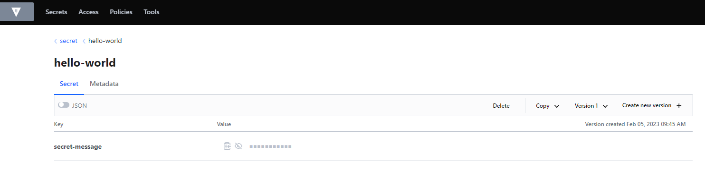

DESCRIPTION
-----------

##### Goal
The goal of this project is to present how to create an application in **Java** programming language with usage **Spring Boot Cloud** framework which displays **Hello World** message stored as secret in **Vault** application.

**Vault** is an application which enables storing secrets. These secrets can overwrite secret data from application.

##### Flow
The following flow takes place in this project:
1. User via any browser sends request to application for a content.
1. Application HelloWorld sends back response to user via browser with JSON containing message.

##### Launch
To launch this application please make sure that the **Preconditions** are met and then follow instructions from **Usage** section.

##### Technologies
This project uses following technologies:
* **Java**: `https://docs.google.com/document/d/119VYxF8JIZIUSk7JjwEPNX1RVjHBGbXHBKuK_1ytJg4/edit?usp=sharing`
* **Maven**: `https://docs.google.com/document/d/1cfIMcqkWlobUfVfTLQp7ixqEcOtoTR8X6OGo3cU4maw/edit?usp=sharing`
* **Git**: `https://docs.google.com/document/d/1Iyxy5DYfsrEZK5fxZJnYy5a1saARxd5LyMEscJKSHn0/edit?usp=sharing`
* **Spring Boot Cloud**: `https://docs.google.com/document/d/1mvrJT5clbkr9yTj-AQ7YOXcqr2eHSEw2J8n9BMZIZKY/edit?usp=sharing`
* **Docker**: `https://docs.google.com/document/d/1tKdfZIrNhTNWjlWcqUkg4lteI91EhBvaj6VDrhpnCnk/edit?usp=sharing`
* **Docker Compose**: `https://docs.google.com/document/d/1SPrCS5OS_G0je_wmcLGrX8cFv7ZkQbb5uztNc9kElS4/edit?usp=sharing`

PRECONDITIONS
-------------

##### Preconditions - Tools
* Installed **Operating System** (tested on Windows 10)
* Installed **Java** (tested on version 11.0.16.1)
* Installed **Maven** (tested on version 3.8.5)
* Installed **Git** (tested on version 2.33.0.windows.2)
* Installed **Docker** (tested on version 20.10.21)
* Installed **Docker Compose** (tested on version v2.12.2)

##### Preconditions - Actions
* **Start** Docker tool
* **Download** source code using Git with `git clone https://github.com/wisniewskikr/chrisblog-it-cloud.git`
* Go to **project's folder** and open it with any **Command Line** tool (for instance "Windonw PowerShell" on Windows OS)

USAGE
-----

> NOTE: On Widnows all commands have to be run on some **bash** command line tool (for instance Git Bash). Vault's start command **does not work** on PowerShell. 

Usage steps:
1. Start Vault with `docker-compose up -d`
1. Configure Vault (please check section **Usage Vault**)
1. Update property **spring.cloud.vault.token** in file bootstrap.properties
1. Start application with `mvn spring-boot:run`
1. Visit `http://localhost:8080`
1. Clean up environment 
     * Stop application with `ctrl + C`
     * Clean Vault with `docker-compose down`

USAGE VAULT
-----------

> NOTE: Vault application is up and running on local environment. How to do it please check section **Usage**. Additionally **path** has te be **secret** and **path for this secret** has to be name of Spring Boot application.

Usage steps:
1. Open Vault console with `http:\\localhost:8200`

