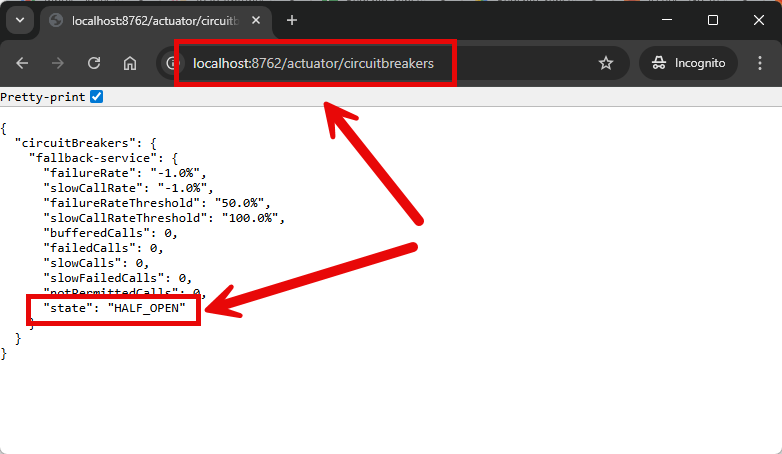
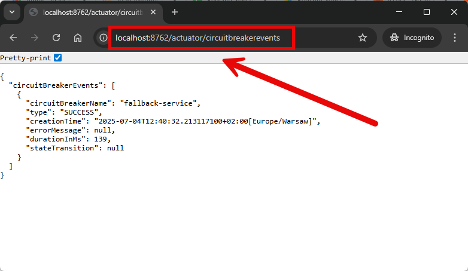

EXAMPLE
-------

DESCRIPTION
-----------

##### Goal
The goal of this project is to present how to use **Circuit Breaker** type **Resilience4J** in
a **microservice** with usage **Java** programming language and **Spring Cloud** and **Spring Boot 3** frameworks.
Circuit Breaker helps of handling 5xx or timeout errors - if such errors occur then special code is run.

Circuit Breaker stages:
* **CLOSED**: Circuit Breaker is turned off. It doesn't do anything. Original code handles requests
* **OPEN**: Circuit Breaker is turned on. It handles requests instead of original code
* **HALF_OPEN**: Circuit Breaker is turned on. It handles half of requests and check if it can switch to CLOSED state

Circuit Breaker and statuses:
* **Status 2xx**: everything is ok. Circuit Breaker should be turn off (state CLOSED)
* **Status 4xx**: problem on our side. Circuit Breaker should be turned off (state CLOSED)
* **Status 5xx**: problem of external service. Circuit Breaker should be turned on (states OPEN and HALF_OPEN)
* **Timeout**: problem of external service. Circuit Breaker should be turned on (states OPEN and HALF_OPEN)

##### Services
This project consists of following applications:
* **Second Service**: an application created in **Java** programming language with usage **Spring Boot** framework.
* **First Service**: an application created in **Java** programming language with usage **Spring Boot** framework. 
It has connection with Second Service

##### Terminology
Terminology explanation:
* **Git**: tool for distributed version control
* **Maven**: tool for build automation
* **Java**: object-oriented programming language
* **Spring Boot**: framework for Java. It consists of: Spring + Container + Configuration
* **Spring Cloud**: Spring Cloud is a framework within the Spring ecosystem that provides tools for building 
distributed systems and microservices. It simplifies tasks like service discovery, configuration management, 
load balancing, circuit breakers, and distributed tracing, allowing developers to build scalable and resilient 
cloud-native applications.
* **Circuit Breaker**: A circuit breaker in IT is a design pattern used to detect failures and prevent an application 
from trying to perform an operation that's likely to fail. It helps improve system stability and resilience by 
"breaking" the connection to a failing service temporarily, allowing it to recover before resuming operations. 
This is especially useful in microservices and distributed systems.
* **Resilience4J**: Resilience4j is a lightweight, fault-tolerance library designed for Java 8 and functional 
programming. It provides easy-to-use and customizable components like Circuit Breaker, Rate Limiter, Retry, Bulkhead, 
and TimeLimiter to build resilient and stable applications. It's designed to work well with frameworks like 
Spring Boot and can be integrated without heavy dependencies.

USAGES
------

This project can be tested in following configurations:
* **Usage Manual**: infrastructure services are started as Docker containers. Application services are started manually in command line
* **Usage Docker Compose**: all services are started as Docker containers definied in docker compose file.
* **Usage Kubernetes (Kind)**: all services are started as Kubernetes pods.

USAGE MANUAL
------------

> **Usage Manual** means that infrastructure services are started as Docker containers. Application services are started manually in command line.

> Please **clone/download** project, open **project's main folder** in your favorite **command line tool** and then **proceed with steps below**.

> **Prerequisites**:
* **Operating System** (tested on Windows 11)
* **Git** (tested on version 2.33.0.windows.2)
* **Java** (tested on version 23.0.1)
* **Maven** (tested on version 3.9.6)

##### Required steps:
1. In a second command line tool **start Second application** with `mvn -f ./springcloud-springboot3-circuitbreaker-r4j-apigateway_SERVICE spring-boot:run`
1. In a third command line tool **start First application** with `mvn -f ./springcloud-springboot3-circuitbreaker-r4j-apigateway_GATEWAY spring-boot:run`
1. In any Browser (e.g. Chrome) visit `http://localhost:8081/status/200`
   * Expected text: Second service returns status 200
   * Expected logs: N/A
1. In any Browser (e.g. Chrome) visit `http://localhost:8081/actuator/circuitbreakers`
   * Expected JSON with value: "state": "CLOSED"
1. In any Browser (e.g. Chrome) visit 3 times `http://localhost:8081/status/400`
   * Expected text: Temporary problem with the application. Our administrators will resolve it as soon as possible!
   * Expected logs: First service handles status 400 using interceptor
1. In any Browser (e.g. Chrome) visit `http://localhost:8081/actuator/circuitbreakers`
   * Expected JSON with value: "state": "CLOSED"
1. In any Browser (e.g. Chrome) visit 3 times `http://localhost:8081/status/500`
   * Expected text: Temporary problem with the application. It seems that external service is unavailable
   * Expected logs: First service handles an error using CircuitBreaker. Error details: 500 : "Second service returns status 500"
1. In any Browser (e.g. Chrome) visit `http://localhost:8081/actuator/circuitbreakers`
   * Expected JSON with value: "state": "OPEN"
1. In any Browser (e.g. Chrome) visit `http://localhost:8081/status/500`
   * Expected text: Temporary problem with the application. It seems that external service is unavailable
   * Expected logs: First service handles an error using CircuitBreaker. Error details: CircuitBreaker 'fallback-second' is OPEN and does not permit further calls
1. In any Browser (e.g. Chrome) visit `http://localhost:8081/actuator/circuitbreakers`
   * Expected JSON with value: "state": "OPEN"
1. Please wait at least 10 seconds
1. In any Browser (e.g. Chrome) visit `http://localhost:8081/actuator/circuitbreakers`
   * Expected JSON with value: "state": "HALF_OPEN"
1. In any Browser (e.g. Chrome) visit 3 times `http://localhost:8081/status/500`
   * Expected text: Temporary problem with the application. It seems that external service is unavailable
   * Expected logs: First service handles an error using CircuitBreaker. Error details: 500 : "Second service returns status 500"
1. In any Browser (e.g. Chrome) visit `http://localhost:8081/actuator/circuitbreakers`
   * Expected JSON with value: "state": "OPEN"
1. Please wait at least 10 seconds
1. In any Browser (e.g. Chrome) visit `http://localhost:8081/actuator/circuitbreakers`
   * Expected JSON with value: "state": "HALF_OPEN"
1. In any Browser (e.g. Chrome) visit 3 times `http://localhost:8081/status/200`
   * Expected text: Second service returns status 200
   * Expected logs: N/A
1. In any Browser (e.g. Chrome) visit `http://localhost:8081/actuator/circuitbreakers`
   * Expected JSON with value: "state": "CLOSED"
1. Clean up environment
   * In the third command line tool **stop First application** with `ctrl + C`
   * In the second command line tool **stop Second application** with `ctrl + C`

##### Optional steps:
1. In a command line tool check Circuit Breaker events with `http://localhost:8081/actuator/circuitbreakerevents`

USAGE DOCKER COMPOSE
--------------------

> **Usage Docker Compose** means all services are started as Docker containers defined in docker compose file.

> Please **clone/download** project, open **project's main folder** in your favorite **command line tool** and then **proceed with steps below**.

> **Prerequisites**:  
* **Operating System** (tested on Windows 11)
* **Git** (tested on version 2.33.0.windows.2)
* **Docker** (tested on version 4.33.1)

##### Required steps:
1. Start **Docker** tool
1. In any command line tool **start Docker containers** with `docker-compose -f .\docker-compose\docker-compose.yaml up -d --build`
1. In any Browser (e.g. Chrome) visit `http://localhost:8081/status/200`
   * Expected text: Second service returns status 200
   * Expected logs: N/A
1. In any Browser (e.g. Chrome) visit `http://localhost:8081/actuator/circuitbreakers`
   * Expected JSON with value: "state": "CLOSED"
1. In any Browser (e.g. Chrome) visit 3 times `http://localhost:8081/status/400`
   * Expected text: Temporary problem with the application. Our administrators will resolve it as soon as possible!
   * Expected logs: First service handles status 400 using interceptor
1. In any Browser (e.g. Chrome) visit `http://localhost:8081/actuator/circuitbreakers`
   * Expected JSON with value: "state": "CLOSED"
1. In any Browser (e.g. Chrome) visit 3 times `http://localhost:8081/status/500`
   * Expected text: Temporary problem with the application. It seems that external service is unavailable
   * Expected logs: First service handles an error using CircuitBreaker. Error details: 500 : "Second service returns status 500"
1. In any Browser (e.g. Chrome) visit `http://localhost:8081/actuator/circuitbreakers`
   * Expected JSON with value: "state": "OPEN"
1. In any Browser (e.g. Chrome) visit `http://localhost:8081/status/500`
   * Expected text: Temporary problem with the application. It seems that external service is unavailable
   * Expected logs: First service handles an error using CircuitBreaker. Error details: CircuitBreaker 'fallback-second' is OPEN and does not permit further calls
1. In any Browser (e.g. Chrome) visit `http://localhost:8081/actuator/circuitbreakers`
   * Expected JSON with value: "state": "OPEN"
1. Please wait at least 10 seconds
1. In any Browser (e.g. Chrome) visit `http://localhost:8081/actuator/circuitbreakers`
   * Expected JSON with value: "state": "HALF_OPEN"
1. In any Browser (e.g. Chrome) visit 3 times `http://localhost:8081/status/500`
   * Expected text: Temporary problem with the application. It seems that external service is unavailable
   * Expected logs: First service handles an error using CircuitBreaker. Error details: 500 : "Second service returns status 500"
1. In any Browser (e.g. Chrome) visit `http://localhost:8081/actuator/circuitbreakers`
   * Expected JSON with value: "state": "OPEN"
1. Please wait at least 10 seconds
1. In any Browser (e.g. Chrome) visit `http://localhost:8081/actuator/circuitbreakers`
   * Expected JSON with value: "state": "HALF_OPEN"
1. In any Browser (e.g. Chrome) visit 3 times `http://localhost:8081/status/200`
   * Expected text: Second service returns status 200
   * Expected logs: N/A
1. In any Browser (e.g. Chrome) visit `http://localhost:8081/actuator/circuitbreakers`
   * Expected JSON with value: "state": "CLOSED"
1. Clean up environment 
     * In a command line tool **remove Docker containers** with `docker-compose -f .\docker-compose\docker-compose.yaml down --rmi all`
     * Stop **Docker** tool

##### Optional steps:
1. In a command line tool check Circuit Breaker events with `http://localhost:8081/actuator/circuitbreakerevents`
1. In a command line tool validate Docker Compose with `docker-compose config`
1. In a command line tool check list of Docker images with `docker images`
1. In a command line tool check list of all Docker containers with `docker ps -a`
1. In a command line tool check list of active Docker containers with `docker ps`
1. In a command line tool check list of Docker nerworks with `docker network ls`
1. In a command line tool check SECOND container logs with `docker logs second-container`
1. In a command line tool check FIRST container logs with `docker logs first-container`

USAGE KUBERNETES (KIND)
---------------------------

> **Usage Kubernetes** means that all services are started as Kubernetes pods. 

> Please **clone/download** project, open **project's main folder** in your favorite **command line tool** and then **proceed with steps below**.

> **Prerequisites**:  
* **Operating System** (tested on Windows 11)
* **Git** (tested on version 2.33.0.windows.2)
* **Kind** (tested on version 0.26.0)

##### Required steps:
1. Start **Docker** tool
1. In the first command line tool create and start cluster **Kind** with `kind create cluster --name helloworld`
1. In the first command line tool **start Kubernetes Pods** with `kubectl apply -f ./k8s --recursive`
1. In the first command line tool **check status of Kubernetes Pods** with `kubectl get pods`
   * Expected mysql, second and first as **READY 1/1** (it can take few minutes)
1. In the second command line tool **forward port of Second service** with `kubectl port-forward service/second 8082:8082`
1. In the third command line tool **forward port of First service** with `kubectl port-forward service/first 8081:8081`
1. In any Browser (e.g. Chrome) visit `http://localhost:8081/status/200`
   * Expected text: Second service returns status 200
   * Expected logs: N/A
1. In any Browser (e.g. Chrome) visit `http://localhost:8081/actuator/circuitbreakers`
   * Expected JSON with value: "state": "CLOSED"
1. In any Browser (e.g. Chrome) visit 3 times `http://localhost:8081/status/400`
   * Expected text: Temporary problem with the application. Our administrators will resolve it as soon as possible!
   * Expected logs: First service handles status 400 using interceptor
1. In any Browser (e.g. Chrome) visit `http://localhost:8081/actuator/circuitbreakers`
   * Expected JSON with value: "state": "CLOSED"
1. In any Browser (e.g. Chrome) visit 3 times `http://localhost:8081/status/500`
   * Expected text: Temporary problem with the application. It seems that external service is unavailable
   * Expected logs: First service handles an error using CircuitBreaker. Error details: 500 : "Second service returns status 500"
1. In any Browser (e.g. Chrome) visit `http://localhost:8081/actuator/circuitbreakers`
   * Expected JSON with value: "state": "OPEN"
1. In any Browser (e.g. Chrome) visit `http://localhost:8081/status/500`
   * Expected text: Temporary problem with the application. It seems that external service is unavailable
   * Expected logs: First service handles an error using CircuitBreaker. Error details: CircuitBreaker 'fallback-second' is OPEN and does not permit further calls
1. In any Browser (e.g. Chrome) visit `http://localhost:8081/actuator/circuitbreakers`
   * Expected JSON with value: "state": "OPEN"
1. Please wait at least 10 seconds
1. In any Browser (e.g. Chrome) visit `http://localhost:8081/actuator/circuitbreakers`
   * Expected JSON with value: "state": "HALF_OPEN"
1. In any Browser (e.g. Chrome) visit 3 times `http://localhost:8081/status/500`
   * Expected text: Temporary problem with the application. It seems that external service is unavailable
   * Expected logs: First service handles an error using CircuitBreaker. Error details: 500 : "Second service returns status 500"
1. In any Browser (e.g. Chrome) visit `http://localhost:8081/actuator/circuitbreakers`
   * Expected JSON with value: "state": "OPEN"
1. Please wait at least 10 seconds
1. In any Browser (e.g. Chrome) visit `http://localhost:8081/actuator/circuitbreakers`
   * Expected JSON with value: "state": "HALF_OPEN"
1. In any Browser (e.g. Chrome) visit 3 times `http://localhost:8081/status/200`
   * Expected text: Second service returns status 200
   * Expected logs: N/A
1. In any Browser (e.g. Chrome) visit `http://localhost:8081/actuator/circuitbreakers`
   * Expected JSON with value: "state": "CLOSED"
1. Clean up environment
     * In the third command line tool **stop forwarding port of First service** with `ctrl + C`
     * In the second command line tool **stop forwarding port of Second service** with `ctrl + C`
     * In the first command line tool **remove Kubernetes Pods** with `kubectl delete -f ./k8s --recursive`
     * In the first command line tool delete cluster **Kind** with `kind delete cluster --name helloworld`
     * Stop **Docker** tool

##### Optional steps:
1. In a command line tool check Circuit Breaker events with `http://localhost:8081/actuator/circuitbreakerevents`
1. In a command line tool build Docker SECOND image with `docker build -f springcloud-springboot3-circuitbreaker-r4j-apigateway_SERVICE/Dockerfile -t wisniewskikr/springcloud-springboot3-circuitbreaker-r4j-apigateway_service:0.0.1 ./springcloud-springboot3-circuitbreaker-r4j-apigateway_SERVICE`
1. In a command line tool push Docker SECOND image to Docker Repository with `docker push wisniewskikr/springcloud-springboot3-circuitbreaker-r4j-apigateway_service:0.0.1` 
1. In a command line tool build Docker FIRST image with `docker build -f springcloud-springboot3-circuitbreaker-r4j-apigateway_GATEWAY/Dockerfile -t wisniewskikr/springcloud-springboot3-circuitbreaker-r4j-apigateway_gateway:0.0.1 ./springcloud-springboot3-circuitbreaker-r4j-apigateway_GATEWAY`
1. In a command line tool push Docker FIRST image to Docker Repository with `docker push wisniewskikr/springcloud-springboot3-circuitbreaker-r4j-apigateway_gateway:0.0.1`  
1. In the first command line tool with administrator privileges check clusers with `kind get clusters`
1. In a command line tool check Kubernetes Deployments with `kubectl get deployments`
1. In a command line tool check Kubernetes Deployments details with **kubectl describe deployment {deployment-name}**
1. In a command line tool check Kubernetes Services with `kubectl get services`
1. In a command line tool check Kubernetes Services details with **kubectl describe service {service-name}**
1. In a command line tool check Kubernetes Pods with `kubectl get pods`
1. In a command line tool check Kubernetes Pods details with **kubectl describe pod {pod-name}**
1. In a command line tool check Kubernetes Pods logs with **kubectl logs {pod-name}**

IMPLEMENTATION
--------------

Implementation details:
* In First service update file **pom.xml** with dependencies **spring-cloud-starter-circuitbreaker-resilience4j** and **spring-boot-starter-aop**
* In First service update file **application.properties** with properties **resilience4j.circuitbreaker.instances.status500fallback**
* In First Service update class **SecondClient** with annotations **@CircuitBreaker** and **@Retry**
* In First Service update class **SecondClient** with method **fallbackSecond()**
