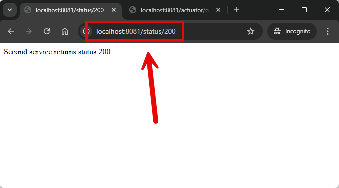
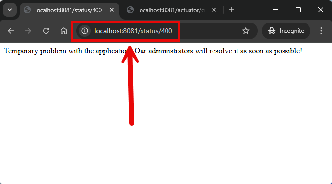

EXAMPLE
-------

DESCRIPTION
-----------

##### Goal
The goal of this project is to present how to create **basic ecosystem of microservices** with usage **Java** programming language and **Spring Cloud** and **Spring Boot 3** frameworks.

##### Services
This project consists of following applications:
* **Database**: SQL database - in this case type **MySql**
* **Second Service**: an application created in **Java** programming language with usage **Spring Boot** framework. It has connection with MySql database
* **First Service**: an application created in **Java** programming language with usage **Spring Boot** framework. It has connection with Second Service

##### Inputs
This project requires following inputs:
* **First Service**: http requests from any Rest Client. It handles GET method for paths "/public" and "/secured"

##### Outputs
This project provides following outputs:
* **First Service**: http responses with JSONs with data

##### Terminology
Terminology explanation:
* **Git**: tool for distributed version control
* **Maven**: tool for build automation
* **Java**: object-oriented programming language
* **Spring Boot**: framework for Java. It consists of: Spring + Container + Configuration
* **Spring Cloud**: Spring Cloud is a framework within the Spring ecosystem that provides tools for building distributed systems and microservices. It simplifies tasks like service discovery, configuration management, load balancing, circuit breakers, and distributed tracing, allowing developers to build scalable and resilient cloud-native applications.
* **Database**: A database is an organized collection of data that is stored and managed electronically, allowing for efficient retrieval, manipulation, and updating of information. It is typically managed by a database management system (DBMS).
* **MySql**: MySQL is an open-source relational database management system (RDBMS) that uses Structured Query Language (SQL) for managing and organizing data. It's widely used for web applications and is known for its speed, reliability, and ease of use.

USAGES
------

This project can be tested in following configurations:
* **Usage Manual**: infrastucture services are started as Docker containers. Application services are started manually in command line
* **Usage Docker Compose**: all services are started as Docker containers definied in docker compose file.
* **Usage Kubernetes (Kind)**: all services are started as Kubernetes pods.

USAGE MANUAL
------------

> **Usage Manual** means that infrastucture services are started as Docker containers. Application services are started manually in command line.

> Please **clone/download** project, open **project's main folder** in your favorite **command line tool** and then **proceed with steps below**.

> **Prerequisites**:
* **Operating System** (tested on Windows 11)
* **Git** (tested on version 2.33.0.windows.2)

##### Required steps:
1. In a second command line tool **start Second application** with `mvn -f ./springcloud-springboot3-circuitbreaker-resilience4j-service_SECOND spring-boot:run`
1. In a third command line tool **start First application** with `mvn -f ./springcloud-springboot3-circuitbreaker-resilience4j-service_FIRST spring-boot:run`
1. In any Rest Client (e.g. Postman) using GET method visit `http://localhost:8081/public`
   * Expected following **JSON**: {"text": "Hello World, Public!", "portFirst": "8081", "portSecond": "8082"}
1. In any Rest Client (e.g. Postman) using GET method visit `http://localhost:8081/secured`
   * Expected following **JSON**: {"text": "Hello World, Secured!", "portFirst": "8081", "portSecond": "8082"}
1. Clean up environment
   * In the third command line tool **stop First application** with `ctrl + C`
   * In the second command line tool **stop Second application** with `ctrl + C`

USAGE DOCKER COMPOSE
--------------------

> **Usage Docker Compse** means all services are started as Docker containers definied in docker compose file.

> Please **clone/download** project, open **project's main folder** in your favorite **command line tool** and then **proceed with steps below**.

> **Prerequisites**:  
* **Operating System** (tested on Windows 11)
* **Git** (tested on version 2.33.0.windows.2)
* **Docker** (tested on version 4.33.1)

##### Required steps:
1. Start **Docker** tool
1. In any command line tool **start Docker containers** with `docker-compose -f .\docker-compose\docker-compose.yaml up -d --build`
1. In any Rest Client (e.g. Postman) using GET method visit `http://localhost:8081/public`
   * Expected following **JSON**: {"text": "Hello World, Public!", "portFirst": "8081", "portSecond": "8082"}
1. In any Rest Client (e.g. Postman) using GET method visit `http://localhost:8081/secured`
   * Expected following **JSON**: {"text": "Hello World, Secured!", "portFirst": "8081", "portSecond": "8082"}
1. Clean up environment 
     * In a command line tool **remove Docker containers** with `docker-compose -f .\docker-compose\docker-compose.yaml down --rmi all`
     * Stop **Docker** tool

##### Optional steps:
1. In a command line tool validate Docker Compose with `docker-compose config`
1. In a command line tool check list of Docker images with `docker images`
1. In a command line tool check list of all Docker containers with `docker ps -a`
1. In a command line tool check list of active Docker containers with `docker ps`
1. In a command line tool check list of Docker nerworks with `docker network ls`
1. In a command line tool check SECOND container logs with `docker logs second-container`
1. In a command line tool check FIRST container logs with `docker logs first-container`

USAGE KUBERNETES (KIND)
---------------------------

> **Usage Kubernetes** means that all services are started as Kubernetes pods. 

> Please **clone/download** project, open **project's main folder** in your favorite **command line tool** and then **proceed with steps below**.

> **Prerequisites**:  
* **Operating System** (tested on Windows 11)
* **Git** (tested on version 2.33.0.windows.2)
* **Kind** (tested on version 0.26.0)

##### Required steps:
1. Start **Docker** tool
1. In the first command line tool create and start cluster **Kind** with `kind create cluster --name helloworld`
1. In the first command line tool **start Kubernetes Pods** with `kubectl apply -f ./k8s --recursive`
1. In the first command line tool **check status of Kubernetes Pods** with `kubectl get pods`
   * Expected mysql, second and first as **READY 1/1** (it can take few minutes)
1. In the second command line tool **forward port of Second service** with `kubectl port-forward service/second 8082:8082`
1. In the third command line tool **forward port of First service** with `kubectl port-forward service/first 8081:8081`
1. In any Rest Client (e.g. Postman) using GET method visit `http://localhost:8081/public`
   * Expected following **JSON**: {"text": "Hello World, Public!", "portFirst": "8081", "portSecond": "8082"}
1. In any Rest Client (e.g. Postman) using GET method visit `http://localhost:8081/secured`
   * Expected following **JSON**: {"text": "Hello World, Secured!", "portFirst": "8081", "portSecond": "8082"}
1. Clean up environment
     * In the third command line tool **stop forwarding port of First service** with `ctrl + C`
     * In the second command line tool **stop forwarding port of Second service** with `ctrl + C`
     * In the first command line tool **remove Kubernetes Pods** with `kubectl delete -f ./k8s --recursive`
     * In the first command line tool delete cluster **Kind** with `kind delete cluster --name helloworld`
     * Stop **Docker** tool

##### Optional steps:
1. In a command line tool build Docker SECOND image with `docker build -f springcloud-springboot3-circuitbreaker-resilience4j-service_SECOND/Dockerfile -t wisniewskikr/springcloud-springboot3-circuitbreaker-resilience4j-service_second:0.0.1 ./springcloud-springboot3-circuitbreaker-resilience4j-service_SECOND`
1. In a command line tool push Docker SECOND image to Docker Repository with `docker push wisniewskikr/springcloud-springboot3-circuitbreaker-resilience4j-service_second:0.0.1` 
1. In a command line tool build Docker FIRST image with `docker build -f springcloud-springboot3-circuitbreaker-resilience4j-service_FIRST/Dockerfile -t wisniewskikr/springcloud-springboot3-circuitbreaker-resilience4j-service_first:0.0.1 ./springcloud-springboot3-circuitbreaker-resilience4j-service_FIRST`
1. In a command line tool push Docker FIRST image to Docker Repository with `docker push wisniewskikr/springcloud-springboot3-circuitbreaker-resilience4j-service_first:0.0.1`  
1. In the first command line tool with administrator privileges check clusers with `kind get clusters`
1. In a command line tool check Kubernetes Deployments with `kubectl get deployments`
1. In a command line tool check Kubernetes Deployments details with **kubectl describe deployment {deployment-name}**
1. In a command line tool check Kubernetes Services with `kubectl get services`
1. In a command line tool check Kubernetes Services details with **kubectl describe service {service-name}**
1. In a command line tool check Kubernetes Pods with `kubectl get pods`
1. In a command line tool check Kubernetes Pods details with **kubectl describe pod {pod-name}**
1. In a command line tool check Kubernetes Pods logs with **kubectl logs {pod-name}**

IMPLEMENTATION
--------------

Implementation details:
* In First service update file **pom.xml** with dependencies **spring-cloud-starter-circuitbreaker-resilience4j** and **spring-boot-starter-aop**
* In First service update file **application.properties** with properties **resilience4j.circuitbreaker.instances.status500fallback**
* In First Service update class **SecondClient** with annotations **@CircuitBreaker** and **@Retry**
* In First Service update class **SecondClient** with method **status500Fallback()**
