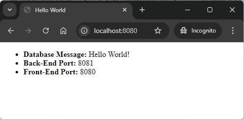

EXAMPLE
-------

DESCRIPTION
-----------

##### Goal
The goal of this project is to present how to create **chain of applications (microservices)** with a **config service** with usage **Java** programming language and **Spring Cloud** framework. Config service enables reading configuration properties stored on the Github. 

Link tu Github project with properties: `https://github.com/wisniewskikr/springcloud-fe-thymeleaf-be-springboot-db-sql-mysql-config.git`. Propeties are stored in different branches regarding to usage:
* branch **manual**: for Usage Manual + Docker
* branch **docker**: for Usage Docker
* branch **docker-compose**: for *sage Docker Compose
* branch **kubernetes**: for Usage Kubernetes

##### Content
This project consists of following applications:
* **Database**: SQL database - in this case type **MySql**
* **Back-End**: an application created in **Java** programming language with usage **Spring Boot** framework
* **Front-End**: an application created in **Java** programming language with usage **Spring Boot** framework. **Thymeleaf** engine is used to display data
* **Config Server**: a tool which reads configuration from external source (like Github etc.)

##### Input
This project requires following inputs:
* **FE**: FE service consumes http request from any browser

##### Outputs
This project provides following outpus:
* **FE**: FE service produces http response to any browser. This response consists of:
   * **Database Message**: the HTML displays the message stored in database. It's the simple text "Hello World!".
   * **Back-End Port**: the HTML page displays the port of Back-End application.
   * **Front-End Port**: the HTML page displays port of Front-End application.

##### Terminology
Terminology explanation:
* **Git**: tool for distributed version control
* **Maven**: tool for build automation
* **Java**: object-oriented programming language
* **Spring Boot**: framework for Java. It consists of: Spring + Container + Configuration
* **Database**: A database is an organized collection of data that is stored and managed electronically, allowing for efficient retrieval, manipulation, and updating of information. It is typically managed by a database management system (DBMS).
* **MySql**: MySQL is an open-source relational database management system (RDBMS) that uses Structured Query Language (SQL) for managing and organizing data. It's widely used for web applications and is known for its speed, reliability, and ease of use.
* **Back-End**: The back-end refers to the server-side part of a software application, responsible for managing the database, server logic, and application programming interface (API). It processes requests from the front-end (user interface), handles data storage, retrieval, and business logic, and sends the appropriate responses back to the front-end.
* **Front-End**: Front-end refers to the part of a website or application that users interact with directly. It includes the visual elements, layout, and design, typically built using HTML, CSS, and JavaScript. The front-end is responsible for the user experience (UX) and interface (UI) that allows users to navigate and interact with the system.
* **Thymeleaf**: Thymeleaf is a modern server-side Java template engine for Java-based web applications. It processes HTML, XML, JavaScript, CSS, and plain text, integrating with the Spring framework. It allows dynamic content rendering on the server while ensuring templates are HTML-compliant. Thymeleaf's key features include natural templates (which work as valid HTML even before rendering), easy integration with Spring MVC, and powerful expressions for iterating, conditional display, and data binding. It's often used to create dynamic web pages that combine static HTML with server-side logic in a clean and intuitive way.
* **Spring Cloud**: Spring Cloud is a framework within the Spring ecosystem that provides tools for building distributed systems and microservices. It simplifies tasks like service discovery, configuration management, load balancing, circuit breakers, and distributed tracing, allowing developers to build scalable and resilient cloud-native applications.
* **Microservices**: Microservices are a software architecture style where an application is built as a collection of small, independent services that communicate through APIs. Each service focuses on a specific business function, allowing for easier scaling, deployment, and maintenance.
* **Spring Cloud Config**: Spring Cloud Config is a tool within the Spring Cloud ecosystem that provides server-side and client-side support for externalized configuration in distributed systems. It allows you to store configuration data centrally (e.g., in a Git repository) and share it across multiple microservices, ensuring consistent and manageable configuration settings for your entire application environment.

USAGES
------

This project can be tested in following configurations:
* **Usage Docker Compose (Recommended)**: all services are started as Docker containers definied in "docker-compose/with-custom-services/docker-compose.yaml" file.
* **Usage Kubernetes (Minikube) (Recommended)**: all services are started as Kubernetes pods.
* **Usage Manual + Docker**: custom services are started manually from command line. Other services (like Sql Databases, NoSql Databases etc.) are started as Docker containers.
* **Usage Docker**: all services are started as Docker containers.

USAGE DOCKER COMPOSE (RECOMMENDED)
----------------------------------

> **Usage Docker Compse** means that all services are started as Docker containers definied in "docker-compose.yaml" file.

> Please **clone/download** project, open **project's main folder** in your favorite **command line tool** and then **proceed with steps below**.

> Please be aware that following tools should be installed on your local PC:  
* **Operating System** (tested on Windows 11)
* **Git** (tested on version 2.33.0.windows.2)
* **Docker** (tested on version 4.33.1)

##### Required steps:
1. Start **Docker** tool
1. In a command line tool **start Docker containers** with `docker-compose up -d --build`
1. In a browser visit `http://localhost:8080`
   * Expected HTML page with **Database Message**, **Back-End Port** and **Front-End Port** 
1. Clean up environment 
     * In a command line tool **remove Docker containers** with `docker-compose down --rmi all`
     * Stop **Docker** tool

##### Optional steps:
1. In a browser check Back-End application healthcheck with `http://localhost:8081/actuator/health`
1. In a browser check Back-End application API result with `http://localhost:8081/message/1`
1. In a browser check Front-End application healthcheck with `http://localhost:8080/actuator/health`
1. In a command line tool validate Docker Compose with `docker-compose config`
1. In a command line tool check list of Docker images with `docker images`
1. In a command line tool check list of all Docker containers with `docker ps -a`
1. In a command line tool check list of active Docker containers with `docker ps`
1. In a command line tool check list of Docker nerworks with `docker network ls`
1. In a command line tool check BE container logs with `docker logs be-container`
1. In a command line tool check FE container logs with `docker logs fe-container`

USAGE KUBERNETES (MINIKUBE) (RECOMMENDED)
-----------------------------------------

> **Usage Kubernetes** means that all services are started as Kubernetes pods. 

> Please **clone/download** project, open **project's main folder** in your favorite **command line tool** and then **proceed with steps below**.

> Please be aware that following tools should be installed on your local PC:  
* **Operating System** (tested on Windows 11)
* **Git** (tested on version 2.33.0.windows.2)
* **Minikube** (tested on version 1.33.1)

##### Required steps:
1. In the first command line tool **with administrator privileges** start **Minikube** with `minikube start`
1. In the second command line tool **start Kubernetes Pods** with `kubectl apply -f kubernetes.yaml`
1. In the second command line tool **check status of Kubernetes Pods** with `kubectl get pods`
   * Expected mysql, be and fe as **READY 1/1** (it can take few minutes)
1. In the first command line tool **with administrator privileges** display FE service in a Browser with `minikube service fe-service`
   * Expected HTML page with **Database Message**, **Back-End Port** and **Front-End Port** 
1. Clean up environment 
     * In the second command line tool **remove Kubernetes Pods** with `kubectl delete -f kubernetes.yaml`
     * In the first command line tool **with administrator privileges** stop **Minikube** with `minikube stop`

##### Optional steps:
1. In a command line tool build Docker CONFIG image with `docker build -f springboot3-microservices-config-valut_SERVER/Dockerfile -t wisniewskikr/springboot3-microservices-config-valut_server:0.0.1 ./springboot3-microservices-config-valut_SERVER`
1. In a command line tool push Docker CONFIG image to Docker Repository with `docker push wisniewskikr/springboot3-microservices-config-valut_server:0.0.1`
1. In a command line tool build Docker BE image with `docker build -f springboot3-microservices-config-valut_BE/Dockerfile -t wisniewskikr/springboot3-microservices-config-valut_be:0.0.1 ./springboot3-microservices-config-valut_BE`
1. In a command line tool push Docker BE image to Docker Repository with `docker push wisniewskikr/springboot3-microservices-config-valut_be:0.0.1` 
1. In a command line tool build Docker FE image with `docker build -f springboot3-microservices-config-valut_FE/Dockerfile -t wisniewskikr/springboot3-microservices-config-valut_fe:0.0.1 ./springboot3-microservices-config-valut_FE`
1. In a command line tool push Docker FE image to Docker Repository with `docker push wisniewskikr/springboot3-microservices-config-valut_fe:0.0.1` 
1. In the first command line tool with administrator privileges check status of Minikube with `minikube status`
1. In the first command line tool with administrator privileges check Docker images in Minikube with `minikube ssh docker images`
1. In the first command line tool with administrator privileges check Docker containers in Minikube with `minikube ssh docker ps`
1. In a command line tool check Kubernetes Deployments with `kubectl get deployments`
1. In a command line tool check Kubernetes Deployments details with **kubectl describe deployment {deployment-name}**
1. In a command line tool check Kubernetes Services with `kubectl get services`
1. In a command line tool check Kubernetes Services details with **kubectl describe service {service-name}**
1. In a command line tool check Kubernetes Pods with `kubectl get pods`
1. In a command line tool check Kubernetes Pods details with **kubectl describe pod {pod-name}**
1. In a command line tool check Kubernetes Pods logs with **kubectl log {pod-name}**

USAGE MANUAL + DOCKER
---------------------

> **Usage Manual** means that custom services are started manually from command line. Other services (like Sql Databases, NoSql Databases etc.) are started as Docker containers.

> Please **clone/download** project, open **project's main folder** in your favorite **command line tool** and then **proceed with steps below**. 

> Please be aware that following tools should be installed on your local PC:  
* **Operating System** (tested on Windows 11)
* **Java** (tested on version 17.0.5)
* **Maven** (tested on version 3.8.5)
* **Git** (tested on version 2.33.0.windows.2)
* **Docker** (tested on version 4.33.1)

##### Required steps:
1. Start **Docker** tool
1. In the first command line tool **start Docker MySql container** with `docker run -d --name mysql-container -e MYSQL_ROOT_PASSWORD=my_secret_password -e MYSQL_DATABASE=database -e MYSQL_USER=admin -e MYSQL_PASSWORD=admin123 -p 3306:3306 mysql:5.7`
1. In the second command line tool **start Config application** with `mvn -f ./springboot3-microservices-config-valut_SERVER spring-boot:run`
1. In the third command line tool (it has to be **BASH** tool e.g. Git Bash) **start Back-End application** with `mvn -f ./springboot3-microservices-config-valut_BE spring-boot:run -Dspring-boot.run.arguments="--spring.config.import=configserver:http://localhost:8888"`
1. In the fourth command line tool (it has to be **BASH** tool e.g. Git Bash) **start Front-End application** with `mvn -f ./springboot3-microservices-config-valut_FE spring-boot:run -Dspring-boot.run.arguments="--spring.config.import=configserver:http://localhost:8888"`
1. In a browser visit `http://localhost:8080`
   * Expected HTML page with **Database Message**, **Back-End Port** and **Front-End Port** 
1. Clean up environment 
     * In the fourth command line tool **stop Front-End application** with `ctrl + C`
     * In the third command line tool **stop Back-End application** with `ctrl + C`
     * In the second command line tool **stop Config application** with `ctrl + C`
     * In the first command line tool **stop and remove Docker MySql container** with `docker rm -f mysql-container`
     * In the first command line tool **remove Docker MySql image** with `docker rmi mysql:5.7`
     * Stop **Docker** tool

##### Optional steps:
1. In a browser check Back-End application healthcheck with `http://localhost:8081/actuator/health`
1. In a browser check Back-End application API result with `http://localhost:8081/message/1`
1. In a browser check Front-End application healthcheck with `http://localhost:8080/actuator/health`
1. In a command line tool check list of Docker images with `docker images`
1. In a command line tool check list of all Docker containers with `docker ps -a`
1. In a command line tool check list of active Docker containers with `docker ps`

USAGE DOCKER
------------

> **Usage Docker** means that all services are started as Docker containers. 

> Please **clone/download** project, open **project's main folder** in your favorite **command line tool** and then **proceed with steps below**.

> Please be aware that following tools should be installed on your local PC:  
* **Operating System** (tested on Windows 11)
* **Git** (tested on version 2.33.0.windows.2)
* **Docker** (tested on version 4.33.1)

##### Required steps:
1. Start **Docker** tool
1. In a command line tool create **Docker Network** with `docker network create helloworld-network`
1. In a command line tool build and start **Docker container MySql** database with `docker run -d --name mysql-container -e MYSQL_ROOT_PASSWORD=my_secret_password -e MYSQL_DATABASE=database -e MYSQL_USER=admin -e MYSQL_PASSWORD=admin123 -p 3306:3306 --network helloworld-network mysql:5.7`
1. In a command line tool build **Docker image CONFIG** with `docker build -f springboot3-microservices-config-valut_SERVER/Dockerfile -t config-image:0.0.1 ./springboot3-microservices-config-valut_SERVER`
1. In a command line tool build and start **Docker container CONFIG** with `docker run -p 8888:8888 --name config-container --network helloworld-network -e spring.cloud.config.server.git.default-label=docker -d config-image:0.0.1`
1. In a command line tool build **Docker image BE** with `docker build -f springboot3-microservices-config-valut_BE/Dockerfile -t be-image:0.0.1 ./springboot3-microservices-config-valut_BE`
1. In a command line tool build and start **Docker container BE** with `docker run -p 8081:8081 --name be-container -e spring.config.import=configserver:http://config-container:8888 --network helloworld-network -d be-image:0.0.1`
1. In a command line tool build **Docker image FE** with `docker build -f springboot3-microservices-config-valut_FE/Dockerfile -t fe-image:0.0.1 ./springboot3-microservices-config-valut_FE`
1. In a command line tool build and start **Docker container FE** with `docker run -p 8080:8080 --name fe-container -e spring.config.import=configserver:http://config-container:8888 --network helloworld-network -d fe-image:0.0.1`
1. In a browser visit `http://localhost:8080`
   * Expected HTML page with **Database Message**, **Back-End Port** and **Front-End Port**  
1. Clean up environment 
     * In a command line tool stop and remove **BE Docker container** with `docker rm -f fe-container`
     * In a command line tool remove **BE Docker image** with `docker rmi fe-image:0.0.1`
     * In a command line tool stop and remove **FE Docker container** with `docker rm -f be-container`
     * In a command line tool remove **FE Docker image** with `docker rmi be-image:0.0.1`
     * In a command line tool stop and remove **CONFIG Docker container** with `docker rm -f config-container`
     * In a command line tool remove **CONFIG Docker image** with `docker rmi config-image:0.0.1`
     * In a command line tool stop and remove **Database Docker container** with `docker rm -f mysql-container`
     * In a command line tool remove **Database Docker image** with `docker rmi mysql:5.7`
     * In a command line tool remove **Docker Nerwork** with `docker network rm helloworld-network`
     * Stop **Docker** tool

##### Optional steps:
1. In a browser check Back-End application healthcheck with `http://localhost:8081/actuator/health`
1. In a browser check Back-End application API result with `http://localhost:8081/message/1`
1. In a browser check Front-End application healthcheck with `http://localhost:8080/actuator/health`
1. In a command line tool check list of Docker images with `docker images`
1. In a command line tool check list of all Docker containers with `docker ps -a`
1. In a command line tool check list of active Docker containers with `docker ps`
1. In a command line tool check list of Docker nerworks with `docker network ls`
1. In a command line tool check BE container logs with `docker logs be-container`
1. In a command line tool check FE container logs with `docker logs fe-container`

IMPLEMENTATION
--------------

Implementation details for **Config Server**:
* Update file **pom.xml** with **spring-boot-starter-web** and **spring-cloud-config-server** dependencies
* Update start class with annotation **@EnableConfigServer**
* Update file **application.properties** with property **spring.cloud.config.server.git.uri** and **spring.cloud.config.server.git.default-label**

Implementation details for **Config Client**:
* Update file **pom.xml** with **spring-boot-starter-web** and **spring-cloud-starter-config** dependencies
* Update file **application.properties** with property **spring.config.import**

Implementation details for **Git Repository**:
* In Git repository create properties per client **<client-name>.properties** (for instance "be.properties", "fe.properties" etc.)