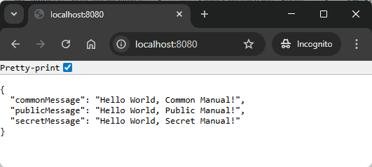
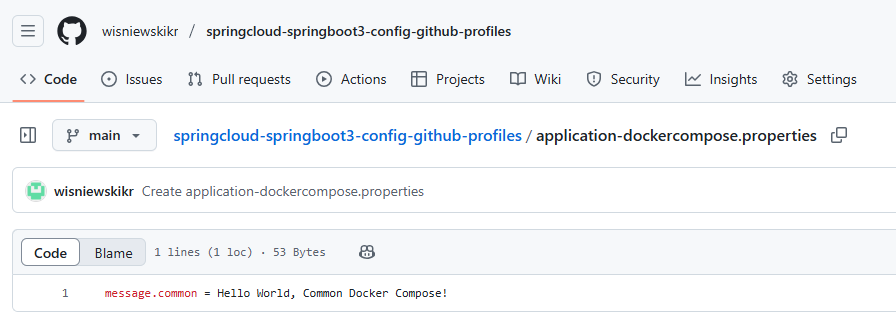
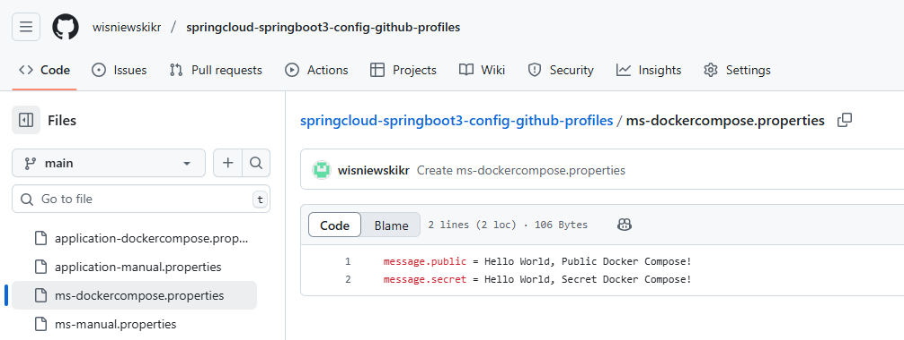
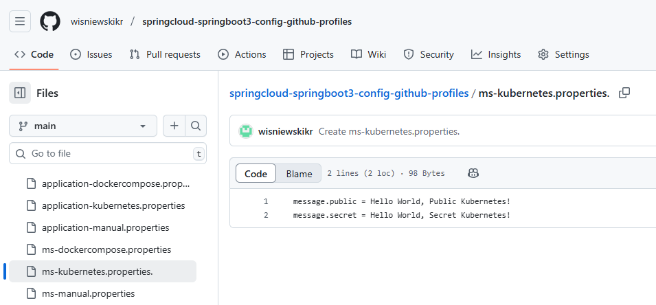

EXAMPLE MANUAL
--------------

EXAMPLE DOCKER COMPOSE
----------------------

EXAMPLE KUBERNETES
------------------

DESCRIPTION
-----------

##### Goal
The goal of this project is to present how to create **Config Server** which reads properties from **public github**
repository from specific **branch** and connect it with microservice with usage **Java** programming language and **Spring Cloud** framework. 

Config service enables reading configuration properties from different sources like: github, file etc. In this
case properties are read from public Github repository and sent to microservice. This microservice displays
these properties: common, public and secret.

Github repository: https://github.com/wisniewskikr/springcloud-springboot3-config-github-profiles

Checking Github properties on Spring Cloud: `http://<CONFIG-SERVER-HOST>:<PORT>/<application>/<profile>[/<label>]`

Explanation:
* **Profile**: Maven profile. Default is "default"
* **Label**: Github branch. Default is "main"

##### Content
This project consists of following applications:
* **MS**: an application created in **Java** programming language with usage **Spring Boot** framework. It reads
properties from Config Server
* **Config**: a tool which reads configuration from external source (like Github etc.)

##### Terminology
Terminology explanation:
* **Git**: tool for distributed version control
* **Maven**: tool for build automation
* **Java**: object-oriented programming language
* **Spring Boot**: framework for Java. It consists of: Spring + Container + Configuration
* **Spring Cloud**: Spring Cloud is a framework within the Spring ecosystem that provides tools for building 
distributed systems and microservices. It simplifies tasks like service discovery, configuration management, 
load balancing, circuit breakers, and distributed tracing, allowing developers to build scalable 
and resilient cloud-native applications.
* **Microservices**: Microservices are a software architecture style where an application is built as a collection of 
small, independent services that communicate through APIs. Each service focuses on a specific business function, 
allowing for easier scaling, deployment, and maintenance.
* **Spring Cloud Config**: Spring Cloud Config is a tool within the Spring Cloud ecosystem that provides server-side 
and client-side support for externalized configuration in distributed systems. It allows you to store configuration 
data centrally (e.g., in a Git repository) and share it across multiple microservices, ensuring consistent and 
manageable configuration settings for your entire application environment.

USAGES
------

This project can be tested in following configurations:
* **Usage Manual**: application services are started manually in command line
* **Usage Docker Compose**: all services are started as Docker containers defined in docker compose file.
* **Usage Kubernetes (Kind)**: all services are started as Kubernetes pods.

USAGE MANUAL
------------

> **Usage Manual** means that application services are started manually in command line.

> Please **clone/download** project, open **project's main folder** in your favorite **command line tool** 
> and then **proceed with steps below**.

> **Prerequisites**:
* **Operating System** (tested on Windows 11)
* **Git** (tested on version 2.33.0.windows.2)

##### Required steps:
1. Create **Github repository** with **manual** branch with following files:
   * File **application.properties** with properties: `message.common = Hello World, Common Manual!`
   * File **ms.properties** with properties: `message.public = Hello World, Public Manual!` and `message.secret = Hello World, Secret Manual!`
1. In **Config** module update file **src/main/resources/application.properties** with property `spring.cloud.config.server.git.uri` which should contain URI to Github repository
1. In a first command line tool **start CONFIG application** with `mvn -f ./springcloud-springboot3-config-github-profiles_CONFIG spring-boot:run`
1. In a second command line tool **start MS application** with `mvn -f ./springcloud-springboot3-config-github-profiles_MS spring-boot:run`
1. In any Internet Browser (e.g. Chrome) visit `http://localhost:8080`
    * Expected HTML page with following JSON: `{"commonMessage":"Hello World, Common Manual!","publicMessage":"Hello World, Public Manual!","secretMessage":"Hello World, Secret Manual!"}`
1. Clean up environment
    * In the second command line tool **stop MS application** with `ctrl + C`
    * In the first command line tool **stop CONFIG application** with `ctrl + C`
    * Remove **Github repository**

##### Optional steps:
1. Check properties of MS service with `http://localhost:8888/ms/default/manual`

USAGE DOCKER COMPOSE
--------------------

> **Usage Docker Compose** means all services are started as Docker containers defined in docker compose file.

> Please **clone/download** project, open **project's main folder** in your favorite **command line tool** and 
then **proceed with steps below**.

> **Prerequisites**:
* **Operating System** (tested on Windows 11)
* **Git** (tested on version 2.33.0.windows.2)
* **Docker** (tested on version 4.33.1)

##### Required steps:
1. Create **Github repository** with **docker-compose** branch with following files:
   * File **application.properties** with properties: `message.common = Hello World, Common Docker Compose!`
   * File **ms.properties** with properties: `message.public = Hello World, Public Docker Compose!` and `message.secret = Hello World, Secret Docker Compose!`
1. Update file **docker-compose/docker-compose.yaml** with property `spring.cloud.config.server.git.uri` which should contain URI to Github repository
1. Start **Docker** tool
1. In any command line tool **start Docker containers** with `docker-compose -f .\docker-compose\docker-compose.yaml up -d --build`
1. In any Internet Browser (e.g. Chrome) visit `http://localhost:8080`
   * Expected HTML page with following JSON: `{"commonMessage":"Hello World, Common Dccker Compose!","publicMessage":"Hello World, Public Docker Compose!","secretMessage":"Hello World, Secret Docker Compose!"}`
1. Clean up environment
   * In a command line tool **remove Docker containers** with `docker-compose -f .\docker-compose\docker-compose.yaml down --rmi all`
   * Stop **Docker** tool

##### Optional steps:
1. Check properties of MS service with `http://localhost:8888/ms/default/docker-compose`
1. In a command line tool validate Docker Compose with `docker-compose config`
1. In a command line tool check list of Docker images with `docker images`
1. In a command line tool check list of all Docker containers with `docker ps -a`
1. In a command line tool check list of active Docker containers with `docker ps`
1. In a command line tool check list of Docker nerworks with `docker network ls`
1. In a command line tool check CONFIG container logs with `docker logs config-container`
1. In a command line tool check MS container logs with `docker logs ms-container`

USAGE KUBERNETES (KIND)
---------------------------

> **Usage Kubernetes** means that all services are started as Kubernetes pods.

> Please **clone/download** project, open **project's main folder** in your favorite **command line tool** and then **proceed with steps below**.

> **Prerequisites**:
* **Operating System** (tested on Windows 11)
* **Git** (tested on version 2.33.0.windows.2)
* **Kind** (tested on version 0.26.0)

##### Required steps:
1. Create **Github repository** with **kubernetes** branch with following files:
   * File **application.properties** with properties: `message.common = Hello World, Common Kubernetes!`
   * File **ms.properties** with properties: `message.public = Hello World, Public Kubernetes!` and `message.secret = Hello World, Secret Kubernetes!`
1. Update file **k8s/config.yaml** with property `spring.cloud.config.server.git.uri` which should contain URI to Github repository
1. Start **Docker** tool
1. In the first command line tool create and start cluster **Kind** with `kind create cluster --name helloworld`
1. In the second command line tool **start Kubernetes Pods** with `kubectl apply -f ./k8s --recursive`
1. In the second command line tool **check status of Kubernetes Pods** with `kubectl get pods`
   * Expected services as **READY 1/1** (it can take few minutes)
1. In the second command line tool **forward port of CONFIG service** with `kubectl port-forward service/config 8888:8888`
1. In the third command line tool **forward port of MS service** with `kubectl port-forward service/ms 8080:8080`
1. In any Internet Browser (e.g. Chrome) visit `http://localhost:8080`
   * Expected HTML page with following JSON: `{"commonMessage":"Hello World, Common Kubernetes!","publicMessage":"Hello World, Public Kubernetes!","secretMessage":"Hello World, Secret Kubernetes!"}`
1. Clean up environment
   * In the third command line tool **stop forwarding port of MS service** with `ctrl + C`
   * In the second command line tool **stop forwarding port of CONFIG service** with `ctrl + C`
   * In the first command line tool **remove Kubernetes Pods** with `kubectl delete -f ./k8s --recursive`
   * In the first command line tool delete cluster **Kind** with `kind delete cluster --name helloworld`
   * Stop **Docker** tool

##### Optional steps:
1. Check properties of MS service with `http://localhost:8888/ms/default/kubernetes`
1. In a command line tool build Docker MS image with `docker build -f springcloud-springboot3-config-github-profiles_MS/Dockerfile -t wisniewskikr/springcloud-springboot3-config-github-profiles_ms:0.0.1 ./springcloud-springboot3-config-github-profiles_MS`
1. In a command line tool push Docker MS image to Docker Repository with `docker push wisniewskikr/springcloud-springboot3-config-github-profiles_ms:0.0.1`
1. In a command line tool build Docker CONFIG image with `docker build -f springcloud-springboot3-config-github-profiles_CONFIG/Dockerfile -t wisniewskikr/springcloud-springboot3-config-github-profiles_config:0.0.1 ./springcloud-springboot3-config-github-profiles_CONFIG`
1. In a command line tool push Docker CONFIG image to Docker Repository with `docker push wisniewskikr/springcloud-springboot3-config-github-profiles_config:0.0.1`
1. In the first command line tool with administrator privileges check clusters with `kind get clusters`
1. In a command line tool check Kubernetes Deployments with `kubectl get deployments`
1. In a command line tool check Kubernetes Deployments details with **kubectl describe deployment {deployment-name}**
1. In a command line tool check Kubernetes Services with `kubectl get services`
1. In a command line tool check Kubernetes Services details with **kubectl describe service {service-name}**
1. In a command line tool check Kubernetes Pods with `kubectl get pods`
1. In a command line tool check Kubernetes Pods details with **kubectl describe pod {pod-name}**
1. In a command line tool check Kubernetes Pods logs with **kubectl logs {pod-name}**

IMPLEMENTATION
--------------

Implementation details:
* In Config module update pom.xml file with `spring-cloud-config-server`
* In Config module update application.properties file with `spring.cloud.config.server.git.uri`
and `spring.cloud.config.server.git.default-label`
* In Config module update ApplicationConfig class with `@EnableConfigServer`
* In MS module update pom.xml file with `spring-cloud-starter-config`
* In MS module update application.properties file with `spring.config.import`