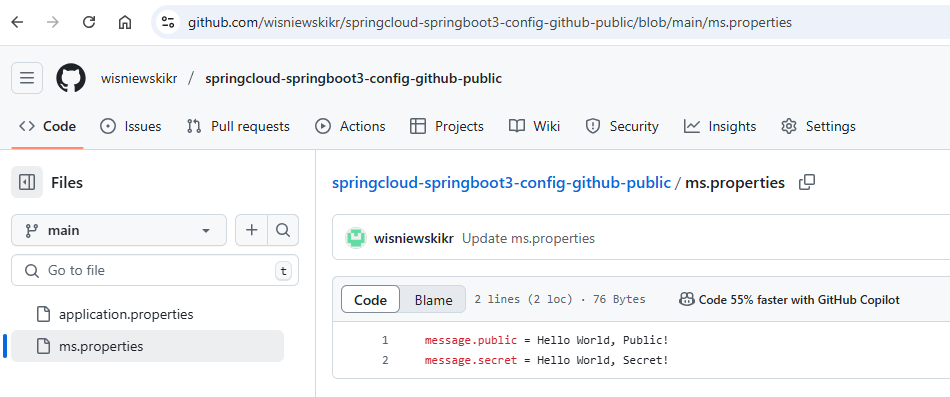

EXAMPLE
-------

DESCRIPTION
-----------

##### Goal
The goal of this project is to present how to create **Config Server** which reads properties from **public github**
repository and connect it with microservice with usage **Java** programming language and **Spring Cloud** framework. 

Config service enables reading configuration properties from different sources like: github, file etc. In this
case properties are read from public Github repository and sent to microservice. This microservice displays
these properties: common, public and secret.

Github repository: https://github.com/wisniewskikr/springcloud-springboot3-config-github-public

##### Content
This project consists of following applications:
* **MS**: an application created in **Java** programming language with usage **Spring Boot** framework. It reads
properties from Config Server
* **Config**: a tool which reads configuration from external source (like Github etc.)

##### Terminology
Terminology explanation:
* **Git**: tool for distributed version control
* **Maven**: tool for build automation
* **Java**: object-oriented programming language
* **Spring Boot**: framework for Java. It consists of: Spring + Container + Configuration
* **Spring Cloud**: Spring Cloud is a framework within the Spring ecosystem that provides tools for building 
distributed systems and microservices. It simplifies tasks like service discovery, configuration management, 
load balancing, circuit breakers, and distributed tracing, allowing developers to build scalable 
and resilient cloud-native applications.
* **Microservices**: Microservices are a software architecture style where an application is built as a collection of 
small, independent services that communicate through APIs. Each service focuses on a specific business function, 
allowing for easier scaling, deployment, and maintenance.
* **Spring Cloud Config**: Spring Cloud Config is a tool within the Spring Cloud ecosystem that provides server-side 
and client-side support for externalized configuration in distributed systems. It allows you to store configuration 
data centrally (e.g., in a Git repository) and share it across multiple microservices, ensuring consistent and 
manageable configuration settings for your entire application environment.

USAGES
------

This project can be tested in following configurations:
* **Usage Manual**: custom services are started manually from command line.
* **Usage Docker Compose**: all services are started as Docker containers defined in docker-compose file
* **Usage Kubernetes (Kind)**: all services are started as Kubernetes pods.

IMPLEMENTATION
--------------

Implementation details:
* In Config module update pom.xml file with `spring-cloud-config-server`
* In Config module update application.properties file with `spring.cloud.config.server.git.uri`
* In Config module update ApplicationConfig class with `@EnableConfigServer`
* In MS module update pom.xml file with `spring-cloud-starter-config`
* In MS module update application.properties file with `spring.config.import`