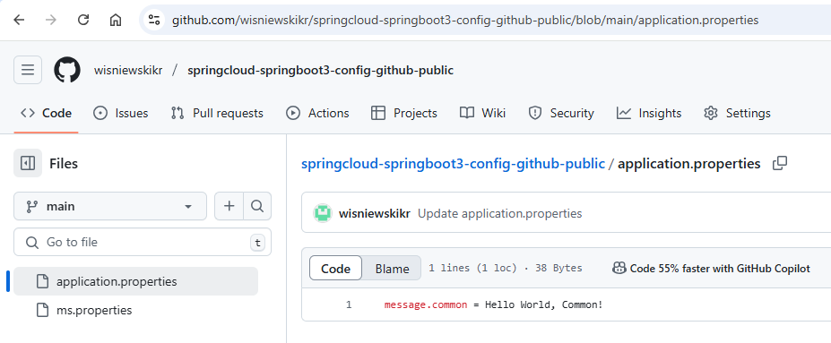

EXAMPLE
-------

DESCRIPTION
-----------

##### Goal
The goal of this project is to present how to create **Config Server** which reads properties from **public github**
repository and connect it with microservice with usage **Java** programming language and **Spring Cloud** framework. 

Config service enables reading configuration properties from different sources like: github, file etc. In this
case properties are read from public Github repository and sent to microservice. This microservice displays
these properties: common, public and secret.

Github repository: https://github.com/wisniewskikr/springcloud-springboot3-config-github-public

##### Content
This project consists of following applications:
* **MS**: an application created in **Java** programming language with usage **Spring Boot** framework. It reads
properties from Config Server
* **Config**: a tool which reads configuration from external source (like Github etc.)

##### Terminology
Terminology explanation:
* **Git**: tool for distributed version control
* **Maven**: tool for build automation
* **Java**: object-oriented programming language
* **Spring Boot**: framework for Java. It consists of: Spring + Container + Configuration
* **Spring Cloud**: Spring Cloud is a framework within the Spring ecosystem that provides tools for building 
distributed systems and microservices. It simplifies tasks like service discovery, configuration management, 
load balancing, circuit breakers, and distributed tracing, allowing developers to build scalable 
and resilient cloud-native applications.
* **Microservices**: Microservices are a software architecture style where an application is built as a collection of 
small, independent services that communicate through APIs. Each service focuses on a specific business function, 
allowing for easier scaling, deployment, and maintenance.
* **Spring Cloud Config**: Spring Cloud Config is a tool within the Spring Cloud ecosystem that provides server-side 
and client-side support for externalized configuration in distributed systems. It allows you to store configuration 
data centrally (e.g., in a Git repository) and share it across multiple microservices, ensuring consistent and 
manageable configuration settings for your entire application environment.

USAGES
------

This project can be tested in following configurations:
* **Usage Manual**: application services are started manually in command line
* **Usage Docker Compose**: all services are started as Docker containers defined in docker compose file.
* **Usage Kubernetes (Kind)**: all services are started as Kubernetes pods.

USAGE MANUAL
------------

> **Usage Manual** means that application services are started manually in command line.

> Please **clone/download** project, open **project's main folder** in your favorite **command line tool** 
> and then **proceed with steps below**.

> **Prerequisites**:
* **Operating System** (tested on Windows 11)
* **Git** (tested on version 2.33.0.windows.2)

##### Required steps:
1. Create **Github repository** with **main** branch with following files:
   * File **application.properties** with properties: `message.common = Common Hello World, Manual!`
   * File **ms.properties** with properties: `message.public = Public Hello World, Manual!` and `message.secret = Secret Hello World, Manual!`
1. In **Config** module update file **src/main/resources/application.properties** with property `spring.cloud.config.server.git.uri` which should contain URI to Github repository
1. In a first command line tool **start CONFIG application** with `mvn -f ./springcloud-springboot3-config-github-public_CONFIG spring-boot:run`
1. In a second command line tool **start MS application** with `mvn -f ./springcloud-springboot3-config-github-public_MS spring-boot:run`
1. In any Internet Browser (e.g. Chrome) visit `http://localhost:8080`
    * Expected HTML page with following JSON: `{"commonMessage":"Common Hello World, Manual!","publicMessage":"Public Hello World, Manual!","secretMessage":"Secret Hello World, Manual!"}`
1. Clean up environment
    * In the second command line tool **stop MS application** with `ctrl + C`
    * In the first command line tool **stop CONFIG application** with `ctrl + C`
    * Remove **Github repository**

USAGE DOCKER COMPOSE
--------------------

> **Usage Docker Compose** means all services are started as Docker containers defined in docker compose file.

> Please **clone/download** project, open **project's main folder** in your favorite **command line tool** and 
then **proceed with steps below**.

> **Prerequisites**:
* **Operating System** (tested on Windows 11)
* **Git** (tested on version 2.33.0.windows.2)
* **Docker** (tested on version 4.33.1)

##### Required steps:
1. Start **Docker** tool
1. In any command line tool **start Docker containers** with `docker-compose -f .\docker-compose\docker-compose.yaml up -d --build`
1. In any Internet Browser (e.g. Chrome) visit `http://localhost:8080`
   * Expected HTML page with following JSON: `{"commonMessage":"Common Hello World, Manual!","publicMessage":"Public Hello World, Manual!","secretMessage":"Secret Hello World, Manual!"}`
1. Clean up environment
   * In a command line tool **remove Docker containers** with `docker-compose -f .\docker-compose\docker-compose.yaml down --rmi all`
   * Stop **Docker** tool

##### Optional steps:
1. In any Internet Browser (e.g. Chrome) visit `http://localhost:8086`
   * Expected Kafka UI
1. In a command line tool validate Docker Compose with `docker-compose config`
1. In a command line tool check list of Docker images with `docker images`
1. In a command line tool check list of all Docker containers with `docker ps -a`
1. In a command line tool check list of active Docker containers with `docker ps`
1. In a command line tool check list of Docker nerworks with `docker network ls`
1. In a command line tool check CONFIG container logs with `docker logs config-container`
1. In a command line tool check MS container logs with `docker logs ms-container`

IMPLEMENTATION
--------------

Implementation details:
* In Config module update pom.xml file with `spring-cloud-config-server`
* In Config module update application.properties file with `spring.cloud.config.server.git.uri`
* In Config module update ApplicationConfig class with `@EnableConfigServer`
* In MS module update pom.xml file with `spring-cloud-starter-config`
* In MS module update application.properties file with `spring.config.import`