EXAMPLE PUBLIC
--------------

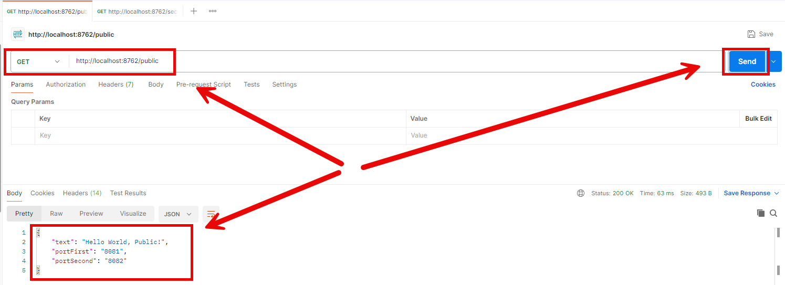

EXAMPLE SECURED
---------------

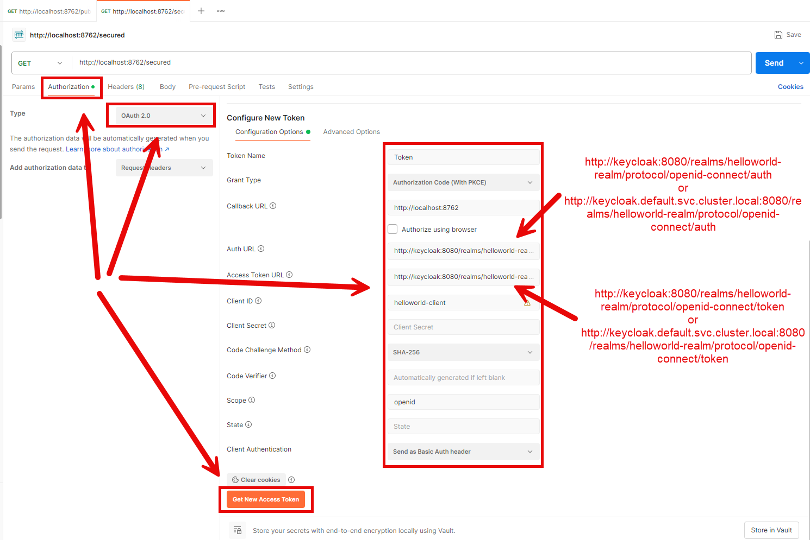

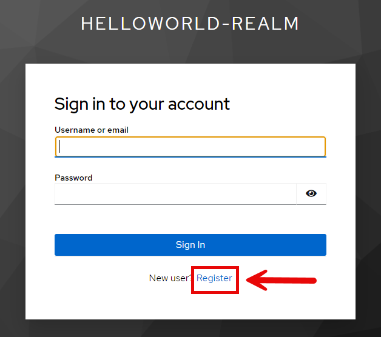

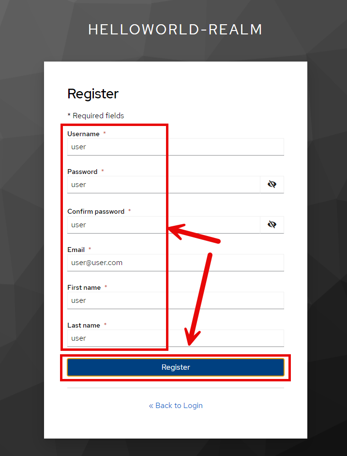

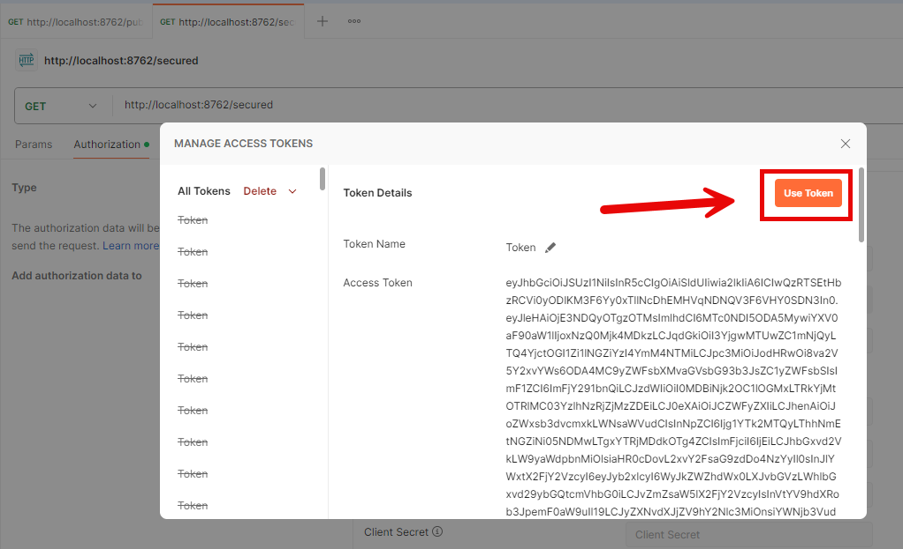

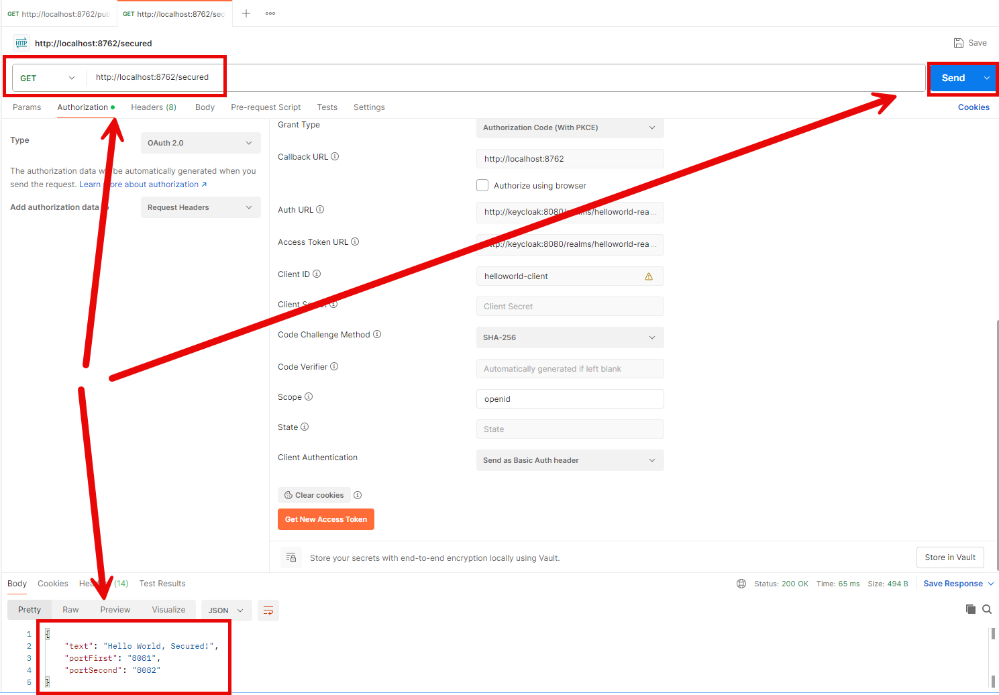

EXAMPLE GRAFANA
---------------

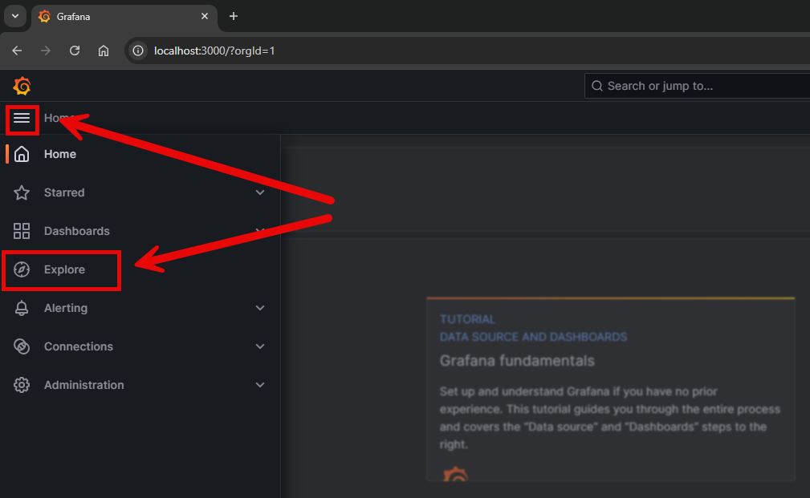

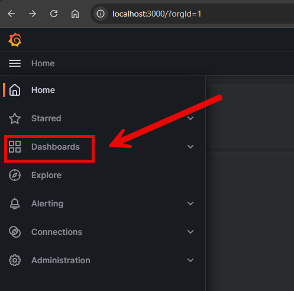

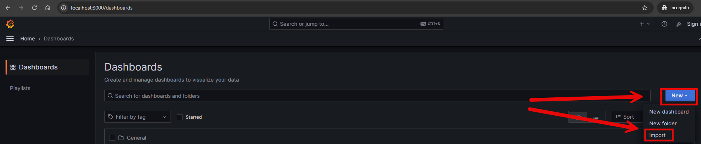

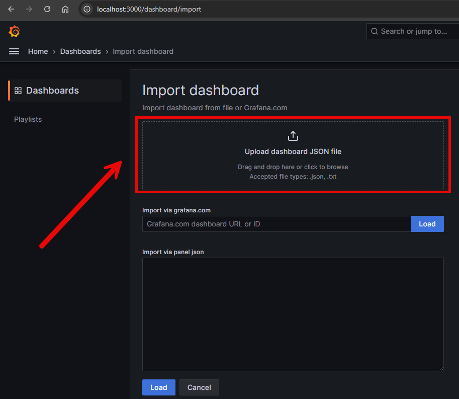

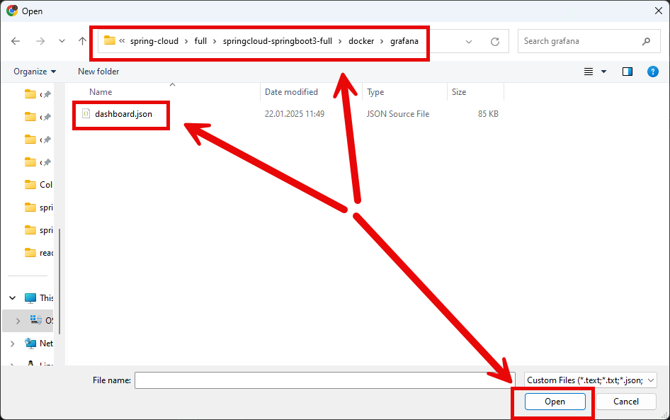

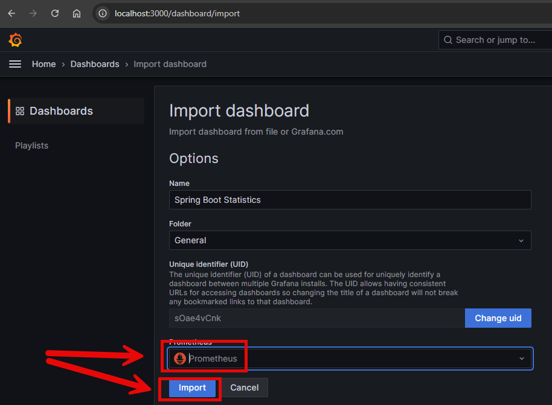

DESCRIPTION
-----------

##### Goal
The goal of this project is to present how to create **ecosystem of microservices** with usage **Java** programming language and **Spring Cloud** and **Spring Boot 3** frameworks.

##### Services
This project consists of following applications:
* **Database**: SQL database - in this case type **MySql**
* **Second Service**: an application created in **Java** programming language with usage **Spring Boot** framework. It has connection with MySql database
* **First Service**: an application created in **Java** programming language with usage **Spring Boot** framework. It has connection with Second Service
* **Loki**: it enables collecting logs from many microservices
* **Prometeus**" it enables collecting metrics from many microservices
* **Tempo**: it enables collecting traces from many microservices
* **Grafana**: it enables displaying logs, metrics and traces from Loki, Prometeus and Tempo tools 
* **Api Gateway**: it enables redirectic traffic to different microservices. It is secured by Keycloak tool
* **Service Discovery**: it manages microservices
* **Config Server**: it stores configs of all microservices
* **Keycloak**: it enables user management

##### Inputs
This project requires following inputs:
* **Service Discovery**: http call from any Rest Client
* **Api Gateway**: http call from any browser
* **Grafana**: http call from any browser

##### Outputs
This project provides following outputs:
* **Service Discovery**: it displayes all microservices in ecosystem
* **Api Gateway**: it redirects trafic to First service which connects with Second service which connects with database. Output:
   * **Database Message**: JSON property displays the message stored in database. The message depends on public or secured API. 
   * **Second Port**: JSON property displays the port of Second application.
   * **First Port**: JSON property displays port of First application.
* **Grafana**: this dashboard contains following data: 
   * **Logs**: logs of all custom services 
   * **Metrics**: metrics of all custom services
   * **Traces**: traces of all custom services

##### Terminology
Terminology explanation:
* **Git**: tool for distributed version control
* **Maven**: tool for build automation
* **Java**: object-oriented programming language
* **Spring Boot**: framework for Java. It consists of: Spring + Container + Configuration
* **Spring Cloud**: Spring Cloud is a framework within the Spring ecosystem that provides tools for building distributed systems and microservices. It simplifies tasks like service discovery, configuration management, load balancing, circuit breakers, and distributed tracing, allowing developers to build scalable and resilient cloud-native applications.
* **Database**: A database is an organized collection of data that is stored and managed electronically, allowing for efficient retrieval, manipulation, and updating of information. It is typically managed by a database management system (DBMS).
* **MySql**: MySQL is an open-source relational database management system (RDBMS) that uses Structured Query Language (SQL) for managing and organizing data. It's widely used for web applications and is known for its speed, reliability, and ease of use.
* **Loki**: Grafana Loki is a log aggregation system designed to store, query, and visualize logs efficiently. Unlike traditional log management tools, Loki is lightweight and cost-effective, as it indexes logs by labels (like Kubernetes pod or service name) rather than indexing the entire log content. It's tightly integrated with Grafana, enabling unified metrics and log analysis within the same interface, making it ideal for cloud-native environments.
* **Prometeus**: Prometheus is an open-source monitoring and alerting toolkit designed for collecting, storing, and querying time-series data, primarily metrics from servers, applications, and services.
* **Tempo**: Grafana Tempo is a highly scalable, distributed tracing backend used to collect, store, and query traces from applications. It supports open standards like OpenTelemetry, integrates seamlessly with Grafana for visualization, and is optimized for low-cost storage by only indexing trace IDs while keeping the rest of the trace data in object storage.
* **Grafana**: Grafana is an open-source visualization and analytics platform used for monitoring, querying, and visualizing metrics from various data sources in customizable dashboards.
* **API Gateway**: An API Gateway is a management tool that acts as an entry point for APIs, handling tasks like routing, authentication, rate limiting, monitoring, and load balancing. It simplifies communication between clients and backend services, often used in microservices architectures to centralize API requests and enforce policies.
* **Service Discovery**: Service discovery is the process of automatically detecting and locating network services or resources in a system, enabling communication between components without requiring manual configuration. It ensures that services can find and connect to each other dynamically in distributed or microservices architectures.
* **Config Server**: A Config Server is a centralized service that manages and provides external configuration for distributed applications. It enables dynamic configuration updates without redeploying applications, improving maintainability and scalability.
* **Keycloak**: Keycloak is an open-source identity and access management solution that provides features like single sign-on (SSO), user federation, role-based access control, and multi-factor authentication for web and mobile applications.

USAGES
------

This project can be tested in following configurations:
* **Usage Docker Compose**: all services are started as Docker containers definied in docker compose file.
* **Usage Kubernetes (Kind)**: all services are started as Kubernetes pods.

USAGE DOCKER COMPOSE
--------------------

> **Usage Docker Compse** means all services are started as Docker containers definied in docker compose file.

> Please **clone/download** project, open **project's main folder** in your favorite **command line tool** and then **proceed with steps below**.

> **Prerequisites**:  
* **Operating System** (tested on Windows 11)
* **Git** (tested on version 2.33.0.windows.2)
* **Docker** (tested on version 4.33.1)

##### Required steps:
1. Update **hosts** file (Run as Administrator; Windows: "Windows\System32\drivers\etc\hosts"; MAC/Linux: "etc/hosts") with new line **127.0.0.1 keycloak**
1. Start **Docker** tool
1. In any command line tool **start Docker containers** with `docker-compose -f .\docker-compose\docker-compose.yaml up -d --build`
1. In any Rest Client (e.g. Postman) using GET method visit `http://localhost:8762/public`
   * Expected JSON with **Database Message**, **Second Service Port** and **First Service Port** 
1. In any Rest Client (e.g. Postman) using GET method visit `http://localhost:8762/secured`
   * Authorization -> Type -> OAuth 2.0
   * Token Name: **Token**
   * Grant Type: **Authorization Code (With PKCE)
   * Callback URL: **http://localhost:8762**
   * Auth URL: **http://keycloak:8080/realms/helloworld-realm/protocol/openid-connect/auth**
   * Access Token URL: **http://keycloak:8080/realms/helloworld-realm/protocol/openid-connect/token**
   * Client ID: **helloworld-client**
   * Code Challenge Method: **SHA-256**
   * Click **Get New Access Token -> Use Token**
   * Click **Send**
   * Expected JSON with **Database Message**, **Second Service Port** and **First Service Port** 
1. In any browser visit `http://localhost:3000`
   * Expected HTML page with **Grafana dashboard** (please check section **EXAMPLE GRAFANA**).
1. Clean up environment 
     * In a command line tool **remove Docker containers** with `docker-compose -f .\docker-compose\docker-compose.yaml down --rmi all`
     * Stop **Docker** tool
     * Remove new line from **hosts**

##### Optional steps:
1. In any Internet Browser (e.g. Chrome) visit `http://localhost:8762/swagger-ui.html`
   * Expected HTML page with First and Second services documentation
1. In any browser visit `http://localhost:8761`
   * Expected HTML page with **Discovery dashboard**
1. In a command line tool validate Docker Compose with `docker-compose config`
1. In a command line tool check list of Docker images with `docker images`
1. In a command line tool check list of all Docker containers with `docker ps -a`
1. In a command line tool check list of active Docker containers with `docker ps`
1. In a command line tool check list of Docker nerworks with `docker network ls`
1. In a command line tool check SECOND container logs with `docker logs second-container`
1. In a command line tool check FIRST container logs with `docker logs first-container`

USAGE KUBERNETES (KIND)
---------------------------

> **Usage Kubernetes** means that all services are started as Kubernetes pods. 

> Please **clone/download** project, open **project's main folder** in your favorite **command line tool** and then **proceed with steps below**.

> **Prerequisites**:  
* **Operating System** (tested on Windows 11)
* **Git** (tested on version 2.33.0.windows.2)
* **Kind** (tested on version 0.26.0)

##### Required steps:
1. Update **hosts** file (Run as Administrator; Windows: "Windows\System32\drivers\etc\hosts"; MAC/Linux: "etc/hosts") with new line **127.0.0.1 keycloak.default.svc.cluster.local**
1. Start **Docker** tool
1. In the first command line tool create and start cluster **Kind** with `kind create cluster --name helloworld`
1. In the second command line tool **start Kubernetes Pods** with `kubectl apply -f ./k8s --recursive`
1. In the second command line tool **check status of Kubernetes Pods** with `kubectl get pods`
   * Expected mysql, second and first as **READY 1/1** (it can take few minutes)
1. In the second command line tool **forward port of Discovery service** with `kubectl port-forward service/discovery 8761:8761`
1. In the third command line tool **forward port of Gateway service** with `kubectl port-forward service/gateway 8762:8762`
1. In the fourth command line tool**forward port of Grafana service** with `kubectl port-forward service/grafana 3000:3000`
1. In the fifth command line tool **forward port of Keycloak service** with `kubectl port-forward service/keycloak 8080:8080`
1. In any Rest Client (e.g. Postman) using GET method visit `http://localhost:8762/public`
   * Expected JSON with **Database Message**, **Second Service Port** and **First Service Port** 
1. In any Rest Client (e.g. Postman) using GET method visit `http://localhost:8762/secured`
   * Authorization -> Type -> OAuth 2.0
   * Token Name: **Token**
   * Grant Type: **Authorization Code (With PKCE)
   * Callback URL: **http://localhost:8762**
   * Auth URL: **http://keycloak.default.svc.cluster.local:8080/realms/helloworld-realm/protocol/openid-connect/auth**
   * Access Token URL: **http://keycloak.default.svc.cluster.local:8080/realms/helloworld-realm/protocol/openid-connect/token**
   * Client ID: **helloworld-client**
   * Code Challenge Method: **SHA-256**
   * Click **Get New Access Token -> Use Token**
   * Click **Send**
   * Expected JSON with **Database Message**, **Second Service Port** and **First Service Port** 
1. In any browser visit `http://localhost:3000`
   * Expected HTML page with **Grafana dashboard** (please check section **EXAMPLE GRAFANA**)
1. Clean up environment 
     * In the fifth command line tool **stop forwarding port of Keycloak service** with `ctrl + C`
     * In the fourth command line tool **stop forwarding port of Grafana service** with `ctrl + C`
     * In the third command line tool **stop forwarding port of Gateway service** with `ctrl + C`
     * In the second command line tool **stop forwarding port of Discovery service** with `ctrl + C`
     * In the second command line tool **remove Kubernetes Pods** with `kubectl delete -f ./k8s --recursive`
     * In the first command line tool delete cluster **Kind** with `kind delete cluster --name helloworld`
     * Stop **Docker** tool
     * Remove new line from **hosts**

##### Optional steps:
1. In a command line tool build Docker SECOND image with `docker build -f springcloud-springboot3-full_SECOND/Dockerfile -t wisniewskikr/springcloud-springboot3-full_second:0.0.1 ./springcloud-springboot3-full_SECOND`
1. In a command line tool push Docker SECOND image to Docker Repository with `docker push wisniewskikr/springcloud-springboot3-full_second:0.0.1` 
1. In a command line tool build Docker FIRST image with `docker build -f springcloud-springboot3-full_FIRST/Dockerfile -t wisniewskikr/springcloud-springboot3-full_first:0.0.1 ./springcloud-springboot3-full_FIRST`
1. In a command line tool push Docker FIRST image to Docker Repository with `docker push wisniewskikr/springcloud-springboot3-full_first:0.0.1` 
1. In a command line tool build Docker GATEWAY image with `docker build -f springcloud-springboot3-full_GATEWAY/Dockerfile -t wisniewskikr/springcloud-springboot3-full_gateway:0.0.1 ./springcloud-springboot3-full_GATEWAY`
1. In a command line tool push Docker GATEWAY image to Docker Repository with `docker push wisniewskikr/springcloud-springboot3-full_gateway:0.0.1`
1. In a command line tool build Docker DISCOVERY image with `docker build -f springcloud-springboot3-full_DISCOVERY/Dockerfile -t wisniewskikr/springcloud-springboot3-full_discovery:0.0.1 ./springcloud-springboot3-full_DISCOVERY`
1. In a command line tool push Docker DISCOVERY image to Docker Repository with `docker push wisniewskikr/springcloud-springboot3-full_discovery:0.0.1`  
1. In a command line tool build Docker CONFIG image with `docker build -f springcloud-springboot3-full_CONFIG/Dockerfile -t wisniewskikr/springcloud-springboot3-full_config:0.0.1 ./springcloud-springboot3-full_CONFIG`
1. In a command line tool push Docker CONFIG image to Docker Repository with `docker push wisniewskikr/springcloud-springboot3-full_config:0.0.1`
1. In any Internet Browser (e.g. Chrome) visit `http://localhost:8762/swagger-ui.html`
   * Expected HTML page with First and Second services documentation
1. In any browser visit `http://localhost:8761`
   * Expected HTML page with **Discovery dashboard**
1. In the first command line tool with administrator privileges check clusers with `kind get clusters`
1. In a command line tool check Kubernetes Deployments with `kubectl get deployments`
1. In a command line tool check Kubernetes Deployments details with **kubectl describe deployment {deployment-name}**
1. In a command line tool check Kubernetes Services with `kubectl get services`
1. In a command line tool check Kubernetes Services details with **kubectl describe service {service-name}**
1. In a command line tool check Kubernetes Pods with `kubectl get pods`
1. In a command line tool check Kubernetes Pods details with **kubectl describe pod {pod-name}**
1. In a command line tool check Kubernetes Pods logs with **kubectl logs {pod-name}**
