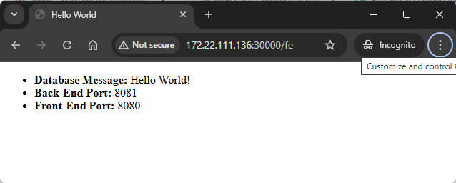

DESCRIPTION
-----------

##### Goal
The goal of this project is to present how to create **chain of applications (microservices)** with a **load balancing** type **server-side** with usage **Java** programming language and **Spring Cloud** framework. Server-side load balancing is the process of distributing incoming network traffic across multiple servers on the server side. In Spring Cloud framework it requires:
* **Eureka**: discovery service
* **Gateway**: API Gateway servvie

This chain of services consists of following applications:
* **Database**: SQL database - in this case type **MySql**
* **Back-End**: an application created in **Java** programming language with usage **Spring Boot** framework
* **Front-End**: an application created in **Java** programming language with usage **Spring Boot** framework. **Thymeleaf** engine is used to display data
* **Eureka**: a tool which displays basic information - like status, port etc. - about microservices
* **API Gateway**: a tool which distibutes incoming network traffic

Fe output consists of following elements:
* **Database Message**: the HTML displays the message stored in database. It's the simple text "Hello World!".
* **Back-End Port**: the HTML page displays the port of Back-End application.
* **Front-End Port**: the HTML page displays port of Front-End application.

Eureka output consists of following elements:
* **Services status**: basic information - like status, port etc. - about microservices

##### Terminology
Terminology explanation:
* **Git**: tool for distributed version control
* **Maven**: tool for build automation
* **Java**: object-oriented programming language
* **Spring Boot**: framework for Java. It consists of: Spring + Container + Configuration
* **Database**: A database is an organized collection of data that is stored and managed electronically, allowing for efficient retrieval, manipulation, and updating of information. It is typically managed by a database management system (DBMS).
* **MySql**: MySQL is an open-source relational database management system (RDBMS) that uses Structured Query Language (SQL) for managing and organizing data. It's widely used for web applications and is known for its speed, reliability, and ease of use.
* **Back-End**: The back-end refers to the server-side part of a software application, responsible for managing the database, server logic, and application programming interface (API). It processes requests from the front-end (user interface), handles data storage, retrieval, and business logic, and sends the appropriate responses back to the front-end.
* **Front-End**: Front-end refers to the part of a website or application that users interact with directly. It includes the visual elements, layout, and design, typically built using HTML, CSS, and JavaScript. The front-end is responsible for the user experience (UX) and interface (UI) that allows users to navigate and interact with the system.
* **Thymeleaf**: Thymeleaf is a modern server-side Java template engine for Java-based web applications. It processes HTML, XML, JavaScript, CSS, and plain text, integrating with the Spring framework. It allows dynamic content rendering on the server while ensuring templates are HTML-compliant. Thymeleaf's key features include natural templates (which work as valid HTML even before rendering), easy integration with Spring MVC, and powerful expressions for iterating, conditional display, and data binding. It's often used to create dynamic web pages that combine static HTML with server-side logic in a clean and intuitive way.
* **Spring Cloud**: Spring Cloud is a framework within the Spring ecosystem that provides tools for building distributed systems and microservices. It simplifies tasks like service discovery, configuration management, load balancing, circuit breakers, and distributed tracing, allowing developers to build scalable and resilient cloud-native applications.
* **Microservices**: Microservices are a software architecture style where an application is built as a collection of small, independent services that communicate through APIs. Each service focuses on a specific business function, allowing for easier scaling, deployment, and maintenance.
* **Service Discovery**: Service discovery in microservices is the process of automatically detecting and connecting services within a distributed system. It allows services to find each other dynamically without hardcoding network locations, enabling seamless scaling and communication across microservices.
* **Eureka Service Discovery**: Eureka Service Discovery is a system that allows microservices in a distributed architecture to dynamically register themselves and discover other services. It acts as a registry where services announce their availability, enabling seamless communication between services without needing hard-coded network addresses. Eureka is commonly used in Netflix's microservices architecture and part of the Spring Cloud ecosystem.
* **Spring Cloud API Gateway**: it is a framework for building API gateways in microservices architectures. It provides routing, load balancing, security, and other features for managing and directing traffic between clients and microservices. 
* **Server-side load balancing**: it is the process of distributing incoming network traffic across multiple servers on the server side to ensure efficient resource use, improve application performance, and enhance reliability. It is typically managed by a load balancer device or software that sits between the client and the servers.

##### Implementation
Implementation details:
* **Eureka Service Discovery**: update pom.xml file with dependency **spring-cloud-starter-netflix-eureka-server**. Update Spring Boot starter class with annotation **@EnableEurekaServer** in starter class. Update file **application.properties** with service name, port and eureka properties.
* **Other Services**: update pom.xml file with dependency **spring-cloud-starter-netflix-eureka-client**. Update Spring Boot starter class with annotation **@EnableEurekaClient** in starter class. Update file **application.properties** with services names, ports and eureka properties.

EXAMPLE
-------

USAGE MANUAL
------------

> **Usage Manual** means that microservices are provided as **Java and Maven applications** and started **manually**. Database is provided as **Docker container**.

> Please **clone/download** project, open **project's main folder** in your favorite **command line tool** and then **proceed with steps below**. 

> Please be aware that following tools should be installed on your local PC:  
* **Operating System** (tested on Windows 11)
* **Java** (tested on version 17.0.5)
* **Maven** (tested on version 3.8.5)
* **Git** (tested on version 2.33.0.windows.2)
* **Docker** (tested on version 4.33.1 - it has to be up and running)

##### Required steps:
1. In the first command line tool **start Docker MySql container** with `docker run -d --name mysql-container -e MYSQL_ROOT_PASSWORD=my_secret_password -e MYSQL_DATABASE=database -e MYSQL_USER=admin -e MYSQL_PASSWORD=admin123 -p 3306:3306 mysql:5.7`
1. In the second command line tool **start Discovery application** with `mvn -f ./springcloud-loadbalancing-serverside_DISCOVERY spring-boot:run`
1. In the third command line tool **start first Back-End application** with `mvn -f ./springcloud-loadbalancing-serverside_BE spring-boot:run`
1. In the fourth command line tool **start second Back-End application** with `mvn -f ./springcloud-loadbalancing-serverside_BE spring-boot:run`
1. In the fifth command line tool **start first Front-End application** with `mvn -f ./springcloud-loadbalancing-serverside_FE spring-boot:run`
1. In the sixth command line tool **start second Front-End application** with `mvn -f ./springcloud-loadbalancing-serverside_FE spring-boot:run`
1. In the seventh command line tool **start Routing application** with `mvn -f ./springcloud-loadbalancing-serverside_ROUTING spring-boot:run`
1. In a browser visit `http://localhost:8060/fe`
   * Expected HTML page with **Database Message**, **Back-End Port** and **Front-End Port** 
1. Clean up environment 
     * In the seventh command line tool **stop Routing application** with `ctrl + C`
     * In the sixth command line tool **stop second Front-End application** with `ctrl + C`
     * In the fifth command line tool **stop first Front-End application** with `ctrl + C`
     * In the fourth command line tool **stop second Back-End application** with `ctrl + C`
     * In the third command line tool **stop first Back-End application** with `ctrl + C`
     * In the second command line tool **stop Discovery application** with `ctrl + C`
     * In the first command line tool **stop and remove Docker MySql container** with `docker rm -f mysql-container`
     * In the first command line tool **remove Docker MySql image** with `docker rmi mysql:5.7`

##### Optional steps:
1. In a browser visit `http://localhost:8761`
   * Expected Discovery page with services **be**, **fe** and **routing** details
1. In a command line tool check list of Docker images with `docker images`
1. In a command line tool check list of all Docker containers with `docker ps -a`
1. In a command line tool check list of active Docker containers with `docker ps`

USAGE DOCKER
------------

> **Usage Docker** means that microservices and Database are provided as **Docker containers**. 

> Please **clone/download** project, open **project's main folder** in your favorite **command line tool** and then **proceed with steps below**.

> Please be aware that following tools should be installed on your local PC:  
* **Operating System** (tested on Windows 11)
* **Git** (tested on version 2.33.0.windows.2)
* **Docker** (tested on version 4.33.1 - it has to be up and running)

##### Required steps:
1. In a command line tool create **Docker Network** with `docker network create helloworld-network`
1. In a command line tool build and start **Docker container MySql** database with `docker run -d --name mysql-container -e MYSQL_ROOT_PASSWORD=my_secret_password -e MYSQL_DATABASE=database -e MYSQL_USER=admin -e MYSQL_PASSWORD=admin123 -p 3306:3306 --network helloworld-network mysql:5.7`
1. In a command line tool build **Docker image DISCOVERY** with `docker build -f springcloud-loadbalancing-serverside_DISCOVERY/Dockerfile -t discovery-image:0.0.1 ./springcloud-loadbalancing-serverside_DISCOVERY`
1. In a command line tool build and start **Docker container DISCOVERY** with `docker run -p 8761:8761 --name discovery-container --network helloworld-network -d discovery-image:0.0.1`
1. In a command line tool build **Docker image BE** with `docker build -f springcloud-loadbalancing-serverside_BE/Dockerfile -t be-image:0.0.1 ./springcloud-loadbalancing-serverside_BE`
1. In a command line tool build and start **Docker first container BE** with `docker run -P --name be-container-1 --network helloworld-network -e spring.datasource.url=jdbc:mysql://mysql-container:3306/database -e eureka.client.service-url.defaultZone=http://discovery-container:8761/eureka -d be-image:0.0.1`
1. In a command line tool build and start **Docker second container BE** with `docker run -P --name be-container-2 --network helloworld-network -e spring.datasource.url=jdbc:mysql://mysql-container:3306/database -e eureka.client.service-url.defaultZone=http://discovery-container:8761/eureka -d be-image:0.0.1`
1. In a command line tool build **Docker image FE** with `docker build -f springcloud-loadbalancing-serverside_FE/Dockerfile -t fe-image:0.0.1 ./springcloud-loadbalancing-serverside_FE`
1. In a command line tool build and start **Docker first container FE** with `docker run -P --name fe-container-1 --network helloworld-network -e eureka.client.service-url.defaultZone=http://discovery-container:8761/eureka -d fe-image:0.0.1`
1. In a command line tool build and start **Docker second container FE** with `docker run -P --name fe-container-2 --network helloworld-network -e eureka.client.service-url.defaultZone=http://discovery-container:8761/eureka -d fe-image:0.0.1`
1. In a command line tool build **Docker image GATEWAY** with `docker build -f springcloud-loadbalancing-serverside_ROUTING/Dockerfile -t gateway-image:0.0.1 ./springcloud-loadbalancing-serverside_ROUTING`
1. In a command line tool build and start **Docker container GATEWAY** with `docker run -p 8060:8060 --name gateway-container --network helloworld-network -e eureka.client.service-url.defaultZone=http://discovery-container:8761/eureka -d gateway-image:0.0.1`
1. In a browser visit `http://localhost:8060/fe`
   * Expected HTML page with **Database Message**, **Back-End Port** and **Front-End Port** 
1. Clean up environment 
     * In a command line tool stop and remove **Gateway container** with `docker rm -f gateway-container`
     * In a command line tool remove **Gateway Docker image** with `docker rmi gateway-image:0.0.1`
     * In a command line tool stop and remove **second FE Docker container** with `docker rm -f fe-container-2`
     * In a command line tool stop and remove **first FE Docker container** with `docker rm -f fe-container-1`
     * In a command line tool remove **FE Docker image** with `docker rmi fe-image:0.0.1`
     * In a command line tool stop and remove **second BE Docker container** with `docker rm -f be-container-2`
     * In a command line tool stop and remove **first BE Docker container** with `docker rm -f be-container-1`
     * In a command line tool remove **BE Docker image** with `docker rmi be-image:0.0.1`
     * In a command line tool stop and remove **DISCOVERY Docker container** with `docker rm -f discovery-container`
     * In a command line tool remove **DISCOVERY Docker image** with `docker rmi discovery-image:0.0.1`
     * In a command line tool stop and remove **Database Docker container** with `docker rm -f mysql-container`
     * In a command line tool remove **Database Docker image** with `docker rmi mysql:5.7`
     * In a command line tool remove **Docker Nerwork** with `docker network rm helloworld-network`

##### Optional steps:
1. In a browser visit `http://localhost:8761`
   * Expected Discovery page with services **be**, **fe** and **routing** details 
1. In a command line tool check list of Docker images with `docker images`
1. In a command line tool check list of all Docker containers with `docker ps -a`
1. In a command line tool check list of active Docker containers with `docker ps`
1. In a command line tool check list of Docker nerworks with `docker network ls`
1. In a command line tool check BE container logs with `docker logs be-container`
1. In a command line tool check FE container logs with `docker logs fe-container`

USAGE DOCKER COMPOSE
--------------------

> **Usage Docker Compse** means that microservices and Database are provided as **Docker containers** definied in **Docker Compose** file. 

> Please **clone/download** project, open **project's main folder** in your favorite **command line tool** and then **proceed with steps below**.

> Please be aware that following tools should be installed on your local PC:  
* **Operating System** (tested on Windows 11)
* **Git** (tested on version 2.33.0.windows.2)
* **Docker** (tested on version 4.33.1 - it has to be up and running)

##### Required steps:
1. In a command line tool **start Docker containers** with `docker-compose up -d --build`
1. In a browser visit `http://localhost:8060/fe`
   * Expected HTML page with **Database Message**, **Back-End Port** and **Front-End Port** 
1. Clean up environment 
     * In a command line tool **remove Docker containers** with `docker-compose down --rmi all`

##### Optional steps:
1. In a browser visit `http://localhost:8761`
   * Expected Discovery page with services **be**, **fe** and **gateway** details 
1. In a command line tool validate Docker Compose with `docker-compose config`
1. In a command line tool check list of Docker images with `docker images`
1. In a command line tool check list of all Docker containers with `docker ps -a`
1. In a command line tool check list of active Docker containers with `docker ps`
1. In a command line tool check list of Docker nerworks with `docker network ls`
1. In a command line tool check BE container logs with `docker logs be-container`
1. In a command line tool check FE container logs with `docker logs fe-container`

USAGE KUBERNETES (MINIKUBE)
---------------------------

> **Usage Kubernetes** means that microservices and Database are provided as **Docker containers** managed by **Kubernetes** type **Minikube**. 

> Please **clone/download** project, open **project's main folder** in your favorite **command line tool** and then **proceed with steps below**.

> Please be aware that following tools should be installed on your local PC:  
* **Operating System** (tested on Windows 11)
* **Git** (tested on version 2.33.0.windows.2)
* **Minikube** (tested on version 1.33.1)

##### Required steps:
1. In the first command line tool **with administrator privileges** start **Minikube** with `minikube start`
1. In the second command line tool **start Kubernetes Pods** with `kubectl apply -f kubernetes.yaml`
1. In the second command line tool **check status of Kubernetes Pods** with `kubectl get pods`
   * Expected mysql, be and fe as **READY 1/1** (it can take few minutes)
1. In the first command line tool **with administrator privileges** display ROUTING service in a Browser with `minikube service routing-service`
   * In a browser change address to **URL + /fe**
   * Expected HTML page with **Database Message**, **Back-End Port** and **Front-End Port** 
1. Clean up environment 
     * In the second command line tool **remove Kubernetes Pods** with `kubectl delete -f kubernetes.yaml`
     * In the first command line tool **with administrator privileges** stop **Minikube** with `minikube stop`

##### Optional steps:
1. In a command line tool build Docker DISCOVERY image with `docker build -f springcloud-loadbalancing-serverside_DISCOVERY/Dockerfile -t wisniewskikr/springcloud-loadbalancing-serverside_discovery:0.0.1 ./springcloud-loadbalancing-serverside_DISCOVERY`
1. In a command line tool push Docker DISCOVERY image to Docker Repository with `docker push wisniewskikr/springcloud-loadbalancing-serverside_discovery:0.0.1`
1. In a command line tool build Docker BE image with `docker build -f springcloud-loadbalancing-serverside_BE/Dockerfile -t wisniewskikr/springcloud-loadbalancing-serverside_be:0.0.1 ./springcloud-loadbalancing-serverside_BE`
1. In a command line tool push Docker BE image to Docker Repository with `docker push wisniewskikr/springcloud-loadbalancing-serverside_be:0.0.1` 
1. In a command line tool build Docker FE image with `docker build -f springcloud-loadbalancing-serverside_FE/Dockerfile -t wisniewskikr/springcloud-loadbalancing-serverside_fe:0.0.1 ./springcloud-loadbalancing-serverside_FE`
1. In a command line tool push Docker FE image to Docker Repository with `docker push wisniewskikr/springcloud-loadbalancing-serverside_fe:0.0.1` 
1. In a command line tool build Docker ROUTING image with `docker build -f springcloud-loadbalancing-serverside_ROUTING/Dockerfile -t wisniewskikr/springcloud-loadbalancing-serverside_routing:0.0.1 ./springcloud-loadbalancing-serverside_ROUTING`
1. In a command line tool push Docker ROUTING image to Docker Repository with `docker push wisniewskikr/springcloud-loadbalancing-serverside_routing:0.0.1`
1. In the first command line tool **with administrator privileges** display DISCOVERY service in a Browser with `minikube service discovery-service-display`
   * Expected Discovery page with services **be**, **fe** and **routing** details
1. In the first command line tool with administrator privileges check status of Minikube with `minikube status`
1. In the first command line tool with administrator privileges check Docker images in Minikube with `minikube ssh docker images`
1. In the first command line tool with administrator privileges check Docker containers in Minikube with `minikube ssh docker ps`
1. In a command line tool check Kubernetes Deployments with `kubectl get deployments`
1. In a command line tool check Kubernetes Deployments details with **kubectl describe deployment {deployment-name}**
1. In a command line tool check Kubernetes Services with `kubectl get services`
1. In a command line tool check Kubernetes Services details with **kubectl describe service {service-name}**
1. In a command line tool check Kubernetes Pods with `kubectl get pods`
1. In a command line tool check Kubernetes Pods details with **kubectl describe pod {pod-name}**
1. In a command line tool check Kubernetes Pods logs with **kubectl log {pod-name}**