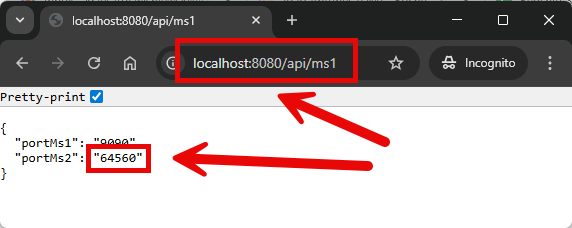
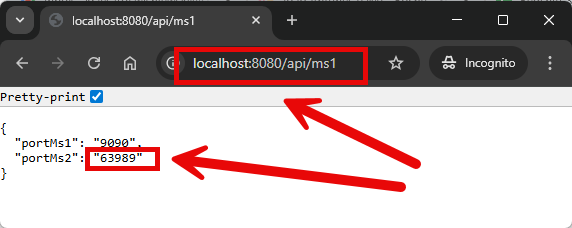
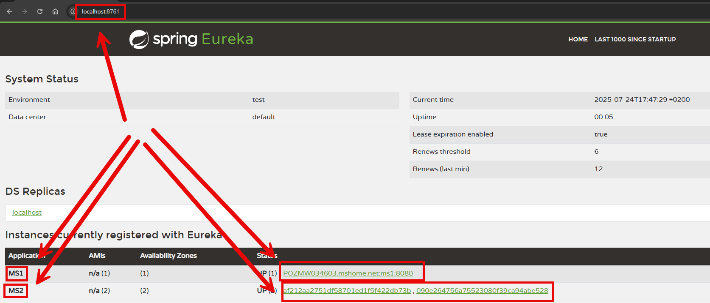

EXAMPLE
-------

DESCRIPTION
-----------

##### Goal
The goal of this project is to present how to create a **load balancing** 
type **client-side** with usage **Java** programming language and **Spring Boot 3** and **Spring Cloud** frameworks. 
Client-side loadbalancing means that all traffic is redirected in Microservice which calls API, 
not in Eureka Discovery Server.

This chain of services consists of following applications:
* **MS1**: an application created in **Java** programming language with usage **Spring Boot** framework. 
This application calls MS2 application and is responsible for loadbalancing.
* **MS2**: an application created in **Java** programming language with usage **Spring Boot** framework. 
* **Eureka**: a tool which displays basic information - like status, port etc. - about microservices

##### Terminology
Terminology explanation:
* **Git**: tool for distributed version control
* **Maven**: tool for build automation
* **Java**: object-oriented programming language
* **Spring Boot**: framework for Java. It consists of: Spring + Container + Configuration
* **Spring Cloud**: Spring Cloud is a framework within the Spring ecosystem that provides tools for building distributed systems and microservices. It simplifies tasks like service discovery, configuration management, load balancing, circuit breakers, and distributed tracing, allowing developers to build scalable and resilient cloud-native applications.
* **Microservices**: Microservices are a software architecture style where an application is built as a collection of small, independent services that communicate through APIs. Each service focuses on a specific business function, allowing for easier scaling, deployment, and maintenance.
* **Service Discovery**: Service discovery in microservices is the process of automatically detecting and connecting services within a distributed system. It allows services to find each other dynamically without hardcoding network locations, enabling seamless scaling and communication across microservices.
* **Eureka Service Discovery**: Eureka Service Discovery is a system that allows microservices in a distributed architecture to dynamically register themselves and discover other services. It acts as a registry where services announce their availability, enabling seamless communication between services without needing hard-coded network addresses. Eureka is commonly used in Netflix's microservices architecture and part of the Spring Cloud ecosystem.
* **Client-side load balancing**: Client-side load balancing is a method where the client (or service consumer) chooses which server or instance to send a request to, based on available data like service registry or load metrics, rather than relying on a central load balancer.

USAGES
------

This project can be tested in following configurations:
* **Usage Manual**: application services are started manually in command line
* **Usage Docker Compose**: all services are started as Docker containers defined in docker compose file.
* **Usage Kubernetes (Kind)**: all services are started as Kubernetes pods.

USAGE MANUAL
------------

> **Usage Manual** means that application services are started manually in command line

> Please **clone/download** project, open **project's main folder** in your favorite **command line tool** and then **proceed with steps below**. 

> Please be aware that following tools should be installed on your local PC:  
* **Operating System** (tested on Windows 11)
* **Java** (tested on version 23.0.1)
* **Maven** (tested on version 3.8.5)
* **Git** (tested on version 2.33.0.windows.2)

##### Required steps:
1. In the first command line tool **start DISCOVERY application** with `mvn -f ./springcloud-springboot3-loadbalancing-serverside_DISCOVERY spring-boot:run`
1. In the second command line tool **start MS1 application** with `mvn -f ./springcloud-springboot3-loadbalancing-serverside_MS1 spring-boot:run`
1. In the third command line tool **start first instance of MS2 application** with `mvn -f ./springcloud-springboot3-loadbalancing-serverside_MS2 spring-boot:run`
1. In the fourth command line tool **start second instance of MS2 application** with `mvn -f ./springcloud-springboot3-loadbalancing-serverside_MS2 spring-boot:run`
1. In a browser visit `http://localhost:8080`
   * Expected JSON with following structure: **{"portMs1":"8080","portMs2":"{port MS2}"}**
   * After refresh **port MS2** should be changed to port of another instance of MS2
1. Clean up environment
     * In the fourth command line tool **stop second instance of MS2 application** with `ctrl + C`
     * In the third command line tool **stop first instance of MS2 application** with `ctrl + C`
     * In the second command line tool **stop MS1 application** with `ctrl + C`
     * In the first command line tool **stop DISCOVERY application** with `ctrl + c`

##### Optional steps:
1. In a browser visit `http://localhost:8761`
   * Expected Discovery page with services details

USAGE DOCKER COMPOSE
--------------------

> **Usage Docker Compose** means all services are started as Docker containers defined in docker compose file.

> Please **clone/download** project, open **project's main folder** in your favorite **command line tool** and
then **proceed with steps below**.

> **Prerequisites**:
* **Operating System** (tested on Windows 11)
* **Git** (tested on version 2.33.0.windows.2)
* **Docker** (tested on version 4.33.1)

##### Required steps:
1. Start **Docker** tool
1. In any command line tool **start Docker containers** with `docker-compose -f .\docker-compose\docker-compose.yaml up -d --build`
1. In a browser visit `http://localhost:8080`
   * Expected JSON with following structure: **{"portMs1":"8080","portMs2":"{port MS2}"}**
   * After refresh **port MS2** should be changed to port of another instance of MS2
1. Clean up environment
   * In a command line tool **remove Docker containers** with `docker-compose -f .\docker-compose\docker-compose.yaml down --rmi all`
   * Stop **Docker** tool

##### Optional steps:
1. In a browser visit `http://localhost:8761`
   * Expected Discovery page with services details
1. In a command line tool validate Docker Compose with `docker-compose config`
1. In a command line tool check list of Docker images with `docker images`
1. In a command line tool check list of all Docker containers with `docker ps -a`
1. In a command line tool check list of active Docker containers with `docker ps`
1. In a command line tool check list of Docker nerworks with `docker network ls`
1. In a command line tool check CONFIG container logs with `docker logs config-container`
1. In a command line tool check MS container logs with `docker logs ms-container`

USAGE KUBERNETES (KIND)
---------------------------

> **Usage Kubernetes** means that all services are started as Kubernetes pods.

> Please **clone/download** project, open **project's main folder** in your favorite **command line tool** and then **proceed with steps below**.

> **Prerequisites**:
* **Operating System** (tested on Windows 11)
* **Git** (tested on version 2.33.0.windows.2)
* **Kind** (tested on version 0.26.0)

##### Required steps:
1. Start **Docker** tool
1. In the first command line tool create and start cluster **Kind** with `kind create cluster --name helloworld`
1. In the second command line tool **start Kubernetes Pods** with `kubectl apply -f ./k8s --recursive`
1. In the second command line tool **check status of Kubernetes Pods** with `kubectl get pods`
   * Expected services as **READY 1/1** (it can take few minutes)
1. In the second command line tool **forward port of DISCOVERY service** with `kubectl port-forward service/discovery 8761:8761`
1. In the third command line tool **forward port of MS1 service** with `kubectl port-forward service/ms1 8080:8080`
1. In a browser visit `http://localhost:8080`
   * Expected JSON with following structure: **{"portMs1":"8080","portMs2":"{port MS2}"}**
   * After refresh **port MS2** should be changed to port of another instance of MS2
1. Clean up environment
   * In the third command line tool **stop forwarding port of MS1 service** with `ctrl + C`
   * In the second command line tool **stop forwarding port of DISCOVERY service** with `ctrl + C`
   * In the first command line tool **remove Kubernetes Pods** with `kubectl delete -f ./k8s --recursive`
   * In the first command line tool delete cluster **Kind** with `kind delete cluster --name helloworld`
   * Stop **Docker** tool

##### Optional steps:
1. In a browser visit `http://localhost:8761`
   * Expected Discovery page with services details
1. In a command line tool build Docker MS1 image with `docker build -f springcloud-springboot3-loadbalancing-serverside_MS1/Dockerfile -t wisniewskikr/springcloud-springboot3-loadbalancing-serverside_ms1:0.0.1 ./springcloud-springboot3-loadbalancing-serverside_MS1`
1. In a command line tool push Docker MS1 image to Docker Repository with `docker push wisniewskikr/springcloud-springboot3-loadbalancing-serverside_ms1:0.0.1`
1. In a command line tool build Docker MS2 image with `docker build -f springcloud-springboot3-loadbalancing-serverside_MS2/Dockerfile -t wisniewskikr/springcloud-springboot3-loadbalancing-serverside_ms2:0.0.1 ./springcloud-springboot3-loadbalancing-serverside_MS2`
1. In a command line tool push Docker MS2 image to Docker Repository with `docker push wisniewskikr/springcloud-springboot3-loadbalancing-serverside_ms2:0.0.1`
1. In a command line tool build Docker CONFIG image with `docker build -f springcloud-springboot3-loadbalancing-serverside_DISCOVERY/Dockerfile -t wisniewskikr/springcloud-springboot3-loadbalancing-serverside_discovery:0.0.1 ./springcloud-springboot3-loadbalancing-serverside_DISCOVERY`
1. In a command line tool push Docker CONFIG image to Docker Repository with `docker push wisniewskikr/springcloud-springboot3-loadbalancing-serverside_discovery:0.0.1`
1. In the first command line tool with administrator privileges check clusters with `kind get clusters`
1. In a command line tool check Kubernetes Deployments with `kubectl get deployments`
1. In a command line tool check Kubernetes Deployments details with **kubectl describe deployment {deployment-name}**
1. In a command line tool check Kubernetes Services with `kubectl get services`
1. In a command line tool check Kubernetes Services details with **kubectl describe service {service-name}**
1. In a command line tool check Kubernetes Pods with `kubectl get pods`
1. In a command line tool check Kubernetes Pods details with **kubectl describe pod {pod-name}**
1. In a command line tool check Kubernetes Pods logs with **kubectl logs {pod-name}**

##### Implementation
Implementation details:
* In DISCOVERY update **pom.xml** file with dependency `spring-cloud-starter-netflix-eureka-server`
* In DISCOVERY update **ApplicationDiscovery** class with annotation `@EnableEurekaServer`
* In DISCOVERY update **application.properties** file with properties `eureka.client.fetch-registry=false` 
and `eureka.client.register-with-eureka=false`
* In MS1 and MS2 update **pom.xml** files with dependency `spring-cloud-starter-netflix-eureka-client`
* In MS1 and MS2 update **application.properties** files with property `eureka.client.service-url.defaultZone=http://localhost:8761/eureka`
* In MS1 update **application.properties** file with property `baseurl.ms2=http://MS2` (name from DISCOVERY, no more host and port)
* In MS1 update **RestClientConfig** class with annotation `@LodaBalanced`
