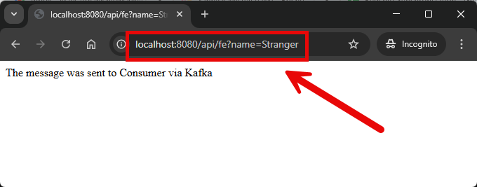

EXAMPLE
-------

DESCRIPTION
-----------

##### Goal
The goal of this project is to present how to create **chain of applications (microservices)** with **observability** type **Grafana Stack (Loki + Prometeus + Tempo)** with usage **Java** programming language and **Spring Cloud** and **Spring Boot 3** frameworks. Grafana Stack enables observing many microservices (Logs, Metrics and Traces) in one central Grafana dashboard. Class **RestClient** is used to handle REST connection between FE and BE services.

##### Services
This project consists of following applications:
* **Database**: SQL database - in this case type **MySql**
* **Back-End**: an application created in **Java** programming language with usage **Spring Boot** framework
* **Front-End**: an application created in **Java** programming language with usage **Spring Boot** framework. **Thymeleaf** engine is used to display data
* **Loki**: it enables collecting logs from many microservices
* **Prometeus**" it enables collecting metrics from many microservices
* **Tempo**: it enables collecting traces from many microservices
* **Grafana**: it enables displaying logs, metrics and traces from Loki, Prometeus and Tempo tools 

##### Inputs
This project requires following inputs:
* **FE**: http call from any browser
* **Grafana**: http call from any browser

##### Outputs
This project provides following outputs:
* **FE**: Front-End service connects with Back-End service which connects with database. Output displayed by FE:
   * **Database Message**: the HTML displays the message stored in database. It's the simple text "Hello World!".
   * **Back-End Port**: the HTML page displays the port of Back-End application.
   * **Front-End Port**: the HTML page displays port of Front-End application.
* **Grafana**: this dashboard contains following data: 
   * **Logs**: logs of all custom services 
   * **Metrics**: metrics of all custom services
   * **Traces**: traces of all custom services

##### Terminology
Terminology explanation:
* **Git**: tool for distributed version control
* **Maven**: tool for build automation
* **Java**: object-oriented programming language
* **Spring Boot**: framework for Java. It consists of: Spring + Container + Configuration
* **Spring Cloud**: Spring Cloud is a framework within the Spring ecosystem that provides tools for building distributed systems and microservices. It simplifies tasks like service discovery, configuration management, load balancing, circuit breakers, and distributed tracing, allowing developers to build scalable and resilient cloud-native applications.
* **Database**: A database is an organized collection of data that is stored and managed electronically, allowing for efficient retrieval, manipulation, and updating of information. It is typically managed by a database management system (DBMS).
* **MySql**: MySQL is an open-source relational database management system (RDBMS) that uses Structured Query Language (SQL) for managing and organizing data. It's widely used for web applications and is known for its speed, reliability, and ease of use.
* **Back-End**: The back-end refers to the server-side part of a software application, responsible for managing the database, server logic, and application programming interface (API). It processes requests from the front-end (user interface), handles data storage, retrieval, and business logic, and sends the appropriate responses back to the front-end.
* **Front-End**: Front-end refers to the part of a website or application that users interact with directly. It includes the visual elements, layout, and design, typically built using HTML, CSS, and JavaScript. The front-end is responsible for the user experience (UX) and interface (UI) that allows users to navigate and interact with the system.
* **Loki**: Grafana Loki is a log aggregation system designed to store, query, and visualize logs efficiently. Unlike traditional log management tools, Loki is lightweight and cost-effective, as it indexes logs by labels (like Kubernetes pod or service name) rather than indexing the entire log content. It's tightly integrated with Grafana, enabling unified metrics and log analysis within the same interface, making it ideal for cloud-native environments.
* **Prometeus**: Prometheus is an open-source monitoring and alerting toolkit designed for collecting, storing, and querying time-series data, primarily metrics from servers, applications, and services.
* **Tempo**: Grafana Tempo is a highly scalable, distributed tracing backend used to collect, store, and query traces from applications. It supports open standards like OpenTelemetry, integrates seamlessly with Grafana for visualization, and is optimized for low-cost storage by only indexing trace IDs while keeping the rest of the trace data in object storage.
* **Grafana**: Grafana is an open-source visualization and analytics platform used for monitoring, querying, and visualizing metrics from various data sources in customizable dashboards.

USAGES
------

This project can be tested in following configurations:
* **Usage Manual**: custom services are started manually from command line. Other services (like Sql Databases, NoSql Databases etc.) are started as Docker containers definied in "docker-compose/without-custom-services/docker-compose.yaml" file.
* **Usage Docker Compose**: N/A
* **Usage Kubernetes (Minikube)**: N/A

USAGE MANUAL
------------

> **Usage Manual** means that custom services are started manually from command line. Other services (like Sql Databases, NoSql Databases etc.) are started as Docker containers definied in "docker-compose/without-custom-services/docker-compose.yaml" file.

> Please **clone/download** project, open **project's main folder** in your favorite **command line tool** and then **proceed with steps below**.

> **Prerequisites**:
* **Operating System** (tested on Windows 11)
* **Git** (tested on version 2.33.0.windows.2)
* **Docker** (tested on version 4.33.1)

##### Required steps:
1. Start **Docker** tool
1. In the first command line tool **start Docker containers** with `docker-compose -f .\docker-compose\infrastructure\docker-compose.yaml up -d`
1. In the second command line tool **start Back-End application** with `mvn -f ./springcloud-springboot3-observability-grafana-stack-kafka_BE spring-boot:run`
1. In the third command line tool **start Front-End application** with `mvn -f ./springcloud-springboot3-observability-grafana-stack-kafka_FE spring-boot:run`
1. In a browser visit `http://localhost:8080/api/fe?name=Stranger`
   * Expected message **The message was sent to Consumer via Kafka**
1. In a browser visit `http://localhost:8081/api/be`
   * Expected message **Message from Producer via Kafka is: Hello World Stranger**
1. In a browser visit `http://localhost:3000`
   * Expected HTML page with **Grafana dashboard** (please check section **EXAMPLE**).
1. Clean up environment
   * In the third command line tool **stop Front-End application** with `ctrl + C`
   * In the second command line tool **stop Back-End application** with `ctrl + C`
   * In the first command line tool **remove Docker containers** with `docker-compose -f .\docker-compose\infrastructure\docker-compose.yaml down --rmi all`
   * Stop **Docker** tool

##### Optional steps:
1. In a browser check Back-End application healthcheck with `http://localhost:8081/actuator/health`
1. In a browser check Back-End application API result with `http://localhost:8081/message/1`
1. In a browser check Front-End application healthcheck with `http://localhost:8080/actuator/health`
1. In a command line tool validate Docker Compose with `docker-compose config`
1. In a command line tool check list of Docker images with `docker images`
1. In a command line tool check list of all Docker containers with `docker ps -a`
1. In a command line tool check list of active Docker containers with `docker ps`
1. In a command line tool check list of Docker nerworks with `docker network ls`
1. In a command line tool check BE container logs with `docker logs be-container`
1. In a command line tool check FE container logs with `docker logs fe-container`

USAGE DOCKER COMPOSE
--------------------

N/A

USAGE KUBERNETES (MINIKUBE)
---------------------------

N/A

IMPLEMENTATION
--------------

In FE application:
* Add class **KafkaProducerConfig**

In BE application:
* Add class **KafkaConsumerConfig**