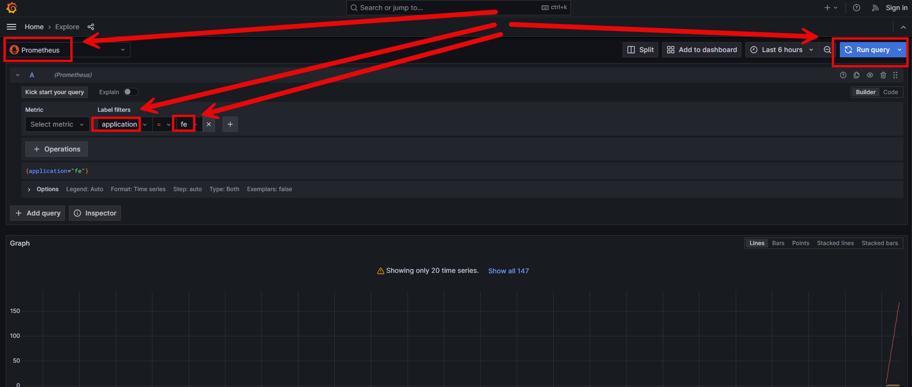

DESCRIPTION
-----------

##### Goal
The goal of this project is to present how to create **chain of applications (microservices)** with **observability** type **Grafana Stack (Loki + Prometeus + Tempo)** with usage **Java** programming language and **Spring Cloud** framework. Grafana Stack enables observing many microservices (Logs, Metrics and Traces) in one central Grafana dashboard.

This chain of services consists of following applications:
* **Loki**: it enables collecting logs from many microservices
* **Prometeus**" it enables collecting metrics from many microservices
* **Tempo**: it enables collecting traces from many microservices
* **Grafana**: it enables displaying logs, metrics and traces from Loki, Prometeus and Tempo tools 
* **Database**: SQL database - in this case type **MySql**
* **Back-End**: an application created in **Java** programming language with usage **Spring Boot** framework
* **Front-End**: an application created in **Java** programming language with usage **Spring Boot** framework. **Thymeleaf** engine is used to display data

This output consists of following elements:
* **Database Message**: the HTML displays the message stored in database. It's the simple text "Hello World!".
* **Back-End Port**: the HTML page displays the port of Back-End application.
* **Front-End Port**: the HTML page displays port of Front-End application.
* **Grafana**: the HTML dashboard for displaing logs, metrics and traces

##### Terminology
Terminology explanation:
* **Git**: tool for distributed version control
* **Maven**: tool for build automation
* **Java**: object-oriented programming language
* **Spring Boot**: framework for Java. It consists of: Spring + Container + Configuration
* **Spring Cloud**: Spring Cloud is a framework within the Spring ecosystem that provides tools for building distributed systems and microservices. It simplifies tasks like service discovery, configuration management, load balancing, circuit breakers, and distributed tracing, allowing developers to build scalable and resilient cloud-native applications.
* **Database**: A database is an organized collection of data that is stored and managed electronically, allowing for efficient retrieval, manipulation, and updating of information. It is typically managed by a database management system (DBMS).
* **MySql**: MySQL is an open-source relational database management system (RDBMS) that uses Structured Query Language (SQL) for managing and organizing data. It's widely used for web applications and is known for its speed, reliability, and ease of use.
* **Back-End**: The back-end refers to the server-side part of a software application, responsible for managing the database, server logic, and application programming interface (API). It processes requests from the front-end (user interface), handles data storage, retrieval, and business logic, and sends the appropriate responses back to the front-end.
* **Front-End**: Front-end refers to the part of a website or application that users interact with directly. It includes the visual elements, layout, and design, typically built using HTML, CSS, and JavaScript. The front-end is responsible for the user experience (UX) and interface (UI) that allows users to navigate and interact with the system.
* **Loki**: Grafana Loki is a log aggregation system designed to store, query, and visualize logs efficiently. Unlike traditional log management tools, Loki is lightweight and cost-effective, as it indexes logs by labels (like Kubernetes pod or service name) rather than indexing the entire log content. It's tightly integrated with Grafana, enabling unified metrics and log analysis within the same interface, making it ideal for cloud-native environments.
* **Prometeus**: Prometheus is an open-source monitoring and alerting toolkit designed for collecting, storing, and querying time-series data, primarily metrics from servers, applications, and services.
* **Tempo**: Grafana Tempo is a highly scalable, distributed tracing backend used to collect, store, and query traces from applications. It supports open standards like OpenTelemetry, integrates seamlessly with Grafana for visualization, and is optimized for low-cost storage by only indexing trace IDs while keeping the rest of the trace data in object storage.
* **Grafana**: Grafana is an open-source visualization and analytics platform used for monitoring, querying, and visualizing metrics from various data sources in customizable dashboards.

##### Implementation
Steps:
* In project add folder **grafana**
* In every service add file **src/main/resources/logback-spring.xml**
* In every servide update **pom.xml** file with **loki-logback-appender**

EXAMPLE
-------

USAGE MANUAL
------------

> **Usage Manual** means that Back-End and Front-End services are provided as **Java and Maven applications** and started **manually**. Database is provided as **Docker container**.

> Please **clone/download** project, open **project's main folder** in your favorite **command line tool** and then **proceed with steps below**. 

> Please be aware that following tools should be installed on your local PC:  
* **Operating System** (tested on Windows 11)
* **Java** (tested on version 17.0.5)
* **Maven** (tested on version 3.8.5)
* **Git** (tested on version 2.33.0.windows.2)
* **Docker** (tested on version 4.33.1 - it has to be up and running)

##### Required steps:
1. In the first command line tool **create network** with `docker network create helloworld-network`
1. In the first command line tool **start Tempo container** with `docker run -d --name tempo -p 3110:3100 -p 9411:9411 --network helloworld-network -v /tempo/tempo.yml:/etc/tempo.yaml:ro -v /tempo/tempo-data:/tmp/tempo grafana/tempo:2.2.2`
1. In the first command line tool **start Loki container** with `docker run -d -p 3100:3100 --network helloworld-network --name loki grafana/loki:main-45bae6d`
1. In the first command line tool **start Grafana container** with `docker run -d --name grafana -p 3000:3000 --network helloworld-network -v /grafana:/etc/grafana/provisioning/datasources:ro -e GF_AUTH_ANONYMOUS_ENABLED=true -e GF_AUTH_ANONYMOUS_ORG_ROLE=Admin -e GF_AUTH_DISABLE_LOGIN_FORM=true grafana/grafana:10.1.0`
1. In the first command line tool **start Docker MySql container** with `docker run -d --name mysql-container -e MYSQL_ROOT_PASSWORD=my_secret_password -e MYSQL_DATABASE=database -e MYSQL_USER=admin -e MYSQL_PASSWORD=admin123 -p 3306:3306 mysql:5.7`
1. In the second command line tool **start Back-End application** with `mvn -f ./springcloud-springboot3-observability-grafana-stack_BE spring-boot:run`
1. In the third command line tool **start Front-End application** with `mvn -f ./springcloud-springboot3-observability-grafana-stack_FE spring-boot:run`
1. In a browser visit `http://localhost:8080`
   * Expected HTML page with **Database Message**, **Back-End Port** and **Front-End Port** 
1. In a browser visit `http://localhost:5601`
   * Expected HTML page with **Kibana dashboard**
1. Clean up environment 
     * In the third command line tool **stop Front-End application** with `ctrl + C`
     * In the second command line tool **stop Back-End application** with `ctrl + C`
     * In the first command line tool **stop and remove Docker MySql container** with `docker rm -f mysql-container`
     * In the first command line tool **remove Docker MySql image** with `docker rmi mysql:5.7`
     * In the first command line tool **stop and remove Logstash container** with `docker rm -f logstash`
     * In the first command line tool **remove Logstash image** with `docker rmi logstash-container docker.elastic.co/logstash/logstash:8.3.3`
     * In the first command line tool **stop and remove Kibana container** with `docker rm -f kibana`
     * In the first command line tool **remove Kibana image** with `docker rmi docker.elastic.co/kibana/kibana:8.3.3` 
     * In the first command line tool **stop and remove Elasticsearch container** with `docker rm -f elasticsearch`
     * In the first command line tool **remove Elasticsearch image** with `docker rmi docker.elastic.co/elasticsearch/elasticsearch:8.3.3`   
     * In a command line tool remove **Docker Nerwork** with `docker network rm helloworld-network` 

##### Optional steps:
1. In a browser check Back-End application healthcheck with `http://localhost:8081/actuator/health`
1. In a browser check Back-End application API result with `http://localhost:8081/message/1`
1. In a browser check Front-End application healthcheck with `http://localhost:8080/actuator/health`
1. In a command line tool check list of Docker images with `docker images`
1. In a command line tool check list of all Docker containers with `docker ps -a`
1. In a command line tool check list of active Docker containers with `docker ps`

USAGE DOCKER
------------

> **Usage Docker** means that Back-End, Front-End services and Database are provided as **Docker containers**. 

> Please **clone/download** project, open **project's main folder** in your favorite **command line tool** and then **proceed with steps below**.

> Please be aware that following tools should be installed on your local PC:  
* **Operating System** (tested on Windows 11)
* **Git** (tested on version 2.33.0.windows.2)
* **Docker** (tested on version 4.33.1 - it has to be up and running)

##### Required steps:
1. In a command line tool create **Docker Network** with `docker network create helloworld-network`
1. In a command line tool **start Elasticsearch container** with `docker run -d -p 9200:9200 --network helloworld-network -e bootstrap.memory_lock=true -e ES_JAVA_OPTS="-Xms512m -Xmx512m" -e discovery.type=single-node -e xpack.security.enabled=false -v elasticsearch_data:/usr/share/elasticsearch/data --name elasticsearch docker.elastic.co/elasticsearch/elasticsearch:8.3.3`
1. In a command line tool **start Kibana container** with `docker run -d -p 5601:5601 --network helloworld-network -e ELASTICSEARCH_URL=http://elasticsearch-container:9200 -e ELASTICSEARCH_HOSTS="http://elasticsearch:9200" --name kibana docker.elastic.co/kibana/kibana:8.3.3`
1. In a line tool **start Logstash container** with `docker run -d -p 5044:5044 -p 5000:5000/tcp -p 5000:5000/udp -p 9600:9600 --network helloworld-network -e LS_JAVA_OPTS="-Xmx256m -Xms256m" -v "$(pwd)/logstash/config/logstash.yml:/usr/share/logstash/config/logstash.yml:ro" -v "$(pwd)/logstash/pipeline:/usr/share/logstash/pipeline:ro" --name logstash docker.elastic.co/logstash/logstash:8.3.3`
1. In a command line tool build and start **Docker container MySql** database with `docker run -d --name mysql-container -e MYSQL_ROOT_PASSWORD=my_secret_password -e MYSQL_DATABASE=database -e MYSQL_USER=admin -e MYSQL_PASSWORD=admin123 -p 3306:3306 --network helloworld-network mysql:5.7`
1. In a command line tool build **Docker image BE** with `docker build -f springcloud-springboot3-observability-grafana-stack_BE/Dockerfile -t be-image:0.0.1 ./springcloud-springboot3-observability-grafana-stack_BE`
1. In a command line tool build and start **Docker container BE** with `docker run -p 8081:8081 --name be-container --network helloworld-network -e spring.datasource.url=jdbc:mysql://mysql-container:3306/database -e logstash.server=logstash -e logstash.port=5000 -d be-image:0.0.1`
1. In a command line tool build **Docker image FE** with `docker build -f springcloud-springboot3-observability-grafana-stack_FE/Dockerfile -t fe-image:0.0.1 ./springcloud-springboot3-observability-grafana-stack_FE`
1. In a command line tool build and start **Docker container FE** with `docker run -p 8080:8080 --name fe-container --network helloworld-network -e api.url=http://be-container:8081 -e logstash.server=logstash -e logstash.port=5000 -d fe-image:0.0.1`
1. In a browser visit `http://localhost:8080`
   * Expected HTML page with **Database Message**, **Back-End Port** and **Front-End Port** 
1. In a browser visit `http://localhost:5601`
   * Expected HTML page with **Kibana dashboard** 
1. Clean up environment 
     * In a command line tool stop and remove **BE Docker container** with `docker rm -f fe-container`
     * In a command line tool remove **BE Docker image** with `docker rmi fe-image:0.0.1`
     * In a command line tool stop and remove **FE Docker container** with `docker rm -f be-container`
     * In a command line tool remove **FE Docker image** with `docker rmi be-image:0.0.1`
     * In a command line tool stop and remove **Database Docker container** with `docker rm -f mysql-container`
     * In a command line tool remove **Database Docker image** with `docker rmi mysql:5.7`
     * In a command line tool **stop and remove Logstash container** with `docker rm -f logstash`
     * In a command line tool **remove Logstash image** with `docker rmi logstash-container docker.elastic.co/logstash/logstash:8.3.3`
     * In a command line tool **stop and remove Kibana container** with `docker rm -f kibana`
     * In a command line tool **remove Kibana image** with `docker rmi docker.elastic.co/kibana/kibana:8.3.3` 
     * In a command line tool **stop and remove Elasticsearch container** with `docker rm -f elasticsearch`
     * In a command line tool **remove Elasticsearch image** with `docker rmi docker.elastic.co/elasticsearch/elasticsearch:8.3.3`   
     * In a command line tool remove **Docker Nerwork** with `docker network rm helloworld-network` 

##### Optional steps:
1. In a browser check Back-End application healthcheck with `http://localhost:8081/actuator/health`
1. In a browser check Back-End application API result with `http://localhost:8081/message/1`
1. In a browser check Front-End application healthcheck with `http://localhost:8080/actuator/health`
1. In a command line tool check list of Docker images with `docker images`
1. In a command line tool check list of all Docker containers with `docker ps -a`
1. In a command line tool check list of active Docker containers with `docker ps`
1. In a command line tool check list of Docker nerworks with `docker network ls`
1. In a command line tool check BE container logs with `docker logs be-container`
1. In a command line tool check FE container logs with `docker logs fe-container`

USAGE DOCKER COMPOSE
--------------------

> **Usage Docker Compse** means that Back-End, Front-End services and Database are provided as **Docker containers** definied in **Docker Compose** file. 

> Please **clone/download** project, open **project's main folder** in your favorite **command line tool** and then **proceed with steps below**.

> Please be aware that following tools should be installed on your local PC:  
* **Operating System** (tested on Windows 11)
* **Git** (tested on version 2.33.0.windows.2)
* **Docker** (tested on version 4.33.1 - it has to be up and running)

##### Required steps:
1. In a command line tool **start Docker containers** with `docker-compose up -d --build`
1. In a browser visit `http://localhost:8080`
   * Expected HTML page with **Database Message**, **Back-End Port** and **Front-End Port** 
1. In a browser visit `http://localhost:5601`
   * Expected HTML page with **Kibana dashboard**
1. Clean up environment 
     * In a command line tool **remove Docker containers** with `docker-compose down --rmi all`

##### Optional steps:
1. In a browser check Back-End application healthcheck with `http://localhost:8081/actuator/health`
1. In a browser check Back-End application API result with `http://localhost:8081/message/1`
1. In a browser check Front-End application healthcheck with `http://localhost:8080/actuator/health`
1. In a command line tool validate Docker Compose with `docker-compose config`
1. In a command line tool check list of Docker images with `docker images`
1. In a command line tool check list of all Docker containers with `docker ps -a`
1. In a command line tool check list of active Docker containers with `docker ps`
1. In a command line tool check list of Docker nerworks with `docker network ls`
1. In a command line tool check BE container logs with `docker logs be-container`
1. In a command line tool check FE container logs with `docker logs fe-container`

USAGE KUBERNETES (MINIKUBE) - DOESN'T WORK !!!
---------------------------

> **Usage Kubernetes** means that Back-End, Front-End services and Database are provided as **Docker containers** managed by **Kubernetes** type **Minikube**. 

> Please **clone/download** project, open **project's main folder** in your favorite **command line tool** and then **proceed with steps below**.

> Please be aware that following tools should be installed on your local PC:  
* **Operating System** (tested on Windows 11)
* **Git** (tested on version 2.33.0.windows.2)
* **Minikube** (tested on version 1.33.1)

##### Required steps:
1. In the first command line tool **with administrator privileges** start **Minikube** with `minikube start --cpus 4 --memory 7000`
1. In the second command line tool **start Kubernetes Pods** with `kubectl apply -f kubernetes.yaml`
1. In the second command line tool **check status of Kubernetes Pods** with `kubectl get pods`
   * Expected mysql, be and fe as **READY 1/1** (it can take few minutes)
1. In the first command line tool **with administrator privileges** display FE service in a Browser with `minikube service fe-service`
   * Expected HTML page with **Database Message**, **Back-End Port** and **Front-End Port** 
1. Clean up environment 
     * In the second command line tool **remove Kubernetes Pods** with `kubectl delete -f kubernetes.yaml`
     * In the first command line tool **with administrator privileges** stop **Minikube** with `minikube stop`

##### Optional steps:
1. In a command line tool build Docker BE image with `docker build -f springcloud-springboot3-observability-grafana-stack_BE/Dockerfile -t wisniewskikr/springcloud-springboot3-observability-grafana-stack_be:0.0.1 ./springcloud-springboot3-observability-grafana-stack_BE`
1. In a command line tool push Docker BE image to Docker Repository with `docker push wisniewskikr/springcloud-springboot3-observability-grafana-stack_be:0.0.1` 
1. In a command line tool build Docker FE image with `docker build -f springcloud-springboot3-observability-grafana-stack_FE/Dockerfile -t wisniewskikr/springcloud-springboot3-observability-grafana-stack_fe:0.0.1 ./springcloud-springboot3-observability-grafana-stack_FE`
1. In a command line tool push Docker FE image to Docker Repository with `docker push wisniewskikr/springcloud-springboot3-observability-grafana-stack_fe:0.0.1` 
1. In the first command line tool with administrator privileges check status of Minikube with `minikube status`
1. In the first command line tool with administrator privileges check Docker images in Minikube with `minikube ssh docker images`
1. In the first command line tool with administrator privileges check Docker containers in Minikube with `minikube ssh docker ps`
1. In a command line tool check Kubernetes Deployments with `kubectl get deployments`
1. In a command line tool check Kubernetes Deployments details with **kubectl describe deployment {deployment-name}**
1. In a command line tool check Kubernetes Services with `kubectl get services`
1. In a command line tool check Kubernetes Services details with **kubectl describe service {service-name}**
1. In a command line tool check Kubernetes Pods with `kubectl get pods`
1. In a command line tool check Kubernetes Pods details with **kubectl describe pod {pod-name}**
1. In a command line tool check Kubernetes Pods logs with **kubectl logs {pod-name}**