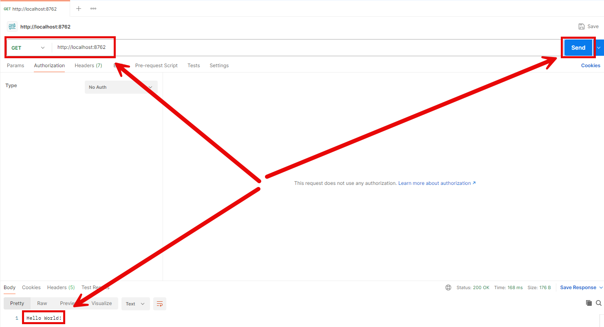

EXAMPLE
-------

DESCRIPTION
-----------

##### Goal
The goal of this project is to present how to create **microservice** and **routing** type **Gateway API** with usage **Java** programming language and **Spring Cloud** framework. Gateway API enables routing - mapping - from one route to another. In this way all microservices can have one URL. It this example Gateway API is **configured the config class**, not in application.properties file. 

This chain of services consists of following applications:
* **Service**: java REST API application which displays "Hello World!" text
* **Gateway**: a tool which routes from one URL to other URL

##### Terminology
Terminology explanation:
* **Git**: tool for distributed version control
* **Maven**: tool for build automation
* **Java**: object-oriented programming language
* **Spring Boot**: framework for Java. It consists of: Spring + Container + Configuration
* **Spring Cloud Gateway**: Spring Cloud Gateway is a reactive, API gateway service in the Spring Cloud ecosystem. It provides routing, load balancing, and API request handling. Built on top of Spring WebFlux, it allows dynamic routing, filtering, and monitoring of requests to various microservices, acting as a reverse proxy with features like path rewriting, rate limiting, and security integration.

USAGES
------

This project can be tested in following configurations:
* **Usage Docker Compose**: all services are started as Docker containers definied in docker compose file.
* **Usage Kubernetes (Kind)**: all services are started as Kubernetes pods.

USAGE DOCKER COMPOSE
--------------------

> **Usage Docker Compse** means that microservices and Database are provided as **Docker containers** definied in **Docker Compose** file. 

> Please **clone/download** project, open **project's main folder** in your favorite **command line tool** and then **proceed with steps below**.

> Please be aware that following tools should be installed on your local PC:  
* **Operating System** (tested on Windows 11)
* **Git** (tested on version 2.33.0.windows.2)
* **Docker** (tested on version 4.33.1)

##### Required steps:
1. Start **Docker** tool
1. In a command line tool **start Docker containers** with `docker-compose up -d --build`
1. In any rest client (e.g. Postman) use GET method and visit `http://localhost:8762`
   * Expected message **Hello World!**
1. Clean up environment 
     * In a command line tool **remove Docker containers** with `docker-compose down --rmi all`
     * Stop **Docker** tool

##### Optional steps:
1. In a command line tool validate Docker Compose with `docker-compose config`
1. In a command line tool check list of Docker images with `docker images`
1. In a command line tool check list of all Docker containers with `docker ps -a`
1. In a command line tool check list of active Docker containers with `docker ps`
1. In a command line tool check list of Docker nerworks with `docker network ls`
1. In a command line tool check Service container logs with `docker logs service-container`

USAGE KUBERNETES (KIND)
---------------------------

> **Usage Kubernetes** means that all services are started as Kubernetes pods. 

> Please **clone/download** project, open **project's main folder** in your favorite **command line tool** and then **proceed with steps below**.

> **Prerequisites**:  
* **Operating System** (tested on Windows 11)
* **Git** (tested on version 2.33.0.windows.2)
* **Kind** (tested on version 0.26.0)

##### Required steps:
1. Start **Docker** tool
1. In the command line tool create and start cluster **Kind** with `kind create cluster --name helloworld`
1. In the command line tool **start Kubernetes Pods** with `kubectl apply -f kubernetes.yaml`
1. In the command line tool **check status of Kubernetes Pods** with `kubectl get pods`
   * Expected mysql, be and fe as **READY 1/1** (it can take few minutes)
1. In the command line tool **forward port of Gateway service** with `kubectl port-forward service/gateway 8762:8762`
1. In a browser visit `http://localhost:8762`
   * Expected HTML page with **Database Message**, **Back-End Port** and **Front-End Port**
1. Clean up environment
     * In the command line tool **stop forwarding port of Gateway service** with `ctrl + C`
     * In the command line tool **remove Kubernetes Pods** with `kubectl delete -f kubernetes.yaml`
     * In the first command line tool delete cluster **Kind** with `kind delete cluster --name helloworld`
     * Stop **Docker** tool

##### Optional steps:
1. In a command line tool build Docker BE image with `docker build -f springcloud-springboot3-gateway-config-class_BE/Dockerfile -t wisniewskikr/springcloud-springboot3-gateway-config-class_be:0.0.1 ./springcloud-springboot3-gateway-config-class_BE`
1. In a command line tool push Docker BE image to Docker Repository with `docker push wisniewskikr/springcloud-springboot3-gateway-config-class_be:0.0.1` 
1. In a command line tool build Docker FE image with `docker build -f springcloud-springboot3-gateway-config-class_FE/Dockerfile -t wisniewskikr/springcloud-springboot3-gateway-config-class_fe:0.0.1 ./springcloud-springboot3-gateway-config-class_FE`
1. In a command line tool push Docker FE image to Docker Repository with `docker push wisniewskikr/springcloud-springboot3-gateway-config-class_fe:0.0.1`
1. In a command line tool build Docker GATEWAY image with `docker build -f springcloud-springboot3-gateway-config-class_ROUTING/Dockerfile -t wisniewskikr/springcloud-springboot3-gateway-config-class_routing:0.0.1 ./springcloud-springboot3-gateway-config-class_ROUTING`
1. In a command line tool push Docker GATEWAY image to Docker Repository with `docker push wisniewskikr/springcloud-springboot3-gateway-config-class_routing:0.0.1` 
1. In a command line tool check Kubernetes Deployments with `kubectl get deployments`
1. In a command line tool check Kubernetes Deployments with `kubectl get deployments`
1. In a command line tool check Kubernetes Deployments details with **kubectl describe deployment {deployment-name}**
1. In a command line tool check Kubernetes Services with `kubectl get services`
1. In a command line tool check Kubernetes Services details with **kubectl describe service {service-name}**
1. In a command line tool check Kubernetes Pods with `kubectl get pods`
1. In a command line tool check Kubernetes Pods details with **kubectl describe pod {pod-name}**
1. In a command line tool check Kubernetes Pods logs with **kubectl log {pod-name}**