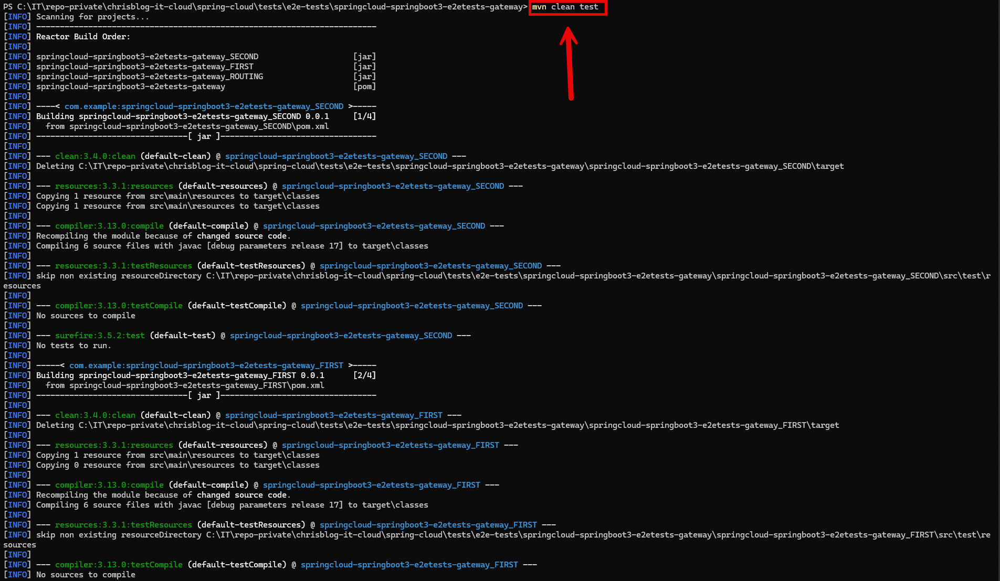

DESCRIPTION
-----------

##### Goal
The goal of this project is to present how to create **chain of applications (microservices)** with a **routing** type **Gateway API** with usage **Java** programming language and **Spring Cloud** framework. Gateway API enables routing - mapping - from one route to another. In this way all microservices can have one URL. It this example Gateway API is **configured the config class**, not in application.properties file. 

This chain of services consists of following applications:
* **Database**: SQL database - in this case type **MySql**
* **Back-End**: an application created in **Java** programming language with usage **Spring Boot** framework
* **Front-End**: an application created in **Java** programming language with usage **Spring Boot** framework. **Thymeleaf** engine is used to display data
* **Gateway**: a tool which routes from one URL to other URL

Fe output consists of following elements:
* **Database Message**: the HTML displays the message stored in database. It's the simple text "Hello World!".
* **Back-End Port**: the HTML page displays the port of Back-End application.
* **Front-End Port**: the HTML page displays port of Front-End application.

##### Terminology
Terminology explanation:
* **Git**: tool for distributed version control
* **Maven**: tool for build automation
* **Java**: object-oriented programming language
* **Spring Boot**: framework for Java. It consists of: Spring + Container + Configuration
* **Database**: A database is an organized collection of data that is stored and managed electronically, allowing for efficient retrieval, manipulation, and updating of information. It is typically managed by a database management system (DBMS).
* **MySql**: MySQL is an open-source relational database management system (RDBMS) that uses Structured Query Language (SQL) for managing and organizing data. It's widely used for web applications and is known for its speed, reliability, and ease of use.
* **Back-End**: The back-end refers to the server-side part of a software application, responsible for managing the database, server logic, and application programming interface (API). It processes requests from the front-end (user interface), handles data storage, retrieval, and business logic, and sends the appropriate responses back to the front-end.
* **Front-End**: Front-end refers to the part of a website or application that users interact with directly. It includes the visual elements, layout, and design, typically built using HTML, CSS, and JavaScript. The front-end is responsible for the user experience (UX) and interface (UI) that allows users to navigate and interact with the system.
* **Thymeleaf**: Thymeleaf is a modern server-side Java template engine for Java-based web applications. It processes HTML, XML, JavaScript, CSS, and plain text, integrating with the Spring framework. It allows dynamic content rendering on the server while ensuring templates are HTML-compliant. Thymeleaf's key features include natural templates (which work as valid HTML even before rendering), easy integration with Spring MVC, and powerful expressions for iterating, conditional display, and data binding. It's often used to create dynamic web pages that combine static HTML with server-side logic in a clean and intuitive way.
* **Spring Cloud**: Spring Cloud is a framework within the Spring ecosystem that provides tools for building distributed systems and microservices. It simplifies tasks like service discovery, configuration management, load balancing, circuit breakers, and distributed tracing, allowing developers to build scalable and resilient cloud-native applications.
* **Microservices**: Microservices are a software architecture style where an application is built as a collection of small, independent services that communicate through APIs. Each service focuses on a specific business function, allowing for easier scaling, deployment, and maintenance.
* **Spring Cloud Gateway**: Spring Cloud Gateway is a reactive, API gateway service in the Spring Cloud ecosystem. It provides routing, load balancing, and API request handling. Built on top of Spring WebFlux, it allows dynamic routing, filtering, and monitoring of requests to various microservices, acting as a reverse proxy with features like path rewriting, rate limiting, and security integration.

##### Implementation
Implementation details:
* **ROUTING service**: update pom.xml file with dependency **spring-cloud-starter-gateway**. Update file **application.properties** with routing properties.

EXAMPLE
-------

USAGES
------

This project can be tested in following configurations:
* **Usage Docker Compose**: all services are started as Docker containers definied in docker compose file.
* **Usage Kubernetes (Kind)**: all services are started as Kubernetes pods.

USAGE DOCKER COMPOSE
--------------------

> **Usage Docker Compse** means that microservices and Database are provided as **Docker containers** definied in **Docker Compose** file. 

> Please **clone/download** project, open **project's main folder** in your favorite **command line tool** and then **proceed with steps below**.

> Please be aware that following tools should be installed on your local PC:  
* **Operating System** (tested on Windows 11)
* **Git** (tested on version 2.33.0.windows.2)
* **Docker** (tested on version 4.33.1)

##### Required steps:
1. Start **Docker** tool
1. In a command line tool **start Docker containers** with `docker-compose up -d --build`
1. In a browser visit `http://localhost:8762`
   * Expected HTML page with **Database Message**, **Back-End Port** and **Front-End Port**
1. Clean up environment 
     * In a command line tool **remove Docker containers** with `docker-compose down --rmi all`
     * Stop **Docker** tool

##### Optional steps:
1. In a browser check Back-End application healthcheck with `http://localhost:8081/actuator/health`
1. In a browser check Back-End application API result with `http://localhost:8081/message/1`
1. In a browser check Front-End application healthcheck with `http://localhost:8080/actuator/health`
1. In a command line tool validate Docker Compose with `docker-compose config`
1. In a command line tool check list of Docker images with `docker images`
1. In a command line tool check list of all Docker containers with `docker ps -a`
1. In a command line tool check list of active Docker containers with `docker ps`
1. In a command line tool check list of Docker nerworks with `docker network ls`
1. In a command line tool check BE container logs with `docker logs be-container`
1. In a command line tool check FE container logs with `docker logs fe-container`

USAGE KUBERNETES (KIND)
---------------------------

> **Usage Kubernetes** means that all services are started as Kubernetes pods. 

> Please **clone/download** project, open **project's main folder** in your favorite **command line tool** and then **proceed with steps below**.

> **Prerequisites**:  
* **Operating System** (tested on Windows 11)
* **Git** (tested on version 2.33.0.windows.2)
* **Kind** (tested on version 0.26.0)

##### Required steps:
1. Start **Docker** tool
1. In the command line tool create and start cluster **Kind** with `kind create cluster --name helloworld`
1. In the command line tool **start Kubernetes Pods** with `kubectl apply -f kubernetes.yaml`
1. In the command line tool **check status of Kubernetes Pods** with `kubectl get pods`
   * Expected mysql, be and fe as **READY 1/1** (it can take few minutes)
1. In the command line tool **forward port of Gateway service** with `kubectl port-forward service/gateway 8762:8762`
1. In a browser visit `http://localhost:8762`
   * Expected HTML page with **Database Message**, **Back-End Port** and **Front-End Port**
1. Clean up environment
     * In the command line tool **stop forwarding port of Gateway service** with `ctrl + C`
     * In the command line tool **remove Kubernetes Pods** with `kubectl delete -f kubernetes.yaml`
     * In the first command line tool delete cluster **Kind** with `kind delete cluster --name helloworld`
     * Stop **Docker** tool

##### Optional steps:
1. In a command line tool build Docker BE image with `docker build -f springcloud-springboot3-e2etests-gateway_SECOND/Dockerfile -t wisniewskikr/springcloud-springboot3-e2etests-gateway_second:0.0.1 ./springcloud-springboot3-e2etests-gateway_SECOND`
1. In a command line tool push Docker BE image to Docker Repository with `docker push wisniewskikr/springcloud-springboot3-e2etests-gateway_second:0.0.1` 
1. In a command line tool build Docker FE image with `docker build -f springcloud-springboot3-e2etests-gateway_FIRST/Dockerfile -t wisniewskikr/springcloud-springboot3-e2etests-gateway_first:0.0.1 ./springcloud-springboot3-e2etests-gateway_FIRST`
1. In a command line tool push Docker FE image to Docker Repository with `docker push wisniewskikr/springcloud-springboot3-e2etests-gateway_first:0.0.1`
1. In a command line tool build Docker GATEWAY image with `docker build -f springcloud-springboot3-e2etests-gateway_ROUTING/Dockerfile -t wisniewskikr/springcloud-springboot3-e2etests-gateway_routing:0.0.1 ./springcloud-springboot3-e2etests-gateway_ROUTING`
1. In a command line tool push Docker GATEWAY image to Docker Repository with `docker push wisniewskikr/springcloud-springboot3-e2etests-gateway_routing:0.0.1` 
1. In a command line tool check Kubernetes Deployments with `kubectl get deployments`
1. In a command line tool check Kubernetes Deployments with `kubectl get deployments`
1. In a command line tool check Kubernetes Deployments details with **kubectl describe deployment {deployment-name}**
1. In a command line tool check Kubernetes Services with `kubectl get services`
1. In a command line tool check Kubernetes Services details with **kubectl describe service {service-name}**
1. In a command line tool check Kubernetes Pods with `kubectl get pods`
1. In a command line tool check Kubernetes Pods details with **kubectl describe pod {pod-name}**
1. In a command line tool check Kubernetes Pods logs with **kubectl log {pod-name}**