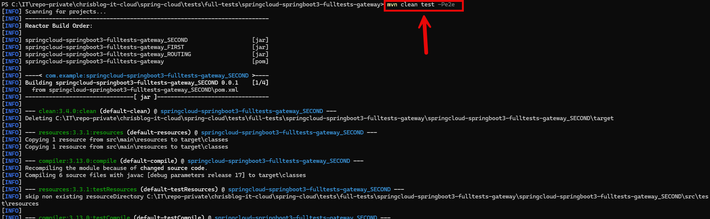

EXAMPLE
-------

DESCRIPTION
-----------

##### Goal
The goal of this project is to present how to create **End-To-End Tests** with a **routing** type **Gateway API** with usage **Java** programming language and **Spring Cloud** framework. Gateway API enables routing - mapping - from one route to another. In this way all microservices can have one URL. It this example Gateway API is **configured the config class**, not in application.properties file. 

This chain of services consists of following applications:
* **Database**: SQL database - in this case type **MySql**
* **Second**: an application created in **Java** programming language with usage **Spring Boot** framework
* **First**: an application created in **Java** programming language with usage **Spring Boot** framework. 
* **Gateway**: a tool which routes from one URL to other URL

Gateway output consists of following elements:
* **Database Message**: the JSON displays the message stored in database.
* **firstPort**: the JSON displays the port of First application.
* **secondPort**: the JSON page displays port of Second application.

##### Terminology
Terminology explanation:
* **Git**: tool for distributed version control
* **Maven**: tool for build automation
* **Java**: object-oriented programming language
* **Spring Boot**: framework for Java. It consists of: Spring + Container + Configuration
* **Database**: A database is an organized collection of data that is stored and managed electronically, allowing for efficient retrieval, manipulation, and updating of information. It is typically managed by a database management system (DBMS).
* **MySql**: MySQL is an open-source relational database management system (RDBMS) that uses Structured Query Language (SQL) for managing and organizing data. It's widely used for web applications and is known for its speed, reliability, and ease of use.
* **Spring Cloud**: Spring Cloud is a framework within the Spring ecosystem that provides tools for building distributed systems and microservices. It simplifies tasks like service discovery, configuration management, load balancing, circuit breakers, and distributed tracing, allowing developers to build scalable and resilient cloud-native applications.
* **Microservices**: Microservices are a software architecture style where an application is built as a collection of small, independent services that communicate through APIs. Each service focuses on a specific business function, allowing for easier scaling, deployment, and maintenance.
* **Spring Cloud Gateway**: Spring Cloud Gateway is a reactive, API gateway service in the Spring Cloud ecosystem. It provides routing, load balancing, and API request handling. Built on top of Spring WebFlux, it allows dynamic routing, filtering, and monitoring of requests to various microservices, acting as a reverse proxy with features like path rewriting, rate limiting, and security integration.
* **End-To-End Tests**: End-to-end (E2E) tests are a type of software testing that validate the complete flow of an application—from start to finish—to ensure all integrated components work together as expected. These tests simulate real user scenarios to verify the system behaves correctly across the full stack, including frontend, backend, databases, and external services.

USAGES
------

This project can be tested in following configurations:
* **Usage Manual**: end-to-end tests are started manually in command line.
* **Usage Docker Compose**: N/A
* **Usage Kubernetes (Kind)**: N/A

USAGE MANUAL
------------

> **Usage Manual** means that end-to-end tests are started manually in command line.

> Please **clone/download** project, open **project's main folder** in your favorite **command line tool** and then **proceed with steps below**.

> **Prerequisites**:
* **Operating System** (tested on Windows 11)
* **Git** (tested on version 2.33.0.windows.2)

##### Required steps:
1. In a first command line tool **start End-To-End Tests** with `mvn clean test`
   * Expected all tests are passed
1. Clean up environment
   * N/A

##### Optional steps:
1. In a command line tool build Docker SECOND image with `docker build -f springcloud-springboot3-fulltests-gateway_SECOND/Dockerfile -t wisniewskikr/springcloud-springboot3-fulltests-gateway_second:0.0.1 ./springcloud-springboot3-fulltests-gateway_SECOND`
1. In a command line tool push Docker SECOND image to Docker Repository with `docker push wisniewskikr/springcloud-springboot3-fulltests-gateway_second:0.0.1`
1. In a command line tool build Docker FIRST image with `docker build -f springcloud-springboot3-fulltests-gateway_FIRST/Dockerfile -t wisniewskikr/springcloud-springboot3-fulltests-gateway_first:0.0.1 ./springcloud-springboot3-fulltests-gateway_FIRST`
1. In a command line tool push Docker FIRST image to Docker Repository with `docker push wisniewskikr/springcloud-springboot3-fulltests-gateway_first:0.0.1`

USAGE DOCKER COMPOSE
--------------------

N/A

USAGE KUBERNETES (KIND)
---------------------------

N/A