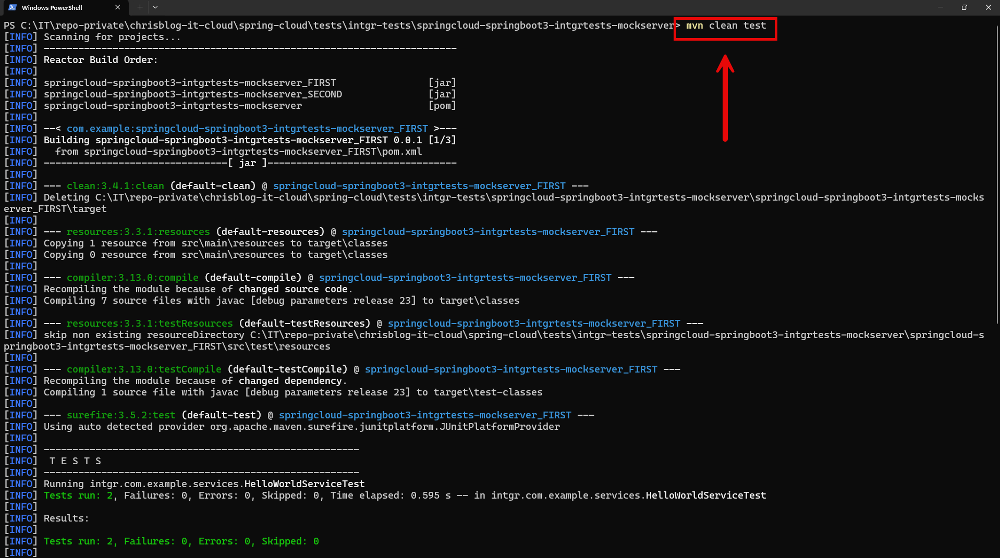
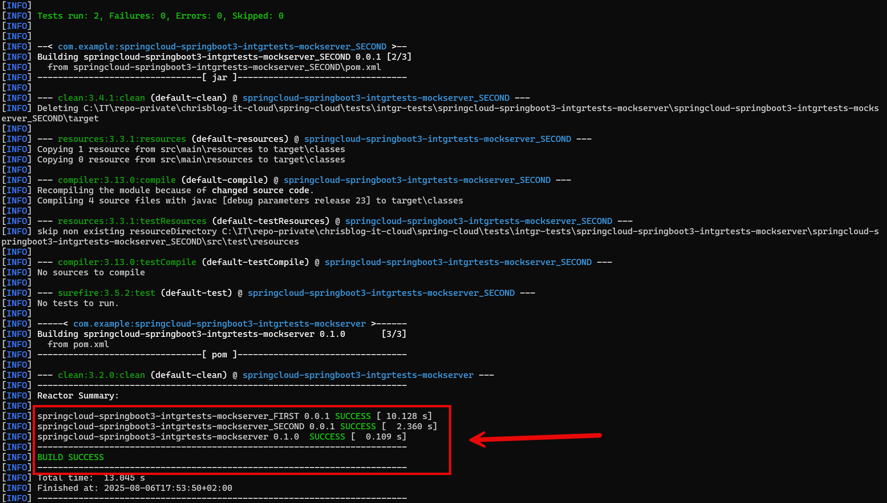

EXAMPLE
-------

DESCRIPTION
-----------

##### Goal
The goal of this project is to present how to create **Integration Tests** for communication type **RestClient** with usage **Java** programming language and **Spring Cloud** and **Spring Boot 3** frameworks.

##### Services
This project consists of following applications:
* **Second Service**: an application created in **Java** programming language with usage **Spring Boot** framework.
* **First Service**: an application created in **Java** programming language with usage **Spring Boot** framework. It has connection with Second Service

##### Inputs
This project requires following inputs:
* **First Service**: http requests from any Rest Client. It handles GET method for paths "/public" and "/secured"

##### Outputs
This project provides following outputs:
* **First Service**: http responses with JSONs with data

##### Terminology
Terminology explanation:
* **Git**: tool for distributed version control
* **Maven**: tool for build automation
* **Java**: object-oriented programming language
* **Spring Boot**: framework for Java. It consists of: Spring + Container + Configuration
* **Spring Cloud**: Spring Cloud is a framework within the Spring ecosystem that provides tools for building distributed systems and microservices. It simplifies tasks like service discovery, configuration management, load balancing, circuit breakers, and distributed tracing, allowing developers to build scalable and resilient cloud-native applications.

USAGES
------

This project can be tested in following configurations:
* **Usage Manual**: integration tests are started manually in command line
* **Usage Docker Compose**: N/A
* **Usage Kubernetes (Kind)**: N/A

USAGE MANUAL
------------

> **Usage Manual** means that integration tests are started manually in command line.

> Please **clone/download** project, open **project's main folder** in your favorite **command line tool** and then **proceed with steps below**.

> **Prerequisites**:
* **Operating System** (tested on Windows 11)
* **Git** (tested on version 2.33.0.windows.2)

##### Required steps:
1. In a first command line tool **start Integration Tests** with `mvn clean test`
   * Expected integration tests are passed
1. Clean up environment
   * N/A

##### Optional steps:
1. In a command line tool build Docker SECOND image with `docker build -f springcloud-springboot3-intgrtests-mockserver_SECOND/Dockerfile -t wisniewskikr/springcloud-springboot3-intgrtests-mockserver_second:0.0.1 ./springcloud-springboot3-intgrtests-mockserver_SECOND`
1. In a command line tool push Docker SECOND image to Docker Repository with `docker push wisniewskikr/springcloud-springboot3-intgrtests-mockserver_second:0.0.1`

USAGE DOCKER COMPOSE
--------------------

N/A

USAGE KUBERNETES (KIND)
---------------------------

N/A
