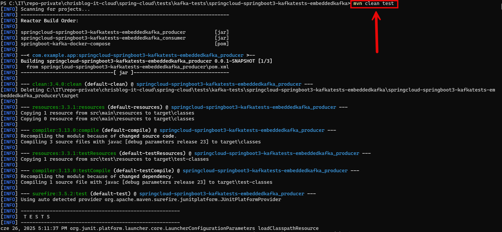
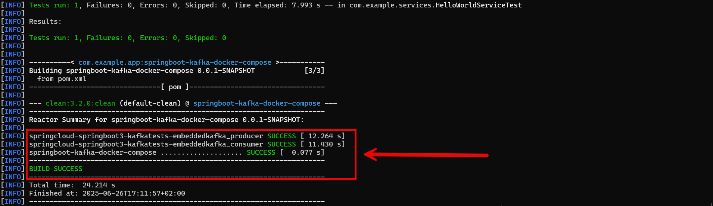

EXAMPLE
-------

DESCRIPTION
-----------

##### Goal
The goal of this project is to present how to create integration tests with usage **@EmbeddedKafka** annotation for **Apache Kafka** tool and microservices created with usage **Java** programming language, **Spring Boot 3** and **Spring Cloud** frameworks.

Apacha Kafka tool is tested as:
* **Producer**: integration tests check if event is sent to the tool 
* **Consumer**: integration tests check if event is read from the tool

##### Content
This project consists of following applications:
* **Producer**: sends events to Kafka broker
   * **Input**: Http request with path variable **name** from any browser is received
   * **Output**: Http response to any browser with message **The message was sent to Consumer via Kafka** is sent
* **Consumer**: receives events from Kafka broker
   * **Input**: Http request from any browser is received
   * **Output**: Http response to any browser with message **Message from Producer via Kafka is: Hello World {name}** is sent
* **Kafka**: acts as an intermediary between the producer and the consumer
   * **Input**: event from Producer is received
   * **Output**: event to Consumer is sent
* **Kafka UI**: displays events handled by Kafka broker
   * **Input**: Http request from any browser is received
   * **Output**: Http response to any browser with **dashboard of Kafka event`s** details is sent
   

##### Terminology
Terminology explanation:
* **Git**: Git is a distributed version control system used to track changes in code, collaborate with others, and manage source code history efficiently.
* **Java**: Java is a high-level, object-oriented programming language known for its platform independence, achieved through the Java Virtual Machine (JVM). It is widely used for developing web, mobile, desktop, and enterprise applications, emphasizing simplicity, security, and portability. "Write once, run anywhere" is its core principle.
* **Maven**: Maven is a build automation and dependency management tool for Java projects, streamlining project builds, managing libraries, and ensuring consistent project configurations.
* **Spring Boot**: Spring Boot is a framework for building Java-based applications that simplifies development by providing auto-configuration, embedded servers, and production-ready tools, enabling developers to create standalone, production-ready applications with minimal configuration.
* **Microservice**: A microservice is a small, independently deployable service that focuses on performing a specific business function. It operates as part of a larger system and communicates with other microservices via lightweight protocols, such as HTTP or messaging queues, typically in a loosely coupled architecture.
* **Spring Cloud**: Spring Cloud is a framework within the Spring ecosystem that provides tools and solutions for building distributed systems and microservices. It simplifies the development of cloud-native applications by offering features such as service discovery, configuration management, load balancing, circuit breakers, distributed tracing, and API gateways. It integrates seamlessly with popular cloud platforms and services, enabling developers to focus on business logic while handling the complexities of distributed systems.
* **Integration Tests**: Integration tests are a type of software testing that verify how different components or systems work together as a group. They ensure that combined parts of an application interact correctly.
* **Apache Kafka**: Apache Kafka is an open-source distributed event streaming platform used to build real-time data pipelines and streaming applications. It is designed to handle high-throughput, low-latency data transmission between systems using a publish-subscribe model.

USAGES
------

This project can be tested in following configurations:
* **Usage Manual**: integrated tests of Apache Kafka are started manually in command line.
* **Usage Docker Compose**: N/A
* **Usage Kubernetes (Kind)**: N/A

USAGE MANUAL
------------

> **Usage Manual** means that integration tests of Apache Kafka are started manually in command line.

> Please **clone/download** project, open **project's main folder** in your favorite **command line tool** and then **proceed with steps below**.

> **Prerequisites**:
* **Operating System** (tested on Windows 11)
* **Git** (tested on version 2.33.0.windows.2)
* **Java** (tested on version 23.0.1)
* **Maven** (tested on version 3.9.6)

##### Required steps:
1. In a first command line tool **start integration tests** with `mvn clean test`
    * Expected all tests are passed
1. Clean up environment
    * N/A

USAGE DOCKER COMPOSE
--------------------

N/A

USAGE KUBERNETES (KIND)
---------------------------

N/A