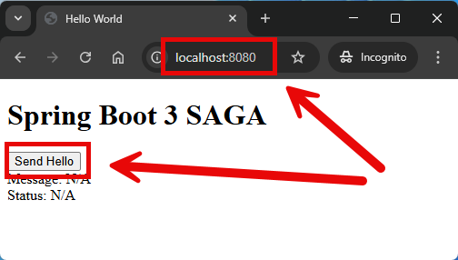
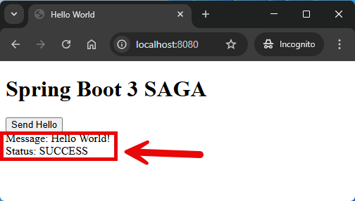
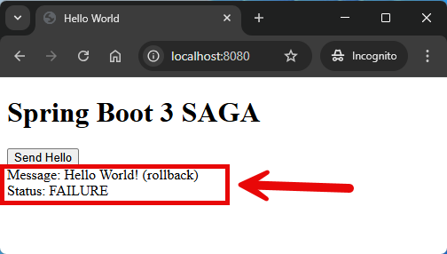

EXAMPLE
-------

DESCRIPTION
-----------

##### Goal
The goal of this project is to present how to implement **distributed transactions management** 
using **SAGA** architecture pattern type **choreography** with usage **Java** programming language 
and **Spring Cloud** and **Spring Boot 3** frameworks.

SAGA enables transaction management in distributed architecture. It means that if transaction fails in one
microservice then it's rolled back in all microservices. Type choreography means every microservices handles
rollback itself.

##### Services
This project consists of following applications:
* **Second Service**: an application created in **Java** programming language with usage **Spring Boot** framework. 
It waits 3 seconds and send back random status SUCCESS/FAILURE to Kafka
* **First Service**: an application created in **Java** programming language with usage **Spring Boot** framework. 
It displays message and status using SSE. 
* **Kafka**: event-driven messaging server

##### Terminology
Terminology explanation:
* **Git**: tool for distributed version control
* **Maven**: tool for build automation
* **Java**: object-oriented programming language
* **Spring Boot**: framework for Java. It consists of: Spring + Container + Configuration
* **Spring Cloud**: Spring Cloud is a framework within the Spring ecosystem that provides tools for building 
distributed systems and microservices. It simplifies tasks like service discovery, configuration management, 
load balancing, circuit breakers, and distributed tracing, allowing developers to build scalable and resilient 
cloud-native applications.
* **Kafka**: Kafka is a distributed event streaming platform used for building real-time data pipelines and applications. 
It allows systems to publish, store, and subscribe to streams of records (events) in a fault-tolerant and scalable way.
* **SAGA**: The Saga Pattern is a design pattern for managing long-running, distributed transactions by breaking them 
into a sequence of local transactions. Each local transaction has a corresponding compensating action to undo its 
effects in case of failure, ensuring eventual consistency without using distributed transactions.

USAGES
------

This project can be tested in following configurations:
* **Usage Manual**: infrastructure services are started as Docker containers. Application services are started manually in command line
* **Usage Docker Compose**: all services are started as Docker containers definied in docker compose file.
* **Usage Kubernetes (Kind)**: all services are started as Kubernetes pods.

USAGE MANUAL
------------

> **Usage Manual** means that infrastructure services are started as Docker containers. Application services are started manually in command line.

> Please **clone/download** project, open **project's main folder** in your favorite **command line tool** and then **proceed with steps below**.

> **Prerequisites**:
* **Operating System** (tested on Windows 11)
* **Git** (tested on version 2.33.0.windows.2)
* **Docker** (tested on version 4.33.1)

##### Required steps:
1. Start **Docker** tool
1. In a first command line tool **start Docker containers** with `docker-compose -f .\docker-compose\infrastructure\docker-compose.yaml up -d --build`
1. In a second command line tool **start Second application** with `mvn -f ./springcloud-transactions-saga-choreography_SECOND spring-boot:run`
1. In a third command line tool **start First application** with `mvn -f ./springcloud-transactions-saga-choreography_FIRST spring-boot:run`
1. In any Internet Browser (e.g. Chrome) visit `http://localhost:8080`
   * Expected HTML page with "Send Hello" button
   * Click "Send Hello" button
   * Expected HTML page with "message" as "Hello World!" and "status" as "IN PROGRESS"
   * After 3 seconds if random status is success: expected HTML page with "message" as "Hello World!" 
     and "status" as "SUCCESS"
   * After 3 seconds if random status is failure: expected HTML page with "message" as "Hello World! (rollback)" 
     and "status" as "FAILURE"
1. Clean up environment
   * In the third command line tool **stop First application** with `ctrl + C`
   * In the second command line tool **stop Second application** with `ctrl + C`
   * In the first command line tool **remove Docker containers** with `docker-compose -f .\docker-compose\infrastructure\docker-compose.yaml down --rmi all`
   * Stop **Docker** tool

USAGE DOCKER COMPOSE
--------------------

> **Usage Docker Compse** means all services are started as Docker containers definied in docker compose file.

> Please **clone/download** project, open **project's main folder** in your favorite **command line tool** and then **proceed with steps below**.

> **Prerequisites**:  
* **Operating System** (tested on Windows 11)
* **Git** (tested on version 2.33.0.windows.2)
* **Docker** (tested on version 4.33.1)

##### Required steps:
1. Start **Docker** tool
1. In any command line tool **start Docker containers** with `docker-compose -f .\docker-compose\full\docker-compose.yaml up -d --build`
1. In any Rest Client (e.g. Postman) using GET method visit `http://localhost:8081/public`
   * Expected following **JSON**: {"text": "Hello World, Public!", "portFirst": "8081", "portSecond": "8082"}
1. In any Rest Client (e.g. Postman) using GET method visit `http://localhost:8081/secured`
   * Expected following **JSON**: {"text": "Hello World, Secured!", "portFirst": "8081", "portSecond": "8082"}
1. Clean up environment 
     * In a command line tool **remove Docker containers** with `docker-compose -f .\docker-compose\full\docker-compose.yaml down --rmi all`
     * Stop **Docker** tool

##### Optional steps:
1. In a command line tool validate Docker Compose with `docker-compose config`
1. In a command line tool check list of Docker images with `docker images`
1. In a command line tool check list of all Docker containers with `docker ps -a`
1. In a command line tool check list of active Docker containers with `docker ps`
1. In a command line tool check list of Docker nerworks with `docker network ls`
1. In a command line tool check SECOND container logs with `docker logs second-container`
1. In a command line tool check FIRST container logs with `docker logs first-container`

USAGE KUBERNETES (KIND)
---------------------------

> **Usage Kubernetes** means that all services are started as Kubernetes pods. 

> Please **clone/download** project, open **project's main folder** in your favorite **command line tool** and then **proceed with steps below**.

> **Prerequisites**:  
* **Operating System** (tested on Windows 11)
* **Git** (tested on version 2.33.0.windows.2)
* **Kind** (tested on version 0.26.0)

##### Required steps:
1. Start **Docker** tool
1. In the first command line tool create and start cluster **Kind** with `kind create cluster --name helloworld`
1. In the first command line tool **start Kubernetes Pods** with `kubectl apply -f ./k8s --recursive`
1. In the first command line tool **check status of Kubernetes Pods** with `kubectl get pods`
   * Expected mysql, second and first as **READY 1/1** (it can take few minutes)
1. In the second command line tool **forward port of Second service** with `kubectl port-forward service/second 8082:8082`
1. In the third command line tool **forward port of First service** with `kubectl port-forward service/first 8081:8081`
1. In any Rest Client (e.g. Postman) using GET method visit `http://localhost:8081/public`
   * Expected following **JSON**: {"text": "Hello World, Public!", "portFirst": "8081", "portSecond": "8082"}
1. In any Rest Client (e.g. Postman) using GET method visit `http://localhost:8081/secured`
   * Expected following **JSON**: {"text": "Hello World, Secured!", "portFirst": "8081", "portSecond": "8082"}
1. Clean up environment
     * In the third command line tool **stop forwarding port of First service** with `ctrl + C`
     * In the second command line tool **stop forwarding port of Second service** with `ctrl + C`
     * In the first command line tool **remove Kubernetes Pods** with `kubectl delete -f ./k8s --recursive`
     * In the first command line tool delete cluster **Kind** with `kind delete cluster --name helloworld`
     * Stop **Docker** tool

##### Optional steps:
1. In a command line tool build Docker SECOND image with `docker build -f springcloud-transactions-saga-choreography_SECOND/Dockerfile -t wisniewskikr/springcloud-transactions-saga-choreography_second:0.0.1 ./springcloud-transactions-saga-choreography_SECOND`
1. In a command line tool push Docker SECOND image to Docker Repository with `docker push wisniewskikr/springcloud-transactions-saga-choreography_second:0.0.1` 
1. In a command line tool build Docker FIRST image with `docker build -f springcloud-transactions-saga-choreography_FIRST/Dockerfile -t wisniewskikr/springcloud-transactions-saga-choreography_first:0.0.1 ./springcloud-transactions-saga-choreography_FIRST`
1. In a command line tool push Docker FIRST image to Docker Repository with `docker push wisniewskikr/springcloud-transactions-saga-choreography_first:0.0.1`  
1. In the first command line tool with administrator privileges check clusers with `kind get clusters`
1. In a command line tool check Kubernetes Deployments with `kubectl get deployments`
1. In a command line tool check Kubernetes Deployments details with **kubectl describe deployment {deployment-name}**
1. In a command line tool check Kubernetes Services with `kubectl get services`
1. In a command line tool check Kubernetes Services details with **kubectl describe service {service-name}**
1. In a command line tool check Kubernetes Pods with `kubectl get pods`
1. In a command line tool check Kubernetes Pods details with **kubectl describe pod {pod-name}**
1. In a command line tool check Kubernetes Pods logs with **kubectl logs {pod-name}**
